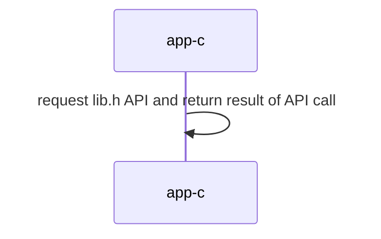
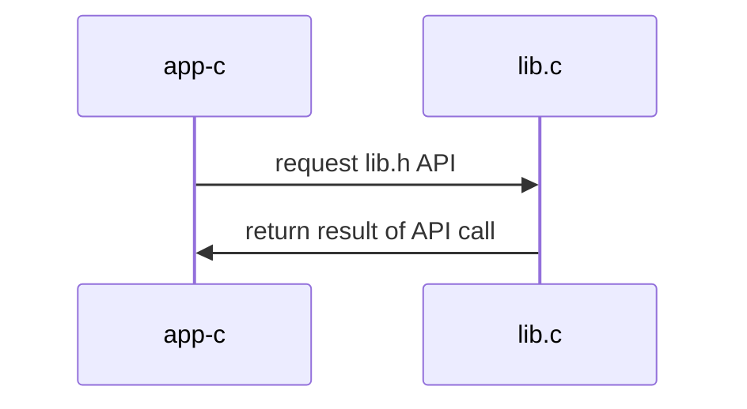
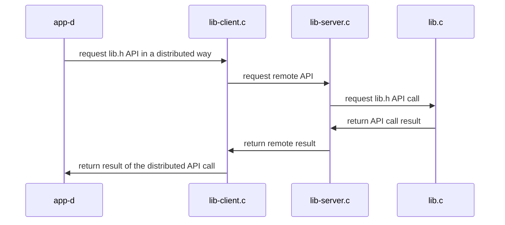

## Materiales usados en ARCOS.INF.UC3M.ES con Licencia GPLv3.0
  * Felix García Carballeira y Alejandro Calderón Mateos

## Sistemas Distribuidos

### Ejemplo de transformación a aplicación distribuida

Partimos del servicio de una tabla hash diseñada como único ejecutable (centralizado) en ún único fichero fuente (monolítico):
  * [Servicio centralizado monolítico](#servicio-centralizado-monolitico)

Pasamos al servicio de dicha tabla hash diseñada como ejecutable único (centralizada) pero usando librería (librería):
  * [Servicio centralizado con librería](#servicio-centralizado-con-libreria)

Pasamos dicho servicio de tabla hash diseñado como aplicación distribuida:
  * [Servicio distribuido basado en colas POSIX](#servicio-distribuido-basado-en-colas-posix)
  * [Servicio distribuido basado en sockets](#servicio-distribuido-basado-en-sockets)


### Servicio centralizado monolítico

#### Compilar

Hay que introducir:
```
cd centralizado-monolitico
make
```

Y la salida debería ser similar a:
```
gcc -g -Wall -c app-c.c
gcc -g -Wall app-c.o  -o app-c
```

#### Ejecutar

Hay que introducir:
```
./app-c
```

Y la salida debería ser similar a:
```
set("nombre", 100, 0x0)
set("nombre", 101, 0x1)
set("nombre", 102, 0x2)
...
get("nombre", 107) -> 0x7
get("nombre", 108) -> 0x8
get("nombre", 109) -> 0x9
```

#### Arquitectura




### Servicio centralizado con librería

#### Compilar

Hay que introducir:
```
cd centralizado-librería
make
```

Y la salida debería ser similar a:
```
gcc -g -Wall -c app-c.c
gcc -g -Wall -c lib.c
gcc -g -Wall app-c.o lib.o  -o app-c
```

#### Ejecutar

Hay que introducir:
```
./app-c
```

Y la salida debería ser similar a:
```
set("nombre", 1, 0x123)
get("nombre", 1) -> 0x123
```

#### Arquitectura




### Servicio distribuido basado en colas POSIX

#### Compilar

Hay que introducir:
```
cd distribuido-mqueue
make
```

Y la salida debería ser similar a:
```
gcc -g -Wall -c app-d.c
gcc -g -Wall -c lib-client.c
gcc -g -Wall -c lib.c
gcc -g -Wall -lrt app-d.o lib.o lib-client.o       -o app-d  -lrt
gcc -g -Wall -c lib-server.c
gcc -g -Wall            lib.o lib-client.o lib-server.o  -o lib-server  -lrt
```

#### Ejecutar

*TIP: Las colas POSIX se utilizan para comunicar procesos en la misma máquina*

<html>
<table>
<tr><th>Paso</th><th>Cliente</th><th>Servidor</th></tr>
<tr>
<td>1</td>
<td></td>
<td>

```
$ ./lib-server
```

</td>
</tr>

<tr>
<td>2</td>
<td>

```
$ ./app-d
d_set("nombre", 1, 0x123)
d_get("nombre", 1) -> 0x123
```

</td>
<td>

```

 1 = init(nombre, 10);
 1 = set(nombre, 1, 0x123);
 1 = get(nombre, 1, 0x123);
```

</td>
</tr>

<tr>
<td>3</td>
<td></td>
<td>

```
^Caccept: Interrupted system call
```

</td>
</tr>
</table>
</html>

*TIP: Las colas POSIX pueden ser visibles desde la línea de comando:*

``` bash
sudo mkdir /dev/mqueue
sudo mount -t mqueue none /dev/mqueue
ls -las /dev/mqueue
```

#### Arquitectura




### Servicio distribuido basado en sockets

*TIP: Before execute in two different machine please update the server IP address in lib-client.c*

### Compilar

```
$ cd distribuido-sockets
$ make
gcc -g -Wall -c app-d.c
gcc -g -Wall -c lib-client.c
gcc -g -Wall -c lib.c
gcc -g -Wall  app-d.o lib.o lib-client.o       -o app-d
gcc -g -Wall -c lib-server.c
gcc -g -Wall            lib.o lib-client.o lib-server.o  -o lib-server
```

### Ejecutar

<html>
<table>
<tr><th>Paso</th><th>Cliente</th><th>Servidor</th></tr>
<tr>
<td>1</td>
<td></td>
<td>

```
$ ./lib-server
```

</td>
</tr>

<tr>
<td>2</td>
<td>

```
$ ./app-d
d_set("nombre", 1, 0x123)
d_get("nombre", 1) -> 0x123
```

</td>
<td>

```

 1 = init(nombre, 10);
 1 = set(nombre, 1, 0x123);
 1 = get(nombre, 1, 0x123);
```

</td>
</tr>

<tr>
<td>3</td>
<td></td>
<td>

```
^Caccept: Interrupted system call
```

</td>
</tr>
</table>
</html>

### Arquitectura


## Información adicional

 * [Introducción al lab 1](https://www.youtube.com/watch?v=LWeuoihcKyI)
 * [Introducción al lab 2](https://www.youtube.com/watch?v=tmFu_JenEi0)


### Servicio distribuido basado en RPC

#### Compilar

Hay que introducir:
```
cd distribuido-rpc
make
```

Y la salida debería ser similar a:
```
gcc -g -Wall -c app-d.c
gcc -g -Wall -c message_clnt.c
gcc -g -Wall -c message_xdr.c
gcc -g -Wall    app-d.o message_clnt.o message_xdr.o  -o app-d 
gcc -g -Wall -c lib.c
gcc -g -Wall -c lib-server.c
gcc -g -Wall -c message_svc.c
gcc -g -Wall    lib-server.o lib.o  message_svc.o  message_xdr.o  -o lib-server 
```

#### Ejecutar

<html>
<table>
<tr><th>Paso</th><th>Cliente</th><th>Servidor</th></tr>
<tr>
<td>1</td>
<td></td>
<td>

```
$ ./lib-server
```

</td>
</tr>

<tr>
<td>2</td>
<td>

```
$ ./app-d localhost
d_set("nombre", 1, 0x123)
d_get("nombre", 1) -> 0x123
```

</td>
<td>

```

 1 = init(nombre, 10);
 1 = set(nombre, 1, 0x123);
 1 = get(nombre, 1, 0x123);
```

</td>
</tr>

<tr>
<td>3</td>
<td></td>
<td>

```
^Caccept: Interrupted system call
```

</td>
</tr>
</table>
</html>


#### Arquitectura


