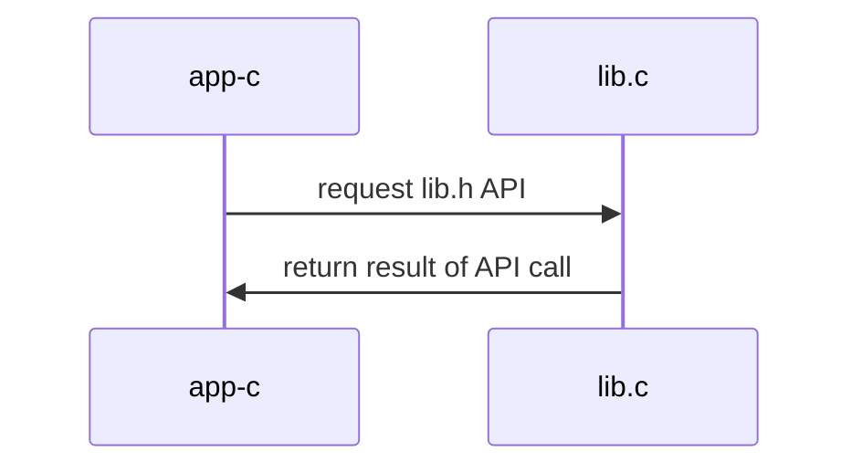

## Materiales usados en ARCOS.INF.UC3M.ES con Licencia GPLv3.0
  * Felix García Carballeira y Alejandro Calderón Mateos

## Servicio centralizado con librería

### Compilar 

Hay que introducir:
```
cd centralizado-librería
make
```

Y la salida debería ser similar a:
```
gcc -g -Wall -c app-c.c
gcc -g -Wall -c lib.c
gcc -g -Wall app-c.o lib.o  -o app-c
```

### Ejecutar

Hay que introducir:
```
./app-c
```

Y la salida debería ser similar a:
```
0 = add(30, 20, 10)
0 = divide(2, 20, 10)
0 = neg(-10, 10)
```

### Arquitectura



