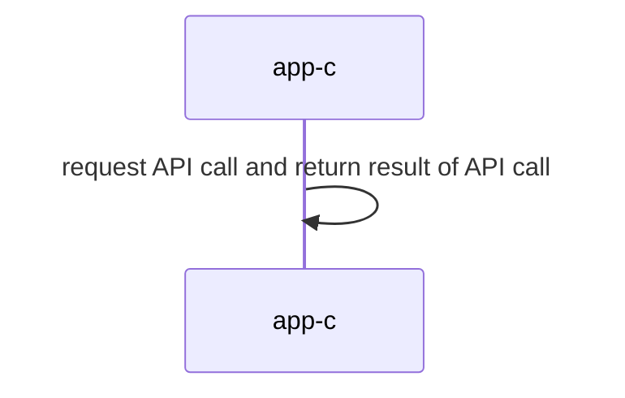

## Materiales usados en ARCOS.INF.UC3M.ES con Licencia CC BY-NC-SA 4.0
  * Felix García Carballeira y Alejandro Calderón Mateos

## Servicio centralizado monolítico

### Compilar

Hay que introducir:
```
cd cal-centralizado-monolitico
make
```

Y la salida debería ser similar a:
```
gcc -g -Wall -c app-c.c
gcc -g -Wall app-c.o  -o app-c
```

### Ejecutar 

Hay que introducir:
```
./app-c
```

Y la salida debería ser similar a:
```
0 = add(30, 20, 10)
0 = divide(2, 20, 10)
0 = neg(-10, 10)
```

### Arquitectura



