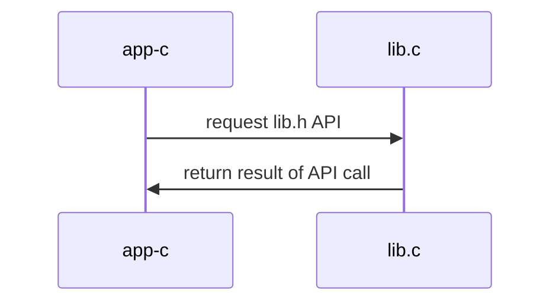

## Materiales usados en ARCOS.INF.UC3M.ES con Licencia GPLv3.0
  * Felix García Carballeira y Alejandro Calderón Mateos

## Servicio centralizado con librería

### Compilar 

Hay que introducir:
```
cd centralizado-librería
make
```

Y la salida debería ser similar a:
```
gcc -g -Wall -c app-c.c
gcc -g -Wall -c lib.c
gcc -g -Wall app-c.o lib.o  -o app-c
```

### Ejecutar

Hay que introducir:
```
./app-c
```

Y la salida debería ser similar a:
```
set("nombre", 100, 0x0)
set("nombre", 101, 0x1)
set("nombre", 102, 0x2)
...
get("nombre", 107) -> 0x7
get("nombre", 108) -> 0x8
get("nombre", 109) -> 0x9
```

### Arquitectura



