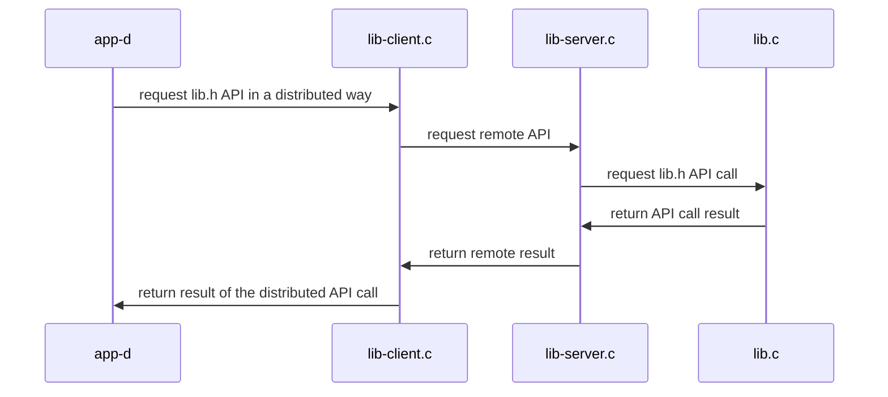

## Materiales usados en ARCOS.INF.UC3M.ES con Licencia GPLv3.0
  * Felix García Carballeira y Alejandro Calderón Mateos

## Servicio distribuido basado en RPC

### (0) Pasos iniciales para Ubuntu 22.04 o compatible:

  1) Instalar pre-requisitos:
     ```
     sudo apt-get install libtirpc-common libtirpc-dev libtirpc3  rpcbind build-essential  
     ```
  2) Configurar pre-requisitos:
     ```
     sudo mkdir -p /run/sendsigs.omit.d/
     sudo /etc/init.d/rpcbind restart
     ```

### (1) Pasos para crear una aplicación distribuida con las RPC:

  1) Crear el archivo IDL usando lenguaje XDR (que es parecido a C pero no exactamente C). \
     Nuestro ejemplo de [message.x](message.x) es:
     ```
     struct get_res 
     {
       int value ;
       int status ;
     } ;
     program NANODT
     {
      	version NANODT_VERSION
       {
		        int            d_init ( string name, int N )            = 1 ;
		        int            d_set  ( string name, int i, int value ) = 2 ;
		        struct get_res d_get  ( string name, int i )            = 3 ;
	      } = 1 ;
     } = 55555 ;
     ```

  2) Uso de rpcgen con archivo de IDL:
     ```
     rpcgen -a -N -M message.x
     ```
     NOTA: este mandato genera distintos ficheros, los siguientes no han de modificarse:
     * **message.h**: definición de tipos y funciones a partir de lo indicado en message.x
     * **message_clnt.c**: *stub* o suplente RPC en el lado del cliente.
     * **message_svc.c**: *stub* o suplente RPC en el lado del servidor.
     * **message_xdr.c**: encargado del *marshalling* y *unmarshalling* de los datos.

  3) Solo en el caso de usar Ubuntu 22.04 o compatible, habría que editar Makefile.rpc y revisar que CFLAGS y LDFLAGS usan tirpc:
     ```
     ...
     CFLAGS  += -g -I/usr/include/tirpc
     LDFLAGS += -lnsl -lpthread -ldl -ltirpc
     ...
     ```

  4) Hay que completar el código que rpcgen genera, para ello hay que:
     * Añadir el código en el lado del servidor, que implementa el servicio RPC.
     * Añadir el código en el lado del cliente, que usa el API del servicio RPC.
     * Modificar Makefile para compilar nuestro proyecto.

     NOTA: el mandato rpcgen nos ayuda en gran parte del trabajo al generar unos archivos que nos pueden servir de plantilla y que hay que modificar para nuestro proyecto:
     * **message_server.c**: plantilla para el archivo lib-server.c que implementa la interfaz en el servidor.
     * **message_client.c**: ejemplo de programa cliente que hace llamadas RPC
     * **Makefile.message**: plantilla para archivo de compilación, hay que añadir los archivos extras que tenga el proyecto

     En nuestro ejemplo usaremos los siguientes archivos en lugar de los generados por rpcgen:
     * En el lado del servidor (lib-server.c + lib.c + lib.h):
       * **[lib-server.c](lib-server.c)**: implementación de la interfaz RPC
       * **[lib.c](lib.c)**: implementación de la interfaz a ser usada en el lado del servidor
       * **[lib.h](lib.h)**: interfaz a ser usada en el lado del servidor
     * En el lado del cliente (app-d.c):
       * **[lib-client.c](lib-client.c)**: implementación del proxy que usa la interfaz RPC
       * **[app-d.c](app-d.c)**: implementación de programa cliente que usa la interfaz de lib-client.c (la de lib.h en el cliente)
     * El Makefile.rpc para compilar:
       * **[Makefile.rpc](Makefile.rpc)**: archivo para compilar todo


### (2) Compilar

* A continuación hay que compilar:
  ```
  make -f Makefile.rpc
  ```

* Y la salida debería ser similar a:
  ```
  gcc -g -Wall -c app-d.c
  gcc -g -Wall -c lib-client.c
  gcc -g -Wall -c message_clnt.c
  gcc -g -Wall -c message_xdr.c
  gcc -g -Wall    app-d.o lib-client.o message_clnt.o message_xdr.o  -o app-d 
  gcc -g -Wall -c lib.c
  gcc -g -Wall -c lib-server.c
  gcc -g -Wall -c message_svc.c
  gcc -g -Wall    lib-server.o  lib.o  message_svc.o  message_xdr.o  -o lib-server 
  ```

#### (3) Ejecutar

<html>
<table>
<tr><th>Paso</th><th>Cliente</th><th>Servidor</th></tr>
<tr>
<td>1</td>
<td></td>
<td>

```
$ ./lib-server
```

</td>
</tr>

<tr>
<td>2</td>
<td>

```
$ ./app-d localhost
d_set("nombre", 1, 0x123)
d_get("nombre", 1) -> 0x123
```

</td>
<td>

```

 1 = init(nombre, 10);
 1 = set(nombre, 1, 0x123);
 1 = get(nombre, 1, 0x123);
```

</td>
</tr>

<tr>
<td>3</td>
<td></td>
<td>

Para parar el servidor hay que presionar Control-C:

```
^Caccept: Interrupted system call
```

</td>
</tr>
</table>
</html>


#### Arquitectura



