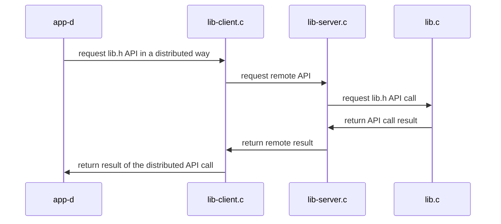

# Ejemplo de transformación de aplicación monolítica a aplicación distribuida
+ **Felix García Carballeira y Alejandro Calderón Mateos**
+ Licencia [GPLv3.0](https://github.com/acaldero/uc3m_sd/blob/main/LICENSE)


## Aplicación centralizado inicial

Partimos de una abstracción de *una tabla hash* con la siguiente interfaz:
```
  // Inicializar un array distribuido de N números enteros.
  int init ( char  *nombre,  int  N ) ;

  // Inserta el valor en la posición i del array nombre.
  int set ( char *nombre, int i, int valor ) ;

  // Recuperar el valor del elemento i del array nombre.
  int get ( char *nombre, int i, int *valor ) ;
```

Y tenemos la siguiente función que usa dicha abstracción:
```
int main ( int argc, char *argv[] )
{
    int   N = 10 ;
    char *A = "nombre" ;
    int   val ;

    // init
    init(A, N) ;

    // set
    for (int i=0; i<N; i++) {
	 set (A, 100+i, i) ;
    }

    // get
    for (int i=0; i<N; i++) {
	 get (A, 100+i, &val) ;
    }

    return 0 ;
}
```

Dicha abstracción se diseña e implementa inicialmente:
  * En ún único fichero fuente (monolítico) y
  * Se despliega como único ejecutable (centralizado)

El código fuente, las instrucciones de compilación y las instrucciones para la ejecución están en:
  * [Servicio centralizado monolítico](/centralizado-monolitico/README.md#servicio-centralizado-monol%C3%ADtico)

Partiendo de esta versión inicial monolítica centralizada,
para transformar a un servicio distribuidos, se aconseja seguir los siguientes pasos:
 ```mermaid
  flowchart LR
    A[monolítico] --> B[librería]
    B[librería]   --> C{Patrón proxy y <br>mecanismo...}
    C -- mqueue   --> D[colas POSIX]
    C -- sockets  --> E[sockets]
    C -- RPC      --> F[RPC]
  ```

La primera transformación consiste en que la abstracción esté en una librería y el programa principal haga uso de esta librería.

Para la siguiente transformacion, el [patrón proxy](https://es.wikipedia.org/wiki/Proxy_(patr%C3%B3n_de_dise%C3%B1o)) es importante para que el programa principal crea estar trabajando con una librería local cuando realmente la implementación será remota.
La librería local realmente es un suplente (*stub*) que se comunica con la implementación remota utilizando algún mecanismo de comunicación de entre los disponibles (colas POSIX, sockets, etc.)


## Servicio centralizado con librería

Dicha abstracción se diseña e implementa inicialmente:
  * En varios fichero fuente (librería + aplicación) y
  * Se despliega como único ejecutable (centralizado)

El código fuente, las instrucciones de compilación y las instrucciones para la ejecución están en:
  * [Servicio centralizado con librería](/centralizado-libreria/README.md)

La arquitectura se puede resumir como:
  ```mermaid
  sequenceDiagram
      app-c   ->> lib.c: request lib.h API
      lib.c   ->> app-c: return result of API call
  ```


## Servicio distribuido basado en colas POSIX

Dicha abstracción se diseña e implementa inicialmente:
  * En varios fichero fuente (librería y ejecutables) y
  * Se despliega como varios ejecutables (distribuidos) usando colas POSIX

El código fuente, las instrucciones de compilación y las instrucciones para la ejecución están en:
  * [Servicio distribuido basado en colas POSIX](/distribuido-mqueue/README.md)

La arquitectura se puede resumir como:



## Servicio distribuido basado en sockets

Dicha abstracción se diseña e implementa inicialmente:
  * En varios fichero fuente (librería y ejecutables) y
  * Se despliega como varios ejecutables (distribuidos) usando sockets

El código fuente, las instrucciones de compilación y las instrucciones para la ejecución están en:
  * [Servicio distribuido basado en sockets](/distribuido-sockets/README.md)

La arquitectura se puede resumir como:


## Servicio distribuido basado en RPC

Dicha abstracción se diseña e implementa inicialmente:
  * En varios fichero fuente (librería y ejecutables) y
  * Se despliega como varios ejecutables (distribuidos) usando RPC

El código fuente, las instrucciones de compilación y las instrucciones para la ejecución están en:
  * [Servicio distribuido basado en RPC](/distribuido-rpc/README.md)

La arquitectura se puede resumir como:


## Información adicional

 * [Introducción al lab 1](https://www.youtube.com/watch?v=LWeuoihcKyI)
 * [Introducción al lab 2](https://www.youtube.com/watch?v=tmFu_JenEi0)


