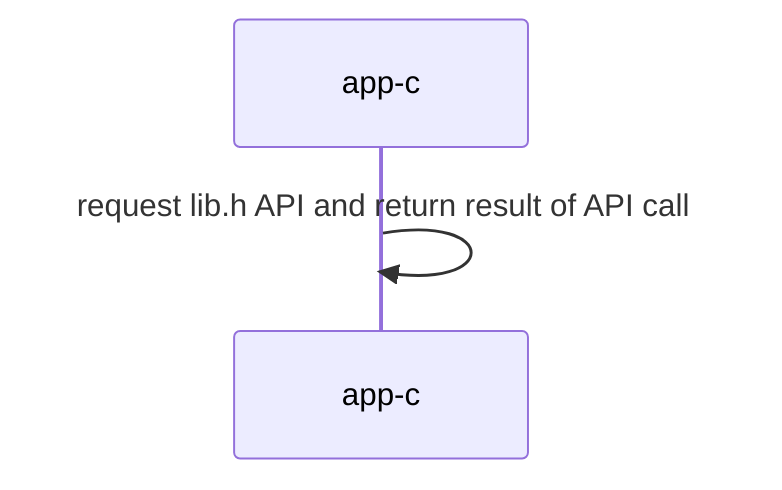

## Materiales usados en ARCOS.INF.UC3M.ES con Licencia GPLv3.0
  * Felix García Carballeira y Alejandro Calderón Mateos

## Sistemas Distribuidos

### Servicio centralizado monolítico

### Compilar

Hay que introducir:
```
cd centralizado-monolitico
make
```

Y la salida debería ser similar a:
```
gcc -g -Wall -c app-c.c
gcc -g -Wall app-c.o  -o app-c
```

### Ejecutar 

Hay que introducir:
```
./app-c
```

Y la salida debería ser similar a:
```
set("nombre", 100, 0x0)
set("nombre", 101, 0x1)
set("nombre", 102, 0x2)
set("nombre", 103, 0x3)
set("nombre", 104, 0x4)
set("nombre", 105, 0x5)
set("nombre", 106, 0x6)
set("nombre", 107, 0x7)
set("nombre", 108, 0x8)
set("nombre", 109, 0x9)
get("nombre", 100) -> 0x0
get("nombre", 101) -> 0x1
get("nombre", 102) -> 0x2
get("nombre", 103) -> 0x3
get("nombre", 104) -> 0x4
get("nombre", 105) -> 0x5
get("nombre", 106) -> 0x6
get("nombre", 107) -> 0x7
get("nombre", 108) -> 0x8
get("nombre", 109) -> 0x9
```

### Arquitectura



