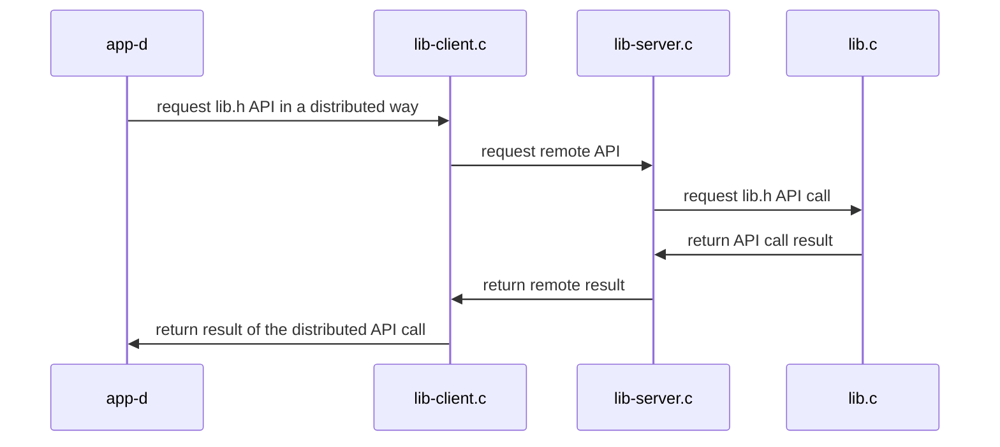

# Ejemplo de transformación de aplicación monolítica a aplicación distribuida
+ **Felix García Carballeira y Alejandro Calderón Mateos**
+ [](https://github.com/acaldero/uc3m_sd/blob/main/LICENSE)


## Aplicación centralizado inicial

Partimos de una abstracción de *calculadora básica* con la siguiente interfaz:
```
  // Sumar dos números enteros.
  int add ( int a, int b ) ;

  // Resta dos números enteros.
  int sub ( int a, int b ) ;

  // Cambio de signo de un número entero.
  int neg ( int a ) ;
```

Y tenemos la siguiente función que usa dicha abstracción:
```
int main ( int argc, char *argv[] )
{
    int   N1 = 20 ;
    int   N2 = 10 ;
    int   val ;

    // add
    val = add(N1, N2) ;
    printf("%d + %d = %d\n", N1, N2, val) ;

    // sub
    val = sub(N1, N2) ;
    printf("%d - %d = %d\n", N1, N2, val) ;

    // neg
    val = neg(N2) ;
    printf("-%d = %d\n", N2, val) ;

    return 0 ;
}
```

Dicha abstracción se diseña e implementa inicialmente:
  * En ún único fichero fuente (monolítico) y
  * Se despliega como único ejecutable (centralizado)

El código fuente, las instrucciones de compilación y las instrucciones para la ejecución están en:
  * [Servicio centralizado monolítico](/cp-calculadora/cal-centralizado-monolitico#readme)

Partiendo de esta versión inicial monolítica centralizada,
para transformar a un servicio distribuidos, se aconseja seguir los siguientes pasos:
 ```mermaid
  flowchart LR
    A[monolítico] --> B[librería]
    B[librería]   --> C{Patrón proxy y <br>mecanismo...}
    C -- mqueue   --> D[colas POSIX]
    C -- sockets  --> E[sockets]
    C -- RPC      --> F[RPC]
    C -- GSOAP    --> G[GSOAP]
  ```

La primera transformación consiste en que la abstracción esté en una librería y el programa principal haga uso de esta librería.

Para la siguiente transformacion, el [patrón proxy](https://es.wikipedia.org/wiki/Proxy_(patr%C3%B3n_de_dise%C3%B1o)) es importante para que el programa principal crea estar trabajando con una librería local cuando realmente la implementación será remota.
La librería local realmente es un suplente (*stub*) que se comunica con la implementación remota utilizando algún mecanismo de comunicación de entre los disponibles (colas POSIX, sockets, etc.)


## Servicio centralizado con librería

Dicha abstracción se diseña e implementa inicialmente:
  * En varios fichero fuente (librería + aplicación) y
  * Se despliega como único ejecutable (centralizado)

El código fuente, las instrucciones de compilación y las instrucciones para la ejecución están en:
  * [Servicio centralizado con librería](/cp-calculadora/cal-centralizado-libreria#readme)

La arquitectura se puede resumir como:
  ```mermaid
  sequenceDiagram
      app-c   ->> lib.c: request lib.h API
      lib.c   ->> app-c: return result of API call
  ```


## Servicio distribuido basado en colas POSIX

Dicha abstracción se diseña e implementa inicialmente:
  * En varios fichero fuente (librería y ejecutables) y
  * Se despliega como varios ejecutables (distribuidos) usando colas POSIX

El código fuente, las instrucciones de compilación y las instrucciones para la ejecución están en:
  * [Servicio distribuido basado en colas POSIX](/cp-calculadora/cal-distribuido-mqueue#readme)

La arquitectura se puede resumir como:



## Servicio distribuido basado en sockets

Dicha abstracción se diseña e implementa inicialmente:
  * En varios fichero fuente (librería y ejecutables) y
  * Se despliega como varios ejecutables (distribuidos) usando sockets

El código fuente, las instrucciones de compilación y las instrucciones para la ejecución están en:
  * [Servicio distribuido basado en sockets](/cp-calculadora/cal-distribuido-sockets#readme)

La arquitectura se puede resumir como:


## Servicio distribuido basado en RPC

Dicha abstracción se diseña e implementa inicialmente:
  * En varios fichero fuente (librería y ejecutables) y
  * Se despliega como varios ejecutables (distribuidos) usando RPC

El código fuente, las instrucciones de compilación y las instrucciones para la ejecución están en:
  * [Servicio distribuido basado en RPC](/cp-calculadora/cal-distribuido-rpc#readme)

La arquitectura se puede resumir como:


## Servicio distribuido basado en GSOAP

Dicha abstracción se diseña e implementa inicialmente:
  * En varios fichero fuente (librería y ejecutables) y
  * Se despliega como varios ejecutables (distribuidos) usando GSOAP

El código fuente, las instrucciones de compilación y las instrucciones para la ejecución están en:
  * [Servicio distribuido basado en GSOAP](/cp-calculadora/cal-distribuido-gsoap-standalone#readme)

La arquitectura se puede resumir como:


## Información adicional

 * [Introducción al lab 1](https://www.youtube.com/watch?v=LWeuoihcKyI)
 * [Introducción al lab 2](https://www.youtube.com/watch?v=tmFu_JenEi0)


