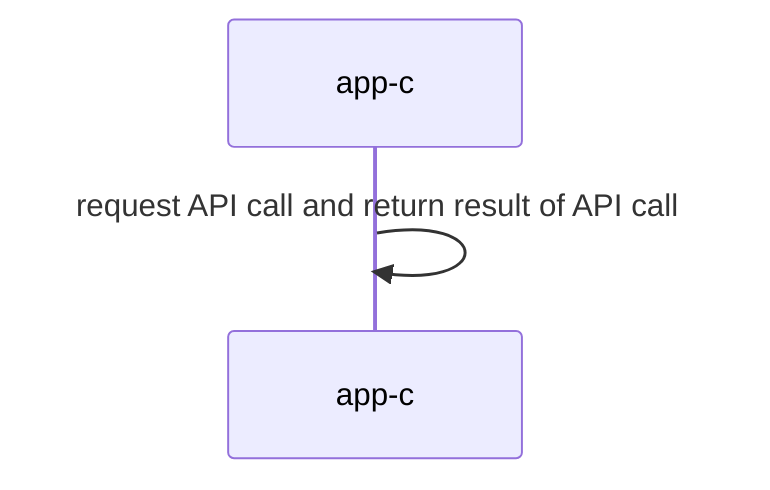

## Sistemas Distribuidos: materiales complementarios
+ **Felix García Carballeira y Alejandro Calderón Mateos**
+ [](https://github.com/acaldero/uc3m_sd/blob/main/LICENSE)
+ ARCOS.INF.UC3M.ES


## Servicio centralizado monolítico

### Compilar

Hay que introducir:
```
cd kv-centralizado-monolitico
make
```

Y la salida debería ser similar a:
```
gcc -g -Wall -c app-c.c
gcc -g -Wall app-c.o  -o app-c
```

### Ejecutar 

Hay que introducir:
```
./app-c
```

Y la salida debería ser similar a:
```
set("nombre", 100, 0x0)
set("nombre", 101, 0x1)
set("nombre", 102, 0x2)
...
get("nombre", 107) -> 0x7
get("nombre", 108) -> 0x8
get("nombre", 109) -> 0x9
```

### Arquitectura



