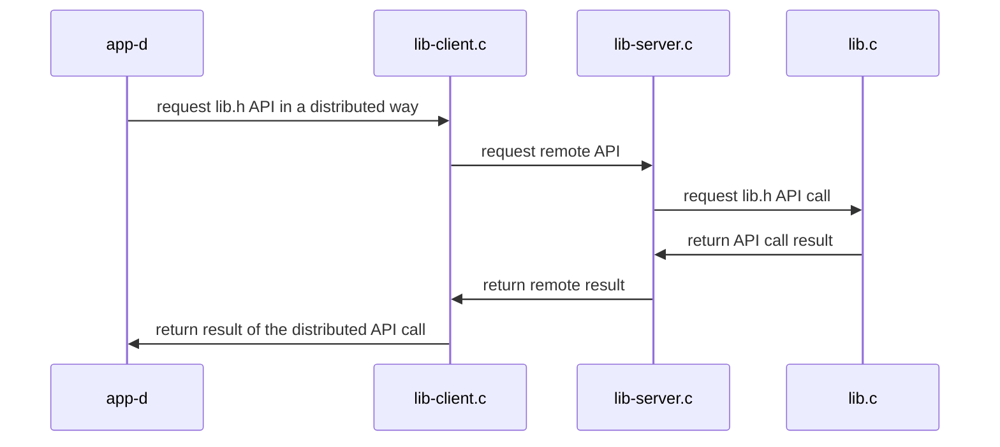

## Sistemas Distribuidos: materiales complementarios
+ **Felix García Carballeira y Alejandro Calderón Mateos**
+ [](https://github.com/acaldero/uc3m_sd/blob/main/LICENSE)
+ ARCOS.INF.UC3M.ES


## Servicio distribuido basado en RPC

### (0) Pasos iniciales para tener las RPC en una distribución Linux compatible con Ubuntu 22.04:

  1) Instalar software y sus pre-requisitos:
     ```
     sudo apt-get install libtirpc-common libtirpc-dev libtirpc3  rpcbind build-essential
     ```
  2) Configurar software y pre-requisitos:
     ```
     sudo mkdir -p /run/sendsigs.omit.d/
     sudo /etc/init.d/rpcbind restart
     ```


### (1) Pasos para crear una aplicación distribuida con las RPC:

  1) Crear el archivo IDL usando lenguaje XDR (que es parecido a C pero no exactamente C).
     * Nuestro ejemplo de [message.x](message.x) es:
       ```
       struct result
       {
         int value ;
         int status ;
       } ;
       
       program NANODT
       {
        	version NANODT_VERSION
          {
		        int            d_init ( string name, int N )            = 1 ;
		        int            d_set  ( string name, int i, int value ) = 2 ;
		        struct get_res d_get  ( string name, int i )            = 3 ;
	       } = 1 ;
	       
       } = 55555 ;
       ```

  2) Uso de rpcgen con el archivo IDL:
     * Para nuestro ejemplo es:
       ```
       rpcgen -a -N -M message.x
       ```
     * Este mandato debería generar los siguientes ficheros:

       |    **Fichero**   	| **Debería editarse o usarse como plantilla**     	| **Dónde se utiliza** 	| **Significado**                                                                                                                             	|
       |:----------------	|:------------------------------------------------:	|:--------------------:	|:------------------------------------------------------------------------------------------------------------------------------------------- |
       | message.h        	|                        No                        	| Cliente y servidor   	| Definición de tipos y funciones a partir de lo indicado en message.x                                                                        	|
       | message_xdr.c    	|                        No                        	| Cliente y servidor   	| Encargado del *marshalling* y *unmarshalling* de los datos                                                                                  	|
       | message_clnt.c   	|                        No                        	| Cliente              	| *stub* o suplente RPC en el lado del cliente                                                                                                	|
       | message_svc.c    	|                        No                        	| Servidor             	| *stub* o suplente RPC en el lado del servidor                                                                                               	|
       | message_server.c 	|                        Si                        	| Servidor             	| Esqueleto para implementar la interfaz en el servidor.<br>Se utiliza como plantilla para lib-server.c                                       	|
       | message_client.c 	|                        Si                        	| Cliente              	| Ejemplo de programa cliente que hace llamadas RPC                                                                                           	|
       | Makefile.message 	|                        Si                        	| Para compilar        	| Plantilla para archivo de compilación.<br>Hay que añadir los archivos extras del proyecto y revisar que las opciones se ajusten al proyecto 	|

  3) Completar el código que rpcgen genera en el lado del **servidor**:
     * En el ejemplo se tiene *lib-server.c + lib.c + lib.h*:
       * **[lib-server.c](lib-server.c)**: implementación de la interfaz RPC usando **message_server.c** como plantilla inicial
       * **[lib.c](lib.c)**: implementación de la interfaz a ser usada en el lado del servidor
       * **[lib.h](lib.h)**: interfaz a ser usada en el lado del servidor

  4) Completar el código que rpcgen genera en el lado del **cliente**:
     * En el ejemplo se tiene *lib-client.c + lib-client.h + app-d.c*:
       * **[lib-client.c](lib-client.c)**: implementación del proxy que usa la interfaz RPC, usando fragmentos de **message_client.c**
       * **[lib-client.h](lib-client.h)**: implementación de la interfaz de lib.h en el cliente, usando **lib.h**
       * **[app-d.c](app-d.c)**: implementación de programa cliente que usa la interfaz de lib-client.c (la de lib.h en el cliente)

  5) Crear **Makefile.rpc** usando **Makefile.message** como plantilla y revisar los siguientes aspectos:
     * En el caso de usar Linux Ubuntu 22.04 o compatible, hay que revisar que CFLAGS y LDFLAGS usan tirpc:
       ```
       ...
       CFLAGS  += -g -I/usr/include/tirpc         # añadir -I/usr/include/tirpc
       LDFLAGS += -lnsl -lpthread -ldl -ltirpc    # añadir -ltirpc
       ...
       ```
     * Añadir los archivos adicionales necesarios para el proyecto:
        ```
       TARGETS_SVC.c  = lib-server.c lib.c    message_svc.c  message_xdr.c
       TARGETS_CLNT.c = app-d.c lib-client.c  message_clnt.c message_xdr.c
       ```
     * Cambiar el nombre de los archivos ejecutables:
        ```
       SERVER = lib-server   # message_server
       CLIENT = app-d        # message_client
       ```
     * Si se modifica **message_server.c** y/o **message_client.c** entoces mejor quitar *$(TARGETS)* de la regla *clean:*:
       ```
       clean:
               # $(RM) core $(TARGETS) $(OBJECTS_CLNT) $(OBJECTS_SVC) $(CLIENT) $(SERVER)
                 $(RM) core            $(OBJECTS_CLNT) $(OBJECTS_SVC) $(CLIENT) $(SERVER)
       ```
       De otra forma cada vez que se haga "make clean" se borran los archivos modificados.


### (2) Compilar

* A continuación hay que compilar:
  ```
  make -f Makefile.rpc
  ```

* Y la salida debería ser similar a:
  ```
  gcc -g -Wall -I/usr/include/tirpc -c app-d.c
  gcc -g -Wall -I/usr/include/tirpc -c lib-client.c
  gcc -g -Wall -I/usr/include/tirpc -c message_clnt.c
  gcc -g -Wall -I/usr/include/tirpc -c message_xdr.c
  gcc -g -Wall -I/usr/include/tirpc lib-client.o app-d.o message_clnt.o message_xdr.o  -o app-d -lnsl -lpthread -ldl -ltirpc
  gcc -g -Wall -I/usr/include/tirpc -c lib.c
  gcc -g -Wall -I/usr/include/tirpc -c lib-server.c
  gcc -g -Wall -I/usr/include/tirpc -c message_svc.c
  gcc -g -Wall -I/usr/include/tirpc lib-server.o  lib.o  message_svc.o  message_xdr.o  -o lib-server -lnsl -lpthread -ldl -ltirpc
  ```


### (3) Ejecutar


<html>
<table>
<tr><th>Paso</th><th>Cliente</th><th>Servidor</th></tr>
<tr>
<td>1</td>
<td></td>
<td>

```
$ ./lib-server
```

</td>
</tr>

<tr>
<td>2</td>
<td>

```
$ ./app-d localhost
d_set("nombre", 1, 0x123)
d_get("nombre", 1) -> 0x123
```

</td>
<td>

```

 1 = init(nombre, 10);
 1 = set(nombre, 1, 0x123);
 1 = get(nombre, 1, 0x123);
```

</td>
</tr>

<tr>
<td>3</td>
<td></td>
<td>

Para parar el servidor hay que presionar Control-C:

```
^Caccept: Interrupted system call
```

</td>
</tr>
</table>
</html>


#### Arquitectura



