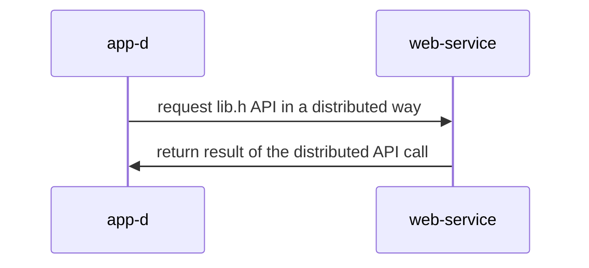

## Materiales usados en ARCOS.INF.UC3M.ES con Licencia GPLv3.0
  * Felix García Carballeira y Alejandro Calderón Mateos

## Servicio distribuido basado en gSOAP

#### Compilar

Hay que introducir:
```
cd distribuido-gsoap-xml
make
```

Si no se tiene instalado gsoap, se puede instalar con:
 * Linux (Ubuntu, Debian o similar):
   ```
   sudo apt-get install -y gsoap
   ```
 * MacOS
   ```
   brew install gsoap
   ```

Y la salida debería ser similar a:
```
soapcpp2 -cL calc.h

**  The gSOAP code generator for C and C++, soapcpp2 release 2.8.127
**  Copyright (C) 2000-2023, Robert van Engelen, Genivia Inc.
**  All Rights Reserved. This product is provided "as is", without any warranty.
**  The soapcpp2 tool and its generated software are released under the GPL.
**  ----------------------------------------------------------------------------
**  A commercial use license is available from Genivia Inc., contact@genivia.com
**  ----------------------------------------------------------------------------

Saving soapStub.h annotated copy of the source interface header file
Saving soapH.h serialization functions to #include in projects
Using ns service name: calc
Using ns service style: document
Using ns service encoding: literal
Using ns schema namespace: urn:calc
Saving calc.wsdl Web Service description
Saving calc.add.req.xml sample SOAP/XML request
Saving calc.add.res.xml sample SOAP/XML response
Saving calc.sub.req.xml sample SOAP/XML request
Saving calc.sub.res.xml sample SOAP/XML response
Saving calc.nsmap namespace mapping table
Saving ns.xsd XML schema
Saving soapClient.c client call stub functions
Saving soapServer.c server request dispatcher
Saving soapC.c serialization functions

Compilation successful 

gcc -o app-d       -I/opt/homebrew/Cellar/gsoap/2.8.127/include/ -L/opt/homebrew/Cellar/gsoap/2.8.127/lib/ app-d.c      soapC.c soapClient.c -lgsoap
gcc -o lib-server  -I/opt/homebrew/Cellar/gsoap/2.8.127/include/ -L/opt/homebrew/Cellar/gsoap/2.8.127/lib/ lib-server.c soapC.c soapServer.c -lgsoap
```

#### Ejecutar

<html>
<table>
<tr><th>Paso</th><th>Cliente</th><th>Servidor</th></tr>

<tr>
<td>1</td>
<td>

```
```

</td>
<td>

```
$ ./lib-server 12345
```

</td>
</tr>

<tr>
<td>2</td>
<td>

```
$ ./app-d a 2 3
result = 5
```

</td>
<td>

```
```

</td>
</tr>

</table>
</html>


#### Arquitectura




https://www.genivia.com/dev.html#client-c


