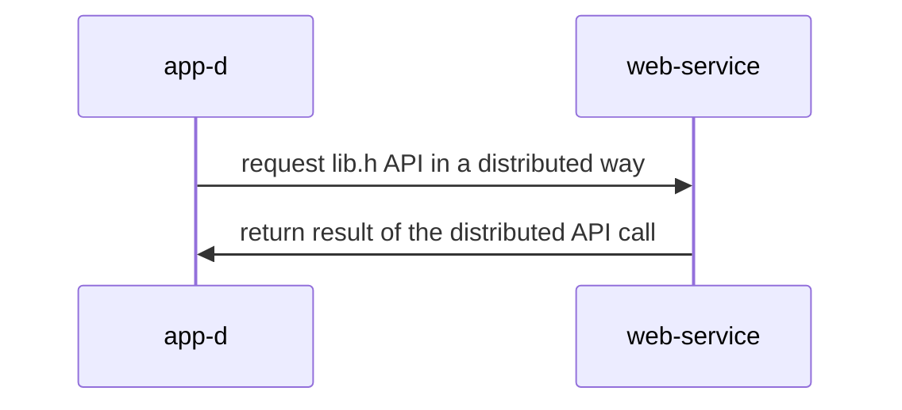

## Materiales usados en ARCOS.INF.UC3M.ES con Licencia GPLv3.0
  * Felix García Carballeira y Alejandro Calderón Mateos

## Servicio distribuido basado en gSOAP

#### Compilar

Hay que introducir:
```
cd distribuido-gsoap-xml
make
```

Si no se tiene instalado gsoap, se puede instalar con:
 * Linux (Ubuntu, Debian o similar):
   ```
   sudo apt-get install -y gsoap
   ```
 * MacOS
   ```
   brew install gsoap
   ```

Y la salida debería ser similar a:
```
wsdl2h -c -o calc.h http://www.genivia.com/calc.wsdl
Saving calc.h


**  The gSOAP WSDL/WADL/XSD processor for C and C++, wsdl2h release 2.8.127
**  Copyright (C) 2000-2023 Robert van Engelen, Genivia Inc.
**  All Rights Reserved. This product is provided "as is", without any warranty.
**  The wsdl2h tool and its generated software are released under the GPL.
**  ----------------------------------------------------------------------------
**  A commercial use license is available from Genivia Inc., contact@genivia.com
**  ----------------------------------------------------------------------------

Reading type definitions from type map "/opt/homebrew/Cellar/gsoap/2.8.127/share/gsoap/WS/typemap.dat"
Connecting to 'http://www.genivia.com/calc.wsdl' to retrieve WSDL/WADL or XSD... connected, receiving...
Done reading 'http://www.genivia.com/calc.wsdl'

To finalize code generation, execute:
> soapcpp2 calc.h

soapcpp2 -CL calc.h

**  The gSOAP code generator for C and C++, soapcpp2 release 2.8.127
**  Copyright (C) 2000-2023, Robert van Engelen, Genivia Inc.
**  All Rights Reserved. This product is provided "as is", without any warranty.
**  The soapcpp2 tool and its generated software are released under the GPL.
**  ----------------------------------------------------------------------------
**  A commercial use license is available from Genivia Inc., contact@genivia.com
**  ----------------------------------------------------------------------------

Saving soapStub.h annotated copy of the source interface header file
Saving soapH.h serialization functions to #include in projects
Using ns2 service name: calc
Using ns2 service style: document
Using ns2 service encoding: literal
Using ns2 service location: http://websrv.cs.fsu.edu/~engelen/calcserver.cgi
Using ns2 schema namespace: urn:calc
Saving calc.add.req.xml sample SOAP/XML request
Saving calc.add.res.xml sample SOAP/XML response
Saving calc.sub.req.xml sample SOAP/XML request
Saving calc.sub.res.xml sample SOAP/XML response
Saving calc.mul.req.xml sample SOAP/XML request
Saving calc.mul.res.xml sample SOAP/XML response
Saving calc.div.req.xml sample SOAP/XML request
Saving calc.div.res.xml sample SOAP/XML response
Saving calc.pow.req.xml sample SOAP/XML request
Saving calc.pow.res.xml sample SOAP/XML response
Saving calc.nsmap namespace mapping table
Saving soapClient.c client call stub functions
Saving soapC.c serialization functions

Compilation successful 

gcc -o app-d  -I/opt/homebrew/Cellar/gsoap/2.8.127/include/ -L/opt/homebrew/Cellar/gsoap/2.8.127/lib/ app-d.c soapC.c soapClient.c -lgsoap
```

#### Ejecutar

<html>
<table>
<tr><th>Paso</th><th>Cliente</th><th>Servidor</th></tr>

<tr>
<td>1</td>
<td>

```
$ ./app-d 
Sum = 5.79
```

</td>
<td>

```
```

</td>
</tr>

</table>
</html>


#### Arquitectura




https://www.genivia.com/dev.html#client-c


