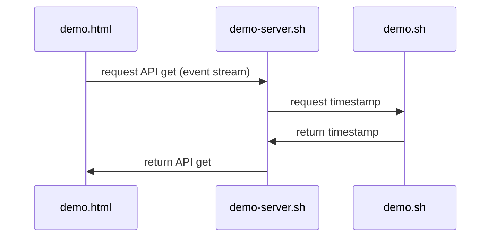

## Materiales usados en ARCOS.INF.UC3M.ES con Licencia GPLv3.0
  * Felix García Carballeira y Alejandro Calderón Mateos

## Servicio distribuido basado en HTML5 Server-Sent Events

#### Compilar

Hay que introducir:
```
cd distribuido-rest-sse-bash
```


#### Ejecutar

<html>
<table>
<tr><th>Paso</th><th>Cliente</th><th>Servidor</th></tr>
<tr>
<td>1</td>
<td></td>
<td>

```
$ ./demo-server
```

</td>
</tr>

<tr>
<td>2</td>
<td>

```
$ open demo.html
```

</td>
<td>

```
{'timestamp': ...}
...
```

</td>
</tr>

<tr>
<td>3</td>
<td></td>
<td>

```
^Caccept: Interrupted system call
```

</td>
</tr>
</table>
</html>


#### Arquitectura




## Información adicional

 * [IoT y sistemas distribuidos](https://acaldero.github.io/slides/MCYTI_Disenyo_De_Sistemas_Distribuidos/mcti-dsd-se-v5d.pdf#34)
 * [Server sent events](https://developer.mozilla.org/es/docs/Web/API/Server-sent_events/Using_server-sent_events)

