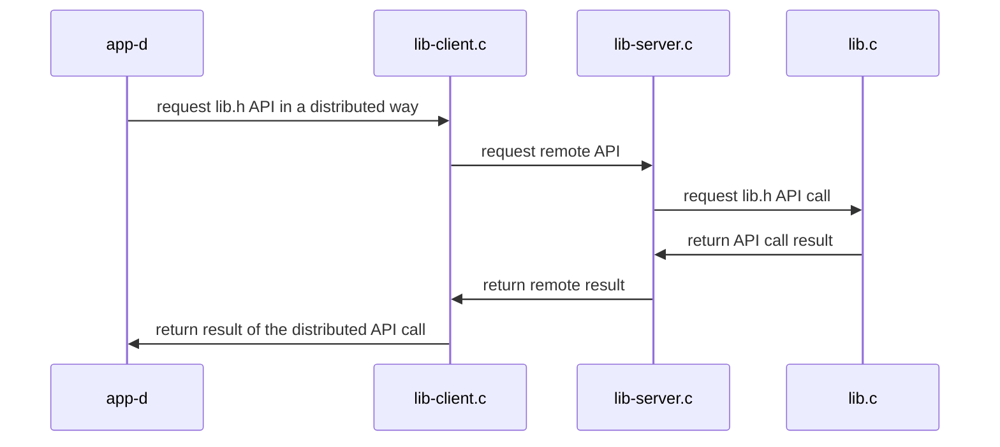

## Materiales usados en ARCOS.INF.UC3M.ES con Licencia GPLv3.0
  * Felix García Carballeira y Alejandro Calderón Mateos

## Servicio distribuido basado en RPC

### (0) Pasos iniciales para Ubuntu 22.04 o compatible:

  1) Instalar pre-requisitos:
     ```
     sudo apt-get install libtirpc-common libtirpc-dev libtirpc3  rpcbind build-essential  
     ```
  2) Configurar pre-requisitos:
     ```
     sudo mkdir -p /run/sendsigs.omit.d/
     sudo /etc/init.d/rpcbind restart
     ```

### (1) Pasos para crear una aplicación distribuida con las RPC:

  1) Crear el archivo IDL usando lenguaje XDR (que es parecido a C pero no exactamente C). \
     Por ejemplo, "message.x":
     ```
     struct get_res 
     {
       int value ;
       int status ;
     } ;
     program NANODT
     {
      	version NANODT_VERSION
       {
		        int            d_init ( string name, int N )            = 1 ;
		        int            d_set  ( string name, int i, int value ) = 2 ;
		        struct get_res d_get  ( string name, int i )            = 3 ;
	      } = 1 ;
     } = 55555 ;
     ```

  2) Uso de rpcgen con archivo de IDL:
     ```
     rpcgen -a -N -M suma.x
     ```

  3) Solo en el caso de usar Ubuntu 22.04 o compatible, habría que editar Makefile.suma y revisar que CFLAGS y LDLIBS usan tirpc:
     ```
     ...
     CFLAGS += -g -I/usr/include/tirpc
     LDLIBS += -lnsl -lpthread -ldl -ltirpc
     ...
     ```

  4) Hay que añadir el código en el lado del servidor (lib-server.c + lib.c + lib.h) y el código del cliente (app-d.c), junto con el Makefile.rpc para compilar:
     * **Makefile.rpc**: archivo para compilar todo
     * **app-d.c**: implementación de programa cliente que usa la interfaz
     * **lib-server.c**: implementación de servidor que sirve la interfaz
     * **lib.c**: implementación de la interfaz a ser usada en el lado del servidor
     * **lib.h**: interfaz a ser usada en el lado del servidor


### (2) Compilar

* A continuación hay que compilar:
  ```
  make -f Makefile.rpc
  ```

* Y la salida debería ser similar a:
  ```
  gcc -g -Wall -c app-d.c
  gcc -g -Wall -c message_clnt.c
  gcc -g -Wall -c message_xdr.c
  gcc -g -Wall    app-d.o message_clnt.o message_xdr.o  -o app-d 
  gcc -g -Wall -c lib.c
  gcc -g -Wall -c lib-server.c
  gcc -g -Wall -c message_svc.c
  gcc -g -Wall    lib-server.o lib.o  message_svc.o  message_xdr.o  -o lib-server 
  ```

#### (3) Ejecutar

<html>
<table>
<tr><th>Paso</th><th>Cliente</th><th>Servidor</th></tr>
<tr>
<td>1</td>
<td></td>
<td>

```
$ ./lib-server
```

</td>
</tr>

<tr>
<td>2</td>
<td>

```
$ ./app-d localhost
d_set("nombre", 1, 0x123)
d_get("nombre", 1) -> 0x123
```

</td>
<td>

```

 1 = init(nombre, 10);
 1 = set(nombre, 1, 0x123);
 1 = get(nombre, 1, 0x123);
```

</td>
</tr>

<tr>
<td>3</td>
<td></td>
<td>

Para parar el servidor hay que presionar Control-C:

```
^Caccept: Interrupted system call
```

</td>
</tr>
</table>
</html>


#### Arquitectura



