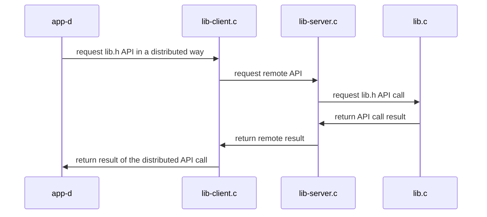

## Materiales usados en ARCOS.INF.UC3M.ES con Licencia GPLv3.0
  * Felix García Carballeira y Alejandro Calderón Mateos

## Servicio distribuido basado en RPC

#### Compilar

Los ficheros necesarios son:
* message.x: definición de la interfaz en lenguaje XDR
* Makefile.rpc: archivo para compilar todo
* app-d.c: implementación de programa cliente que usa la interfaz
* lib-server.c: implementación de servidor que sirve la interfaz
* lib.c: implementación de la interfaz a ser usada en el lado del servidor
* lib.h: interfaz a ser usada en el lado del servidor

El primer paso es generar los suplentes o stubs con rpcgen:
```
rpcgen -a -N -M message.x
```

A continuación hay que compilar:
```
make -f Makefile.rpc
```

Y la salida debería ser similar a:
```
gcc -g -Wall -c app-d.c
gcc -g -Wall -c message_clnt.c
gcc -g -Wall -c message_xdr.c
gcc -g -Wall    app-d.o message_clnt.o message_xdr.o  -o app-d 
gcc -g -Wall -c lib.c
gcc -g -Wall -c lib-server.c
gcc -g -Wall -c message_svc.c
gcc -g -Wall    lib-server.o lib.o  message_svc.o  message_xdr.o  -o lib-server 
```

#### Ejecutar

<html>
<table>
<tr><th>Paso</th><th>Cliente</th><th>Servidor</th></tr>
<tr>
<td>1</td>
<td></td>
<td>

```
$ ./lib-server
```

</td>
</tr>

<tr>
<td>2</td>
<td>

```
$ ./app-d localhost
d_set("nombre", 1, 0x123)
d_get("nombre", 1) -> 0x123
```

</td>
<td>

```

 1 = init(nombre, 10);
 1 = set(nombre, 1, 0x123);
 1 = get(nombre, 1, 0x123);
```

</td>
</tr>

<tr>
<td>3</td>
<td></td>
<td>

Para parar el servidor hay que presionar Control-C:

```
^Caccept: Interrupted system call
```

</td>
</tr>
</table>
</html>


#### Arquitectura




## Uso de RPC en Ubuntu 22.04 (o compatible)

Pasos generales al empezar:

1) Instalar pre-requisitos:
   ```
   sudo apt-get install libtirpc-common libtirpc-dev libtirpc3  rpcbind build-essential
   ```

2) Configurar pre-requisitos:
   ```
   sudo mkdir -p /run/sendsigs.omit.d/
   sudo /etc/init.d/rpcbind restart
   ```

Pasos en cada aplicación que use RPC:

1) Crear el archivo IDL.
   Por ejemplo, "suma.x":
   ```
   program SUMAR {
      version SUMAVER {
         int  SUMA(int a, int b) = 1;
         int RESTA(int a, int b) = 2;
      } = 1;
   } = 99;
   ```

2) Uso de rpcgen con archivo de IDL:
   ```
   rpcgen -NMa suma.x
   ```

3) Habría que editar Makefile.suma y cambiar:
   ```
   ...
   CFLAGS += -g -I/usr/include/tirpc
   LDLIBS += -lnsl -lpthread -ldl -ltirpc
   ...
   ```

4) Hay que añadir el código en el servidor (suma_server.c) y cambiar el código del cliente (suma_client.c)

5) Habría que compilar con make:
   ```
   make -f Makefile.suma
   ```

