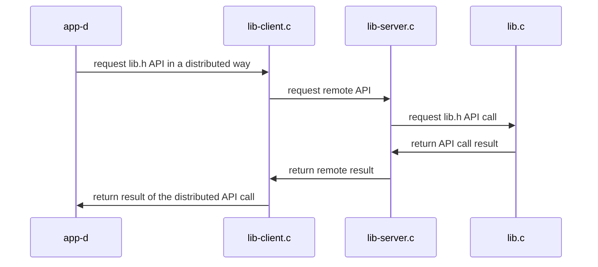

## Materiales usados en ARCOS.INF.UC3M.ES con Licencia GPLv3.0
  * Felix García Carballeira y Alejandro Calderón Mateos

## Sistemas Distribuidos

### Servicio distribuido basado en RPC

#### Compilar

Hay que introducir:
```
cd distribuido-rpc
make
```

Y la salida debería ser similar a:
```
gcc -g -Wall -c app-d.c
gcc -g -Wall -c message_clnt.c
gcc -g -Wall -c message_xdr.c
gcc -g -Wall    app-d.o message_clnt.o message_xdr.o  -o app-d 
gcc -g -Wall -c lib.c
gcc -g -Wall -c lib-server.c
gcc -g -Wall -c message_svc.c
gcc -g -Wall    lib-server.o lib.o  message_svc.o  message_xdr.o  -o lib-server 
```

#### Ejecutar

<html>
<table>
<tr><th>Paso</th><th>Cliente</th><th>Servidor</th></tr>
<tr>
<td>1</td>
<td></td>
<td>

```
$ ./lib-server
```

</td>
</tr>

<tr>
<td>2</td>
<td>

```
$ ./app-d localhost
d_set("nombre", 1, 0x123)
d_get("nombre", 1) -> 0x123
```

</td>
<td>

```

 1 = init(nombre, 10);
 1 = set(nombre, 1, 0x123);
 1 = get(nombre, 1, 0x123);
```

</td>
</tr>

<tr>
<td>3</td>
<td></td>
<td>

```
^Caccept: Interrupted system call
```

</td>
</tr>
</table>
</html>


#### Arquitectura



