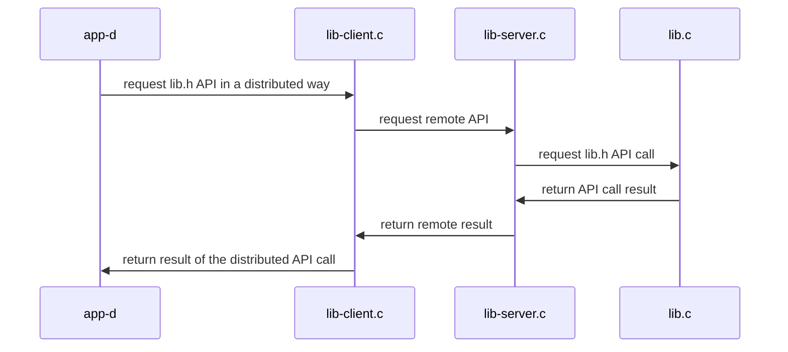

## Sistemas Distribuidos: materiales complementarios
+ **Felix García Carballeira y Alejandro Calderón Mateos** @ arcos.inf.uc3m.es
+ [](https://github.com/acaldero/uc3m_sd/blob/main/LICENSE)


## Servicio distribuido basado en sockets

*NOTA: Antes de ejecutar en dos máquinas diferentes por favor actualice la dirección IP del servidor en el archivo lib-client.c*

### Compilar

```
$ cd cal-distribuido-sockets
$ make
gcc -g -Wall -c app-d.c
gcc -g -Wall -c lib-client.c
gcc -g -Wall -c lib.c
gcc -g -Wall  app-d.o lib.o lib-client.o       -o app-d
gcc -g -Wall -c lib-server.c
gcc -g -Wall  lib.o lib-client.o lib-server.o  -o lib-server
```

### Ejecutar

<html>
<table>
<tr><th>Paso</th><th>Cliente</th><th>Servidor</th></tr>
<tr>
<td>1</td>
<td></td>
<td>

```
$ ./lib-server
```

</td>
</tr>

<tr>
<td>2</td>
<td>

```
$ ./app-d
0 = add(30, 20, 10)
-1 = divide(0, 20, 10)
0 = neg(-10, 10)
```

</td>
<td>

```

 0 = add(30, 20, 10);
 -1 = divide(0, 10, 0);
 0 = neg(-10, 10);
```

</td>
</tr>

<tr>
<td>3</td>
<td></td>
<td>

```
^Caccept: Interrupted system call
```

</td>
</tr>
</table>
</html>

### Arquitectura




**Material adicional**:
  * <a href="https://beej.us/guide/bgnet/html/index-wide.html">Beej's Guide to Network Programming</a>
  * <a href="https://beej.us/guide/bgnet0/html/index-wide.html">Beej's Guide to Network Concepts (más teoría)</a>

