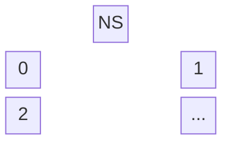
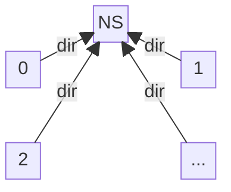
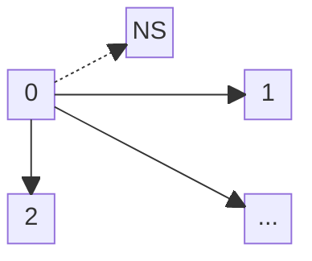
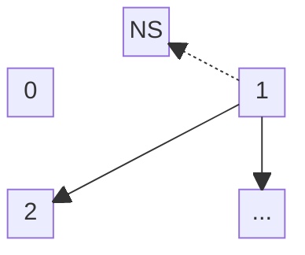
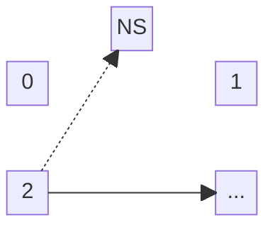
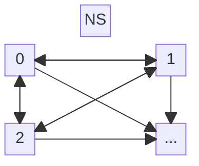
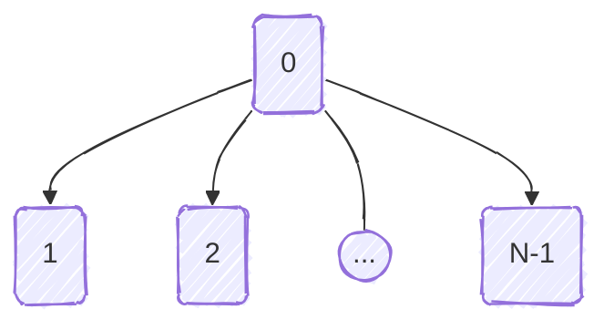
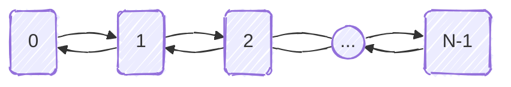

# Ejemplo de paso de mensajes
+ **Felix García Carballeira y Alejandro Calderón Mateos** @ arcos.inf.uc3m.es
+ [](https://github.com/acaldero/uc3m_sd/blob/main/LICENSE)


## Contenidos

 * [Enunciado](#enunciado)
 * [Diseño del sistema de comunicación ampliado](#diseño-del-sistema-de-comunicación-ampliado)


## Enunciado

Sea un sistema que dispone de un API para asociar direcciones de conexión a un identificador unívoco con las siguientes primitivas:
 * int **obtener_direccion** ( void );
    Este servicio permite a un proceso obtener su dirección que se asegura que es única en todo el sistema y que recibe en el momento de comenzar su ejecución.
 * int **publicar_dirección** ( int direccion, int n ); 
   Este servicio permite publicar en un servicio de nombres un valor asociado a una dirección.
 * int **buscar_direccion** ( int n ); 
   Este servicio devuelve la dirección que tiene asociada el servicio de nombres con el valor n.

Este sistema también dispone del siguiente API para comunicaciones:
 * int **connect** ( int direccion ); 
   Este servicio establece una conexión con el proceso que ejecuta en la dirección pasada como argumento. 
   La llamada devuelve un descriptor de comunicación que se puede utilizar en las operaciones de envío y recepción.
 * int **accept** ( int direccion ); 
   Este servicio bloquea al proceso que lo ejecute hasta que el proceso que ejecuta en la dirección pasada como argumento haga un *connect*. 
   La llamada devuelve un descriptor de comunicación que se puede utilizar en las operaciones de envío y recepción.
 * int **send_mess** ( int fd, char *p, int len ); 
   Esta operación envía un mensaje por el canal con descriptor fd. El envío es no bloqueante.
 * int **recv_mess** ( int fd, char *p, int len ); 
   Esta operación recibe un mensaje por el canal con descriptor fd. La recepción es bloqueante.

En dicho sistema de desea diseñar una biblioteca que permita construir un programa distribuido formado por N procesos. 
Cada uno de estos procesos tendrá asociado un identificador de proceso, un número entero comprendido entre 0 y N-1. 
Cada proceso cuando comienza su ejecución recibe este identificador, que puede consultar en la variable PID.
Asimismo puede conocer el número total de procesos (N) consultando la variable NP. 
Se asegura que no hay dos procesos con el mismo identificador. 

Los procesos tienen acceso a la biblioteca con los siguientes servicios a diseñar:
 * int **init** ( void ) 
   Este servicio deben ejecutarlos todos los procesos al comienzo de su ejecución. Esta
operación es imprescindible para utilizar el resto de servicios.
 *  int **send** ( int n, char *buf, int len ); 
    Este servicio envía al proceso con identificador n (comprendido entre 0 y N-1) un mensaje (buf) de longitud len. 
    El envío no es bloqueante.
 * int **recv** ( int n, char *buf, int len ); 
    Este servicio recibe del proceso n un mensaje en buf de longitud len. La recepción es bloqueante.
 * int **broadcast** ( int root, char *buf, int len ); 
    Con este servicio el proceso con identificador root, envía el mensaje buf de longitud len a todos los procesos del programa distribuido excepto al que ejecuta la llamada. Todos los procesos deben ejecutar la llamada.
 * int **barrier** ( void );
    Esta llamada bloquea a un proceso hasta que todos los procesos del programa distribuido la hayan ejecutado, es decir, la deben ejecutar todos los procesos para que puedan continuar su ejecución.

Para el diseño de la biblioteca dispone del API de comunicaciones y el API de asociación de direcciones a identificadores unívocos.
Considere que en este sistema cada proceso lleva asociado una dirección que es única en todo el sistema y que viene
especificada por un número entero. Esta dirección se encuentra asociada al proceso en el momento de comenzar
su ejecución. 


## Diseño del sistema de comunicación ampliado

###  int **init** ( void ) 

Todos los procesos han de llamar a esta función antes que el resto de funciones.
Tras su ejecución, tendremos en el vector *vc[j]* el descriptor de conexión asociado para que el proceso i se conecte con el proceso j, de manera que todos los procesos queden conectados.

Inicialmente se tiene N procesos identificados de 0 a N-1 y un servicio de direcciones:


Cada proceso obtiene su dirección y la publica en el servicio de direcciones:


El proceso 0 se connecta con todos los demás (salvo consigo mismo) que tengan un identificador mayor, preguntando para cada uno al servicio de direcciones la dirección asociada:


El proceso 1 se connecta con todos los demás (salvo consigo mismo) que tengan un identificador mayor (preguntando para cada uno al servicio de direcciones la dirección asociada) y acepta la conexión de los que tengan un identificador menor que él:


Y así sucesivamente, guardando en el vector *vc[j]* el descriptor de conexión asociado para que el proceso i se conecte con el proceso j:


Al final quedan conectados todos los procesos con todos los demás:


El diseño expresado en código C quedaría:

   ```c
   int init ( void )
   {
       int dir, dir2;
       
       dir = obtener_direccion();
       publicar_direccion(dir, PID);
       
       for (int i=0; i<N; i++)
       {
           if (i == PID)
               continue ;  // se salta el propio proceso

           dir2 = buscar_direccion(i);
           if (i > PID)
                vc[i] = connect(dir2);
           else vc[i] = accept(dir2) ;
       }
   }
   ```


###  int **send** ( int n, char *buf, int len )

El proceso que llama a esta función le envía al proceso con identificador *n* un mensaje *buf* de *len* bytes, sin quedarse bloqueado hasta que llegue a su destino. 

El diseño de esta funcionalidad supone traducir del descriptor unívoco de proceso a la dirección asociada a través del vector de traducción *vc* y llamar a la función de envío ya existente. Por tanto el diseño sería:

   ```c
   int send ( int n, char *buf, int len )
   {
       return send_mess(vc[n] , buf, len) ;
   }
   ```


###  int **recv** ( int n, char *buf, int len ) 

El proceso que llama a esta función queda bloqueado hasta que recibe del proceso *n* un mensaje en *buf* de *len* bytes.

El diseño de esta funcionalidad supone también traducir del descriptor unívoco de proceso a la dirección asociada a través del vector de traducción *vc* y llamar a la función de recepción ya existente. Por tanto el diseño sería:

   ```c
   int recv ( int n, char *buf, int len )
   {
       return recv_mess(vc[n] , buf, len) ;
   }
   ```


###  int **broadcast** ( int root, char *buf, int len )

Todos los procesos deben llamar a esta función de forma que el proceso con identificador *root* envía el mensaje *buf* de *len* bytes a todos los restantes procesos del programa distribuido. Y los procesos cuyo identificador no sea *root* se encargan de la recepción del mensaje *buf* de *len* bytes enviado por el proceso *root*. 

Hay diversas formas de diseñar esta funcionalidad.
La más simple es la que se muestra en la siguiente figura:



Una forma de expresar el diseño anterior en C sería la siguiente:

   ```c
   int broadcast ( int root, char *buf, int len )
   {
      if (root != PID) {
          return recv(root, buf, len) ;
      }
   
      // root == PID      
      for (int i=0; i<N; i++)
      {
           if (i != PID) {
               ret = send(i, buf, len) ;
           }
      }
      return ret ;
   }
   ```


###  int **barrier** ( void )

Llamar a esta función hace que el proceso quede bloqueado hasta que todos los procesos del programa distribuido hayan llamado a esta función. Una vez que todos han llamado a esta función, todos los procesos puedan continuar su ejecución.

Aunque hay varias formas de diseñar esta funcionalidad, vamos a realizar un diseño basado en conectar todos los procesos en un círculo de forma que el proceso 0 manda un *token* de 1 byte al proceso 1, este al proceso 2 y así sucesivamente hasta el proceso N-1. Cuando el *token* llega al proceso N-1 es porque todos los procesos han llamado a la función *barrier*, y solo queda desbloquear en ese momento a todos los procesos. Para ello se envía un token de vuelta al N-2, y así sucesivamente hasta volver a alcanzar al proceso 0, terminando la ejecución de *barrier* tras el envío de este segundo token, como se muestra en la siguiente figura:



Una forma de expresar el diseño anterior en C sería la siguiente:

   ```c
   int barrier ( void )
   {
      char token = 'x' ;
    
      if (PID == 0) {
          send(1, &token, 1) ;
          recv(1, &token, 1) ;
      }
      if (PID == N-1) {
          recv(N-2, &token, 1) ;
          send(N-2, &token, 1) ;
      }
      if (PID != 0) && (PID != N-1)
      {
          recv(PID-1, &token, 1) ;
          send(PID+1, &token, 1) ;
          recv(PID+1, &token, 1) ;
          send(PID-1, &token, 1) ;
      }
   }
   ```

