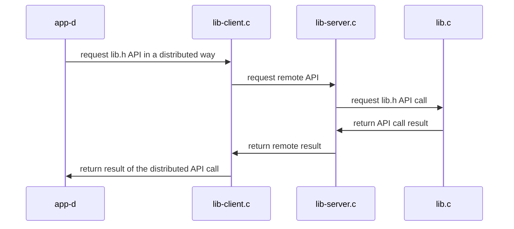

## Sistemas Distribuidos: materiales complementarios
+ **Felix García Carballeira y Alejandro Calderón Mateos** @ arcos.inf.uc3m.es
+ [](https://github.com/acaldero/uc3m_sd/blob/main/LICENSE)


## Servicio distribuido basado en colas POSIX

#### Compilar

Hay que introducir:
```
cd cal-distribuido-mqueue
make
```

Y la salida debería ser similar a:
```
gcc -g -Wall -c app-d.c
gcc -g -Wall -c lib-client.c
gcc -g -Wall -c lib.c
gcc -g -Wall -lrt app-d.o lib.o lib-client.o       -o app-d  -lrt
gcc -g -Wall -c lib-server.c
gcc -g -Wall            lib.o lib-client.o lib-server.o  -o lib-server  -lrt
```

#### Ejecutar

*TIP: Las colas POSIX se utilizan para comunicar procesos en la misma máquina*

<html>
<table>
<tr><th>Paso</th><th>Cliente</th><th>Servidor</th></tr>
<tr>
<td>1</td>
<td></td>
<td>

```
$ ./lib-server
```

</td>
</tr>

<tr>
<td>2</td>
<td>

```
$ ./app-d
0 = d_add(30, 20, 10)
0 = d_divide(2, 20, 10)
0 = d_neg(-10, 10)
```

</td>
<td>

```
 0 = d_add(30, 20, 10)
 0 = d_divide(2, 20, 10)
 0 = d_neg(-10, 10)
```

</td>
</tr>

<tr>
<td>3</td>
<td></td>
<td>

```
^Caccept: Interrupted system call
```

</td>
</tr>
</table>
</html>

*TIP: Las colas POSIX pueden ser visibles desde la línea de comando:*

``` bash
sudo mkdir /dev/mqueue
sudo mount -t mqueue none /dev/mqueue
ls -las /dev/mqueue
```

#### Arquitectura



