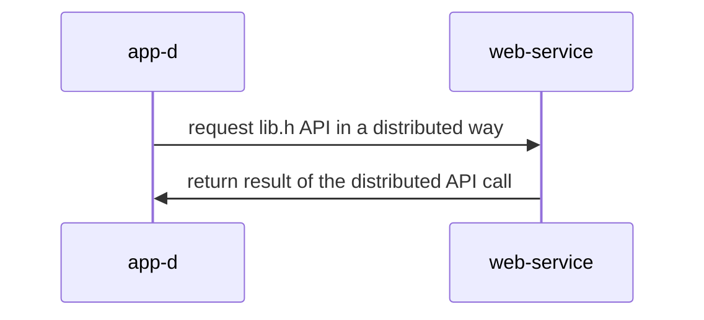

## Sistemas Distribuidos: materiales complementarios
+ **Felix García Carballeira y Alejandro Calderón Mateos** @ arcos.inf.uc3m.es
+ [](https://github.com/acaldero/uc3m_sd/blob/main/LICENSE)


## Servicio distribuido basado en gSOAP

#### Requisitos

Hay que tener instalado gsoap.
Si no se tiene instalado, se puede instalar con:
 * Linux (Ubuntu, Debian o similar):
   ```
   sudo apt-get install -y gsoap
   ```
 * MacOS
   ```
   brew install gsoap
   ```


#### Compilar

Hay que introducir:
```
cd ws-gsoap-xml-standalone
make
```

Y la salida debería ser similar a:
```
soapcpp2 -c calc.h

**  The gSOAP code generator for C and C++, soapcpp2 release 2.8.117
**  Copyright (C) 2000-2021, Robert van Engelen, Genivia Inc.
**  All Rights Reserved. This product is provided "as is", without any warranty.
**  The soapcpp2 tool and its generated software are released under the GPL.
**  ----------------------------------------------------------------------------
**  A commercial use license is available from Genivia Inc., contact@genivia.com
**  ----------------------------------------------------------------------------

Saving soapStub.h annotated copy of the source interface header file
Saving soapH.h serialization functions to #include in projects
Using ns service name: Service
Using ns service style: document
Using ns service encoding: literal
Using ns schema namespace: http://tempuri.org/ns.xsd
Saving ns.wsdl Web Service description
Saving ns.suma.req.xml sample SOAP/XML request
Saving ns.suma.res.xml sample SOAP/XML response
Saving ns.resta.req.xml sample SOAP/XML request
Saving ns.resta.res.xml sample SOAP/XML response
Saving ns.xsd XML schema
Saving ns.nsmap namespace mapping table
Saving soapClient.c client call stub functions
Saving soapClientLib.c client stubs with serializers (use only for libs)
Saving soapServer.c server request dispatcher
Saving soapServerLib.c server request dispatcher with serializers (use only for libs)
Saving soapC.c serialization functions

Compilation successful 

gcc  -Wall -g  -I/opt/homebrew/Cellar/gsoap/2.8.127/include/ -I/opt/gsoap-linux-2.7/  -L/opt/homebrew/Cellar/gsoap/2.8.127/lib/ -c soapC.c        -o soapC.o
gcc  -Wall -g  -I/opt/homebrew/Cellar/gsoap/2.8.127/include/ -I/opt/gsoap-linux-2.7/  -L/opt/homebrew/Cellar/gsoap/2.8.127/lib/ -c calcClient.c   -o calcClient.o
gcc  -Wall -g  -I/opt/homebrew/Cellar/gsoap/2.8.127/include/ -I/opt/gsoap-linux-2.7/  -L/opt/homebrew/Cellar/gsoap/2.8.127/lib/ -c soapClient.c   -o soapClient.o
gcc  -Wall -g  -I/opt/homebrew/Cellar/gsoap/2.8.127/include/ -I/opt/gsoap-linux-2.7/  -L/opt/homebrew/Cellar/gsoap/2.8.127/lib/ -c calcServer.c   -o calcServer.o
gcc  -Wall -g  -I/opt/homebrew/Cellar/gsoap/2.8.127/include/ -I/opt/gsoap-linux-2.7/  -L/opt/homebrew/Cellar/gsoap/2.8.127/lib/ -c soapServer.c   -o soapServer.o
gcc  -o client  calcClient.o  soapC.o  soapClient.o   -lgsoap
gcc  -o server  calcServer.o  soapC.o  soapServer.o   -lgsoap
```

#### Ejecutar

<html>
<table>
<tr><th>Paso</th><th>Cliente</th><th>Servidor</th></tr>

<tr>
<td>1</td>
<td>

```
```

</td>
<td>

```
$ ./server 12345
```

</td>
</tr>

<tr>
<td>2</td>
<td>

```
$ ./client  localhost:12345 2 3
Resultado = 5 
```

</td>
<td>

```
```

</td>
</tr>

</table>
</html>


#### Arquitectura




