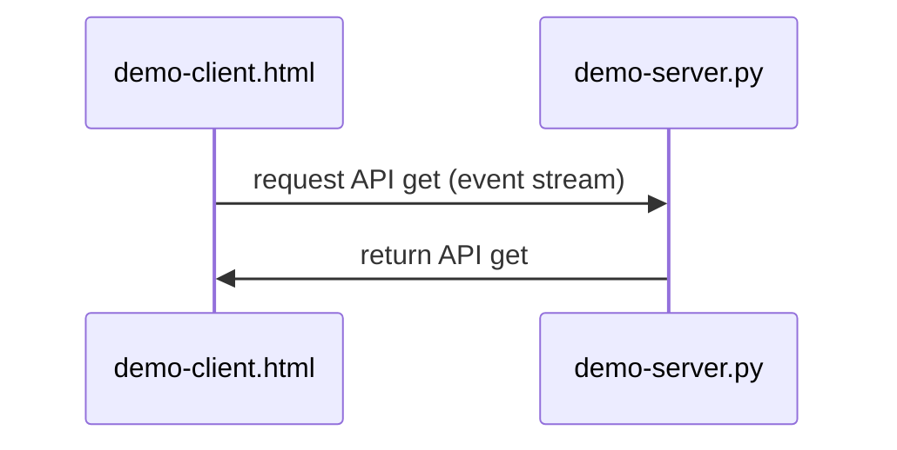

## Sistemas Distribuidos: materiales complementarios
+ **Felix García Carballeira y Alejandro Calderón Mateos** @ arcos.inf.uc3m.es
+ [](https://github.com/acaldero/uc3m_sd/blob/main/LICENSE)


## Servicio distribuido basado en HTML5 Server-Sent Events

#### Preparación

Hay que introducir:
```
cd ws-rest-sse-bash
```


#### Ejecutar

<html>
<table>
<tr><th>Paso</th><th>Cliente</th><th>Servidor</th></tr>
<tr>
<td>1</td>
<td></td>
<td>

```
$ python3 ./demo-server.py

 * Serving Flask app 'demo-server'
 * Debug mode: off
 * Running on http://127.0.0.1:5000
Press CTRL+C to quit
```

</td>
</tr>

<tr>
<td>2</td>
<td>

```
$ firefox demo-client.html
```

</td>
<td>

```
{'timestamp': ...}
...
```

</td>
</tr>

<tr>
<td>3</td>
<td></td>
<td>

```
^C
```

</td>
</tr>
</table>
</html>


#### Arquitectura




## Información adicional

 * [IoT y sistemas distribuidos](https://acaldero.github.io/slides/MCYTI_Disenyo_De_Sistemas_Distribuidos/mcti-dsd-se-v5d.pdf#34)
 * [Server sent events](https://developer.mozilla.org/es/docs/Web/API/Server-sent_events/Using_server-sent_events)

