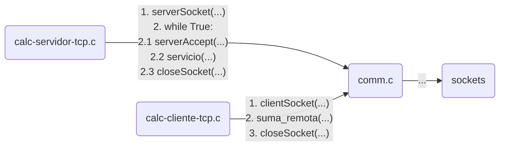

# Ejemplo de calculadora distribuida basada en sockets TCP
+ **Felix García Carballeira y Alejandro Calderón Mateos**
+ Licencia [GPLv3.0](https://github.com/acaldero/uc3m_sd/blob/main/LICENSE)


## Contenidos

 * [Enunciado](#enunciado)
 * [Guía para ayudar a la resolución de ejercicios de diseño de aplicaciones distribuidas](#guía-para-ayudar-a-la-resolución-de-ejercicios-de-diseño-de-aplicaciones-distribuidas)
 * [Ejemplo de diseño de calculadora distribuida basada en sockets](#ejemplo-de-diseño-de-calculadora-distribuida-basada-en-sockets)
 * [Ejemplo de implementación de servicio distribuido de calculadora con TCP](#ejemplo-de-implementación-de-servicio-distribuido-de-calculadora-con-tcp)


## Enunciado

Se pide diseñar e implementar un servicio de calculadora distribuida fiable que permita sumar y restar en C11 usando sockets.


## Guía para ayudar a la resolución de ejercicios de diseño de aplicaciones distribuidas

<html>
<table>
<tr>
<td>
<ol type="1" start="1">
<li>Identificar las partes cliente y servidor
<ul>
<li> Cliente: elemento activo, puede haber varios
<li> Servidor: elemento pasivo
</ul>
<li>Indentificar el protocolo de servicio
<ul>
<li>Identificar peticiones/respuestas
<li>Identificar los tipos mensajes
<li>Identificar la secuencia de intercambio de mensajes
</ul>
</ol>
</td>
<td>
Qué
</td>
</tr>

<tr>
<td>
<ol type="1" start="3">
<li>Elegir el tipo de servidor:
<ul>
    <li> No orientado a conexión (UDP)
    <li> Orientado a conexión (TCP)
    <ul>
      <li> Conexión por petición
      <li> Conexión por sesión
    </ul>
</ul>
</ol>
</td>
<td>
Cómo (1/2)
</td>
</tr>

<tr>
<td>
<ol type="1" start="4">
<li>Definir el formato de los mensajes (representación de los datos) <br>
y la secuencia detallada de paso de mensajes
<ul>
<li>Buscar en lo posible independencia (lenguaje, arquitectura, implementación, ...)
</ul>
</ol>
</td>
<td>
Diseño inicial
</td>
</tr>

<tr>
<td>
<ol type="1" start="5">
 <li>Diseñar aspectos de concurrencia (secuencial, proceso pesado, proceso ligero bajo demanda, proceso ligero con pool)
 <li>Nombrado (direccionamiento estático o dinámico)
</ol>
</td>
<td>
Cómo (2/2)
</td>
</tr>

<tr>
<td>
<ol type="1" start="7">
<li> Modificar el formato de los mensajes y modificar la secuencia detallada de paso de mensajes si fuera necesario
</ol>
</td>
<td>
Diseño final
</td>
</tr>
</table>
</html>


##  Ejemplo de diseño de calculadora distribuida basada en sockets

1. Identificar las partes cliente y servidor:
   * **Cliente: elemento activo que al ejecutar en la máquina A envía petición por la red.**
   * **Servidor: elemento pasivo que al ejecutar en la máquina B que está en un bucle en el que (1) recibe la petición por la red de un cliente, (2) la procesa y (3) responde con el resultado.**

2. Indentificar el protocolo de servicio (peticiones/respuesta, tipos y secuencia de intercambio):
   ```mermaid
    sequenceDiagram
      Cliente1  ->>+  Servidor: petición de suma/resta
      Note right of Servidor: procesa petición
      Servidor ->>-   Cliente1: resultado suma/resta

      Cliente2  ->>+  Servidor: petición suma/resta
      Note left of Servidor: procesa petición
      Servidor ->>-   Cliente2: resultado suma/resta
   ```

3. Tipo de servidor: se utiliza orientado a conexión con conexión por petición:
   * **TCP: No se quiere que se pierda los mensajes intercambiados**
   * **Por petición: No se precisa una sesión con varias peticiones en dicha petición**

4. Definición del formato de los mensajes (representación de datos) y la secuencia detallada de paso de mensajes:
   ```mermaid
    sequenceDiagram
      Cliente1  ->>+  Servidor: Código de operación (1 byte)
      Cliente1  ->>   Servidor: Primer  operando (4 bytes, formato de red)
      Cliente1  ->>   Servidor: Segundo operando (4 bytes, formato de red)
      Note right of Servidor: Procesa petición
      Servidor ->>-   Cliente1: Resultado (4 bytes, formato de red)

      Cliente2  ->>+  Servidor: Código de operación (1 byte)
      Cliente2  ->>   Servidor: Primer  operando (4 bytes, formato de red)
      Cliente2  ->>   Servidor: Segundo operando (4 bytes, formato de red)
      Note left of Servidor: Procesa petición
      Servidor ->>-   Cliente2: Resultado (4 bytes, formato de red)
   ```

5. Diseñar aspectos de concurrencia (secuencial, proceso pesado, proceso ligero bajo demanda, proceso ligero con pool)
   * **Servidor secuencial.**

6. Nombrado (direccionamiento estático o dinámico) 
   * **Direccionamiento "estático": el servidor atiende en el puerto 4200 y al cliente se ha de indicarle la dirección IP de la máquina.**

8. Modificar el formato de los mensajes y modificar la secuencia detallada de paso de mensajes si fuera necesario 
   * **Para el servidor secuencial y direccionamiento estático no se precisa modificar el diagrama del paso 4.**


## Ejemplo de implementación de servicio distribuido de calculadora con TCP

* Se precisan los siguientes ficheros:
  * <details>
    <summary>comm.h -> interfaz de la librería de comunicaciones...</summary>
        
    ### comm.h
    ```c
     #ifndef _COMM_H_
     #define _COMM_H_

       #include <sys/types.h>
       #include <sys/socket.h>
       #include <arpa/inet.h>
       #include <netdb.h>
       #include <unistd.h>
       #include <stdio.h>
       #include <string.h>
       #include <errno.h>

       int     serverSocket ( unsigned int addr, int port, int type ) ;
       int     serverAccept ( int sd ) ;
       int     clientSocket ( char *remote, int port ) ;
       int     closeSocket  ( int sd ) ;

       int     sendMessage  ( int socket, char *buffer, int len );
       int     recvMessage  ( int socket, char *buffer, int len );

       ssize_t writeLine    ( int fd, char *buffer ) ;
       ssize_t readLine     ( int fd, char *buffer, size_t n );

    #endif
    ```
    </details>
  * <details>
    <summary>comm.c -> implementación de la librería de comunicaciones</summary>
    
    ### comm.c
    ```c
    #include "comm.h"

    int serverSocket ( unsigned int addr, int port, int type )
    {
        struct sockaddr_in server_addr ;
        int sd, ret;

        // Crear socket
        sd = socket(AF_INET, type, 0) ;
        if (sd < 0) {
            printf ("SERVER: Error en el socket\n");
            return (0);
        }

        // Opción de reusar dirección
        int val = 1;
        setsockopt(sd, SOL_SOCKET, SO_REUSEADDR, (char *) &val, sizeof(int));

        // Dirección
        bzero((char *)&server_addr, sizeof(server_addr));
        server_addr.sin_family      = AF_INET;
        server_addr.sin_addr.s_addr = INADDR_ANY;
        server_addr.sin_port        = htons(port);

        // Bind
        ret = bind(sd, (const struct sockaddr *)&server_addr, sizeof(server_addr));
        if (ret == -1) {
            printf("Error en bind\n");
            return -1;
        }

        // Listen
        ret = listen(sd, SOMAXCONN);
        if (ret == -1) {
            printf("Error en listen\n");
            return -1;
        }

        return sd ;
    }

    int serverAccept ( int sd )
    {
        int sc ;
        struct sockaddr_in client_addr ;
        socklen_t size ;

        printf("esperando conexion...\n");

        size = sizeof(client_addr) ;
        sc = accept(sd, (struct sockaddr *)&client_addr, (socklen_t *)&size);
        if (sc < 0) {
            printf("Error en accept\n");
            return -1;
        }

        printf("conexión aceptada de IP: %s y puerto: %d\n",
                inet_ntoa(client_addr.sin_addr), ntohs(client_addr.sin_port));

        return sc ;
    }

    int clientSocket ( char *remote, int port )
    {
        struct sockaddr_in server_addr ;
        struct hostent *hp;
        int sd, ret;

        sd = socket(AF_INET, SOCK_STREAM, 0);
        if (sd < 0) {
            printf("Error en socket\n");
            return -1;
        }

        hp = gethostbyname(remote) ;
        if (hp == NULL) {
            printf("Error en gethostbyname\n");
            return -1;
        }

        bzero((char *)&server_addr, sizeof(server_addr));
        memcpy (&(server_addr.sin_addr), hp->h_addr, hp->h_length);
        server_addr.sin_family  = AF_INET;
        server_addr.sin_port    = htons(port);

        ret = connect(sd, (struct sockaddr *) &server_addr,  sizeof(server_addr));
        if (ret < 0) {
            printf("Error en connect\n");
            return -1;
        }

        return sd ;
    }

    int  closeSocket ( int sd )
    {
        return close(sd) ;
    }

    int sendMessage ( int socket, char * buffer, int len )
    {
        int r;
        int l = len;

        do
        {
                r = write(socket, buffer, l);
                if (r < 0)
                    return (-1);   /* fail */

                l = l -r;
                buffer = buffer + r;

        } while ((l>0) && (r>=0));

        return 0;
    }

    int recvMessage ( int socket, char *buffer, int len )
    {
        int r;
        int l = len;

        do {
                r = read(socket, buffer, l);
                if (r < 0)
                    return (-1);   /* fail */

                l = l -r ;
                buffer = buffer + r;

        } while ((l>0) && (r>=0));

        return 0;
    }

    ssize_t writeLine ( int fd, char *buffer )
    {
        return sendMessage(fd, buffer, strlen(buffer)+1) ;
    }

    ssize_t readLine ( int fd, char *buffer, size_t n )
    {
        ssize_t numRead;  /* num of bytes fetched by last read() */
        size_t totRead;   /* total bytes read so far */
        char *buf;
        char ch;

        if (n <= 0 || buffer == NULL) {
                errno = EINVAL;
                return -1;
        }

        buf = buffer;
        totRead = 0;

        while (1)
        {
                numRead = read(fd, &ch, 1);  /* read a byte */

                if (numRead == -1) {
                    if (errno == EINTR)      /* interrupted -> restart read() */
                         continue;
                    else return -1;          /* some other error */
                } else if (numRead == 0) {   /* EOF */
                    if (totRead == 0)        /* no byres read; return 0 */
                         return 0;
                    else break;
                } else {                     /* numRead must be 1 if we get here*/
                    if (ch == '\n') break;
                    if (ch == '\0') break;
                    if (totRead < n - 1) {   /* discard > (n-1) bytes */
                        totRead++;
                        *buf++ = ch;
                    }
                }
        }

        *buf = '\0';
        return totRead;
    }
    ```
    </details>
  * <details>
    <summary>calc-servidor-tcp.c -> implementación de un servicio de calculadora con sockets TCP...</summary>
        
    ### calc-servidor-tcp.c
    ```c
    #include <stdio.h>
    #include <unistd.h>
    #include <strings.h>
    #include "comm.h"

    int servicio ( int sc )
    {
        int ret ;
        char op;
        int32_t a, b, res;

        ret = recvMessage(sc, (char *) &op, sizeof(char)); // operación
        if (ret < 0) {
            printf("Error en recepción op\n");
            return -1 ;
        }

        ret = recvMessage(sc, (char *) &a, sizeof(int32_t)); // recibe a
        if (ret == -1) {
            printf("Error en recepción a\n");
            return -1 ;
        }

        ret = recvMessage(sc, (char *) &b, sizeof(int32_t)); // recibe b
        if (ret == -1) {
            printf("Error en recepción b\n");
            return -1 ;
        }

        a = ntohl(a);
        b = ntohl(b);
        if (op == 0)
             res = a + b;
        else res = a - b;
        res = htonl(res);

        ret = sendMessage(sc, (char *)&res, sizeof(int32_t));
        if (ret == -1) {
            printf("Error en envío\n");
            return -1 ;
        }

        return 0 ;
    }

    int main ( int argc, char *argv[] )
    {
        int sd, sc;

        // crear socket
        sd = serverSocket(INADDR_ANY, 4200, SOCK_STREAM) ;
        if (sd < 0) {
            printf ("SERVER: Error en serverSocket\n");
            return 0;
        }

        while (1)
        {
                // aceptar cliente
                sc = serverAccept(sd) ;
                if (sc < 0) {
                    printf("Error en serverAccept\n");
                    continue ;
                }

                // procesar petición
                servicio(sc) ;
                closeSocket(sc);
        }

        closeSocket(sd);
        return 0;
    }
    ```
    </details>
  * <details>
    <summary>calc-cliente-tcp.c  -> implementación de un cliente  de calculadora con sockets TCP...</summary>
        
    ### calc-cliente-tcp.c
    ```c
    #include <stdio.h>
    #include <netdb.h>
    #include <strings.h>
    #include <string.h>
    #include <unistd.h>
    #include "comm.h"

    int suma_remota ( int sd, int x, int y )
    {
        int  ret;
        char   op = 0; // suma
        int32_t a = htonl(x);
        int32_t b = htonl(y);
        int32_t r ;

        ret = sendMessage(sd, (char *) &op, sizeof(char));  // envía operacion
        if (ret == -1) {
            printf("Error envio op\n");
            return -1;
        }

        ret = sendMessage(sd, (char *) &a, sizeof(int32_t)); // envía a
        if (ret == -1) {
            printf("Error envio a\n");
            return -1;
        }

        ret = sendMessage(sd, (char *) &b, sizeof(int32_t)); // envía b
        if (ret == -1) {
            printf("Error envio b\n");
            return -1;
        }

        ret = recvMessage(sd, (char *) &r, sizeof(int32_t)); // recibe la respuesta
        if (ret == -1) {
            printf("Error en recepcion\n");
            return -1;
        }

        return ntohl(r) ;
    }

    int main ( int argc, char **argv )
    {
        int sd, ret;

        if (argc != 2) {
            printf("Uso: ./%s <dirección servidor>\n", argv[0]);
            return(0);
        }

        sd = clientSocket(argv[1], 4200) ;
        if (sd < 0) {
            printf("Error en clientSocket\n");
            return -1;
        }

        ret = suma_remota(sd, 5, 2) ;
        printf("Resultado de a+b es: %d\n", ret);

        closeSocket(sd);
        return 0;
    }
    ```
    </details>



* Para compilar, se puede usar:
  ```bash
  gcc -I./ -Wall -g -c comm.c
  gcc -I./ -Wall -g -c calc-servidor-tcp.c
  gcc -I./ -Wall -g -c calc-cliente-tcp.c
  gcc  -o calc-cliente-tcp  calc-cliente-tcp.o  comm.o
  gcc  -o calc-servidor-tcp calc-servidor-tcp.o comm.o
  ```

* Para ejecutar, se puede usar:
  ```bash
  $ ./calc-servidor-tcp &
  esperando conexion...
  $ ./calc-cliente-tcp
  Uso: ./calc-cliente-tcp <dirección servidor>
  $ ./calc-cliente-tcp localhost
  $ ./calc-cliente-tcp localhost
  conexión aceptada de IP: 127.0.0.1 y puerto: 41356
  esperando conexion...
  Resultado de a+b es: 7
  $ ./calc-cliente-tcp localhost
  conexión aceptada de IP: 127.0.0.1 y puerto: 41368
  esperando conexion...
  Resultado de a+b es: 7
  $ kill -9 %1
  ```


#### comm.h
```c
#ifndef _COMM_H_
#define _COMM_H_

   #include <sys/types.h>
   #include <sys/socket.h>
   #include <arpa/inet.h>
   #include <netdb.h>
   #include <unistd.h>
   #include <stdio.h>
   #include <string.h>
   #include <errno.h>

   int     serverSocket ( unsigned int addr, int port, int type ) ;
   int     serverAccept ( int sd ) ;
   int     clientSocket ( char *remote, int port ) ;

   int     sendMessage  ( int socket, char *buffer, int len );
   int     recvMessage  ( int socket, char *buffer, int len );

   ssize_t writeLine    ( int fd, char *buffer ) ;
   ssize_t readLine     ( int fd, char *buffer, size_t n );

#endif
```


#### calc-servidor-tcp.c
```c
#include <stdio.h>
#include <unistd.h>
#include <strings.h>
#include "comm.h"

int servicio ( int sc )
{
        int ret ;
        char op;
        int32_t a, b, res;

        ret = recvMessage(sc, (char *) &op, sizeof(char)); // operación
        if (ret < 0) {
            printf("Error en recepción op\n");
            return -1 ;
        }

        ret = recvMessage(sc, (char *) &a, sizeof(int32_t)); // recibe a
        if (ret == -1) {
            printf("Error en recepción a\n");
            return -1 ;
        }

        ret = recvMessage(sc, (char *) &b, sizeof(int32_t)); // recibe b
        if (ret == -1) {
            printf("Error en recepción b\n");
            return -1 ;
        }

        a = ntohl(a);
        b = ntohl(b);
        if (op == 0)
             res = a + b;
        else res = a - b;
        res = htonl(res);

        ret = sendMessage(sc, (char *)&res, sizeof(int32_t));
        if (ret == -1) {
            printf("Error en envío\n");
            return -1 ;
        }

        return 0 ;
}

int main ( int argc, char *argv[] )
{
        int sd, sc;

        // crear socket
        sd = serverSocket(INADDR_ANY, 4200, SOCK_STREAM) ;
        if (sd < 0) {
            printf ("SERVER: Error en serverSocket\n");
            return 0;
        }

        while (1)
        {
                // aceptar cliente
                sc = serverAccept(sd) ;
                if (sc < 0) {
                    printf("Error en serverAccept\n");
                    continue ;
                }

                // procesar petición
                servicio(sc) ;
                close(sc);
        }

        close(sd);
        return 0;
}
```


#### calc-cliente-tcp.c
```c
#include <stdio.h>
#include <netdb.h>
#include <strings.h>
#include <string.h>
#include <unistd.h>
#include "comm.h"

int suma_remota ( int sd, int x, int y )
{
        int  ret;
        char   op = 0; // suma
        int32_t a = htonl(x);
        int32_t b = htonl(y);
        int32_t r ;

        ret = sendMessage(sd, (char *) &op, sizeof(char));  // envía operacion
        if (ret == -1) {
            printf("Error envio op\n");
            return -1;
        }

        ret = sendMessage(sd, (char *) &a, sizeof(int32_t)); // envía a
        if (ret == -1) {
            printf("Error envio a\n");
            return -1;
        }

        ret = sendMessage(sd, (char *) &b, sizeof(int32_t)); // envía b
        if (ret == -1) {
            printf("Error envio b\n");
            return -1;
        }

        ret = recvMessage(sd, (char *) &r, sizeof(int32_t)); // recibe la respuesta
        if (ret == -1) {
            printf("Error en recepcion\n");
            return -1;
        }

        return ntohl(r) ;
}

int main ( int argc, char **argv )
{
        int sd, ret;

        if (argc != 2) {
            printf("Uso: ./%s <dirección servidor>\n", argv[0]);
            return(0);
        }

        sd = clientSocket(argv[1], 4200) ;
        if (sd < 0) {
            printf("Error en clientSocket\n");
            return -1;
        }

        ret = suma_remota(sd, 5, 2) ;
        printf("Resultado de a+b es: %d\n", ret);

        close(sd);
        return 0;
}
```


#### comm.c
```c
#include "comm.h"

int serverSocket ( unsigned int addr, int port, int type )
{
        struct sockaddr_in server_addr ;
        int sd, ret;

        // Crear socket
        sd = socket(AF_INET, type, 0) ;
        if (sd < 0) {
            printf ("SERVER: Error en el socket\n");
            return (0);
        }

        // Opción de reusar dirección
        int val = 1;
        setsockopt(sd, SOL_SOCKET, SO_REUSEADDR, (char *) &val, sizeof(int));

        // Dirección
        bzero((char *)&server_addr, sizeof(server_addr));
        server_addr.sin_family      = AF_INET;
        server_addr.sin_addr.s_addr = INADDR_ANY;
        server_addr.sin_port        = htons(port);

        // Bind
        ret = bind(sd, (const struct sockaddr *)&server_addr, sizeof(server_addr));
        if (ret == -1) {
            printf("Error en bind\n");
            return -1;
        }

        // Listen
        ret = listen(sd, SOMAXCONN);
        if (ret == -1) {
            printf("Error en listen\n");
            return -1;
        }

        return sd ;
}

int serverAccept ( int sd )
{
        int sc ;
        struct sockaddr_in client_addr ;
        socklen_t size ;

        printf("esperando conexion...\n");

        size = sizeof(client_addr) ;
        sc = accept(sd, (struct sockaddr *)&client_addr, (socklen_t *)&size);
        if (sc < 0) {
            printf("Error en accept\n");
            return -1;
        }

        printf("conexión aceptada de IP: %s y puerto: %d\n",
                inet_ntoa(client_addr.sin_addr), ntohs(client_addr.sin_port));

        return sc ;
}

int clientSocket ( char *remote, int port )
{
        struct sockaddr_in server_addr ;
        struct hostent *hp;
        int sd, ret;

        sd = socket(AF_INET, SOCK_STREAM, 0);
        if (sd < 0) {
            printf("Error en socket\n");
            return -1;
        }

        hp = gethostbyname(remote) ;
        if (hp == NULL) {
            printf("Error en gethostbyname\n");
            return -1;
        }

        bzero((char *)&server_addr, sizeof(server_addr));
        memcpy (&(server_addr.sin_addr), hp->h_addr, hp->h_length);
        server_addr.sin_family  = AF_INET;
        server_addr.sin_port    = htons(port);

        ret = connect(sd, (struct sockaddr *) &server_addr,  sizeof(server_addr));
        if (ret < 0) {
            printf("Error en connect\n");
            return -1;
        }

        return sd ;
}

int sendMessage ( int socket, char * buffer, int len )
{
        int r;
        int l = len;

        do
        {
                r = write(socket, buffer, l);
                if (r < 0)
                    return (-1);   /* fail */

                l = l -r;
                buffer = buffer + r;

        } while ((l>0) && (r>=0));

        return 0;
}

int recvMessage ( int socket, char *buffer, int len )
{
        int r;
        int l = len;

        do {
                r = read(socket, buffer, l);
                if (r < 0)
                    return (-1);   /* fail */

                l = l -r ;
                buffer = buffer + r;

        } while ((l>0) && (r>=0));

        return 0;
}

ssize_t writeLine ( int fd, char *buffer )
{
        return sendMessage(fd, buffer, strlen(buffer)+1) ;
}

ssize_t readLine ( int fd, char *buffer, size_t n )
{
        ssize_t numRead;  /* num of bytes fetched by last read() */
        size_t totRead;   /* total bytes read so far */
        char *buf;
        char ch;

        if (n <= 0 || buffer == NULL) {
                errno = EINVAL;
                return -1;
        }

        buf = buffer;
        totRead = 0;

        while (1)
        {
                numRead = read(fd, &ch, 1);  /* read a byte */

                if (numRead == -1) {
                    if (errno == EINTR)      /* interrupted -> restart read() */
                         continue;
                    else return -1;          /* some other error */
                } else if (numRead == 0) {   /* EOF */
                    if (totRead == 0)        /* no byres read; return 0 */
                         return 0;
                    else break;
                } else {                     /* numRead must be 1 if we get here*/
                    if (ch == '\n') break;
                    if (ch == '\0') break;
                    if (totRead < n - 1) {   /* discard > (n-1) bytes */
                        totRead++;
                        *buf++ = ch;
                    }
                }
        }

        *buf = '\0';
        return totRead;
}
```

