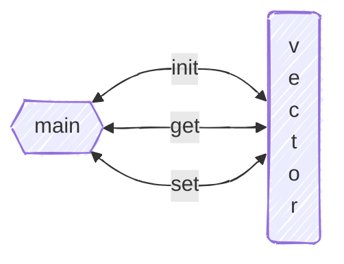
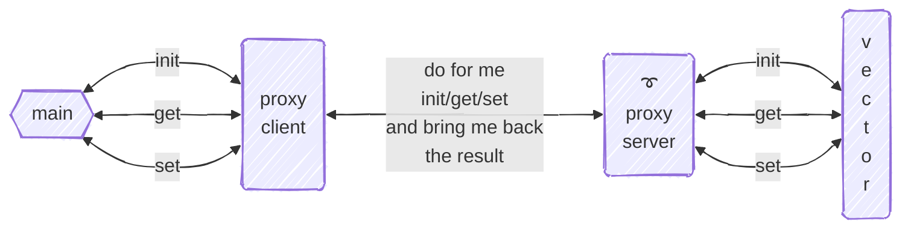

# Ejemplo de paso de mensajes
+ **Felix García Carballeira y Alejandro Calderón Mateos**
+ Licencia [GPLv3.0](https://github.com/acaldero/uc3m_sd/blob/main/LICENSE)


## Contenidos

 * [Enunciado](#enunciado)
 * [Diseño progresivo de monolítico a aplicación distribuida](#diseño-progresivo-de-monolítico-a-aplicación-distribuida)
 * [Diseño de la versión inicial monolítica](#diseño-de-la-versión-inicial-monolítica)
 * [Paso de monolítico a distribuido general](#paso-de-monolítico-a-distribuido-general)
 * [Distribuido general a distribuido con colas de mensajes POSIX](#distribuido-general-a-distribuido-con-colas-de-mensajes-posix)
 * [Ejecución concurrente en el servidor](#ejecución-concurrente-en-el-servidor)


## Enunciado

Se desea diseñar un modelo de vector distribuido. 
Sobre un vector distribuido se definen los siguientes servicios:
* int **init** ( char *nombre, int N )
  Este servicio permite inicializar un array distribuido de N números enteros.
  La función devuelve 1 cuando el array se ha creado por primera vez. En caso de que el array ya esté creado, la función devuelve 0. La función devuelve -1 en caso de error.
* int **set** ( char *nombre, int i, int valor )
  Este servicio inserta el valor en la posición i del array nombre.
* int **get** ( char*nombre, int i, int *valor )
  Este servicio permite recuperar el valor del elemento i del array nombre.

Diseñe un **sistema** **distribuido** que implemente el servicio con **colas POSIX** de forma que permita trabajar con varios clientes **concurrentemente**.


## Diseño progresivo de monolítico a aplicación distribuida

Es importante hacer un diseño progresivo, un diseño que se comience por la funcionalidad básica y al que se pueda ir añadiendo poco a poco los aspectos de sistema distribuido, con colas de mensaje POSIX y concurrente.

Por tanto los pasos que se siguen son:
1. Diseño de un sistema monolítico con la funcionalidad pedida.
2. Modificar el diseño anterior para que pase de sistema monolítico a sistema distribuido mediante el patrón *proxy*.
3. Modificar el diseño anterior para que el sistema distribuido utilice colas de mensajes POSIX como primitivas de comunicación.
4. Modificar el diseño anterior para que los servidores sean concurrentes.


## Diseño de la versión inicial monolítica

El primer diseño a realizar no es distribuido ni tiene concurrencia. 
Empezaremos por diseñar una biblioteca **vector** que implementa el API indicado el enunciado y aplicación **main** que hace uso de la biblioteca:



De esta forma podremos probar que la implementación de estos componentes del sistema funcionan más fácilmente.

Para dicho diseño haremos los siguientes pasos:

1. Tipo de datos a utilizar:
   ```c
   int    a_neltos= 0 ;
   int  * a_values[100] ; // = [ [0…N1], [0…N2], ... [0…NN] ] ;
   char * a_keys[100] ;   // = [ "key1", "key2", ... "keyN" ] ;
   ```

2. Funciones auxiliares de
    (a) buscar un nombre en el array *a_keys* de claves y 
    (b) insertar un nuevo array con *nombre* y *N* elementos de tipo entero:
   ```c
   int buscar ( char *nombre )
   {
       int index= -1 ;
    
       for ( int i=0; i<a_neltos; i++ ) {
           if (!strcmp(a_keys[i], nombre)) {
               return i;
           }
       }
    
       return index;
   }

   int insertar ( char *nombre, int N )
   {
       a_values[a_neltos] = malloc(N*sizeof(int)) ;
       if (NULL == a_values[a_neltos]) {
           return -1 ; // en caso de error => -1
       }

       a_keys[a_neltos] = strdup(nombre) ;
       if (NULL == a_keys[a_neltos]) {
           free(a_values[a_neltos]);
           return -1 ; // en caso de error => -1
       }
    
       a_neltos++ ;
       return 1 ; // todo bien => devolver 1
   }
   ```

3. Funciones pedidas
   ```c
   // Inicializar un array distribuido de N números enteros.
   int init ( char *nombre, int N )
   {
      int index = buscar(nombre) ;
      if (index != -1) return 0 ; // Si array ya esté creado => devolver 0
      
      index = insertar(nombre, N) ;
      if (index == -1) return -1; // en caso de error => -1
      
      return 1 ; // el array se ha creado por primera vez => devolver 1
   }

   // Inserta el valor en la posición i del array nombre.
   int set ( char *nombre, int i, int valor )
   {
      int index = buscar(nombre) ;
      if (index == -1) return -1 ; // Si error => devolver -1
      
      a_values[index][i] = valor ;
      return 1;
   }
   
   // Recuperar el valor del elemento i del array nombre.
   int get ( char*nombre, int i, int *valor )
   {
      int index = buscar(nombre) ;
      if (index == -1) return -1 ; // Si error => devolver -1
      
      *valor = a_values[index][i] ;
      return 1;
   }
   ```

4. Ejemplo de programa principal de prueba:
   ```c
   #include <stdio.h>
   #include <stdlib.h>
   #include "lib.h"
   
   int   N = 10 ;
   char *A = "nombre" ;
   int   E = 1 ;
   int   V = 0x123 ;
   
   int main ( int argc, char *argv[] )
   {
      int ret, val ;
      
      ret = init(A, N) ;
      if (ret < 0) { printf("init: error code %d\n", ret); exit(-1); }
      
      ret = set (A, E, V) ;
      if (ret < 0) { printf("set: error code %d\n", ret); exit(-1); }
      
      ret = get (A, E, &val) ;
      if (ret < 0) { printf("get: error code %d\n", ret); exit(-1); }
      
      return 0 ;
   }
   ```

## Paso de monolítico a distribuido general

Para transformar el diseño inicial monolítico a un diseño de aplicación distribuida en general vamos a utilizar el patrón de diseño llamado **proxy**.
En la siguiente figura se puede apreciar su aplicación:



Como se puede apreciar, la aplicación **main** en lugar de interactuar con vector directamente lo va a hacer con un nuevo componente llamado *proxy* en el lado del cliente que tiene la misma interfaz que **vector**. Para **main** se le hace creer que está actuando con **vector** pero en su lugar lo hace con la parte cliente del *proxy*. 
Este cliente *proxy* se encarga de enviar uan petición remota a otro componente nuevo llamado *proxy* en el lado del servidor al que le pide que haga la petición de **main** en su nombre y le devuelva el resultado. 
El *proxy* en el lado del servidor tiene acceso a la biblioteca **vector** original del diseño monolítico y se encarga de recibir las peticiones del *proxy* en el lado del cliente y hacer la invocación en su nombre, para enviar de vuelta el resultado de dicha invocación.

De esta forma es posible transformar una parte de una aplicación monolítica en una parte distribuida, facilitando las pruebas dado que los componentes **main** y **vector** son los mismos de la aplicación monolítica, que ya han sido probados.

Para dicho diseño haremos los siguientes pasos:

1. *Proxy* en el lado del cliente:
   ```c
   int send_recv ( mensaje *msg )
   {
      c1 = “colamsg_conectar” /SERVIDOR
      “colamsg_enviar”  c1 msg
      “colamsg_recibir” c1 msg
      “colamsg_desconectar”c1
      return msg
   }
   
   int init ( char *nombre, int N )
   {
      petición  = (init, nombre, N)
      respuesta = send_recv(petición)
      return respuesta.status
   }

   int set(char *nombre, int i, int valor)
   {
      petición  = (set, nombre, i, valor)
      respuesta = send_recv(petición)
      return respuesta.status
   }
   
   int get(char*nombre, int i, int *valor)
   {
      petición  = (get, nombre, i)
      respuesta = send_recv(petición)
      *valor = respuesta.valor
      return respuesta.status
   }
   ```

2. *Proxy* en el lado del servidor:
   ```c
   int main( int argc, char *argv)
   {
      c1 = “colamsg_crear” /SERVIDOR
      
      while(TRUE)
      {
         “colamsg_recibir” c1 petición
         switch( petición.operación)
         {
            case INIT: respuesta.status= _init(petición.nombre, petición.N) ;
                       break;
            case GET: respuesta.status= _get(petición.nombre, petición.i, &respuesta.valor) ;
                      break;
            case SET: respuesta.status= _set(petición.nombre, petición.i, petición.valor) ;
                      break;
         }
         
         “colamsg_enviar” c1 respuesta
      }
   }
   ```


## Distribuido general a distribuido con colas de mensajes POSIX

Las colas de mensajes POSIX permiten interconectar dos procesos de forma distribuida, pero tienen unas peculiaridades que hace que haya que adaptar el diseño anterior que es un para un sistema distribuido genérico.
Las principales *peculiaridades* que afectan inicialmente al diseño son:
* Son unidireccionales
* Para simplificar su uso se precisa diseñar un mismo mensaje que valga para todas las operaciones
* Usan el sistema de ficheros de la máquina donde se ejecutan los procesos (lo que no lo hace tan distribuido pero sirve de comienzo)


1. Los tipo de datos principales a utilizar son una estructura para petición (que será una fusión de todos los campos necesarios en todas las operaciones) y otra para respuesta (que será también una fusión de todas respuestas):
   ```c
   // petición = op + q_name + (nombre, N) + (nombre, i, valor) + (nombre, i)
   struct peticion
   {
      int   op;
      char  name[MAX] ;
      int   value;
      int   i;
      char  q_name[MAX];
   } ;
   
   // respuesta = (valor, status)
   struct respuesta
   {
      int  value;
      char status;
   } ;
   ```

1. *Proxy* en el lado del cliente (en el que en la petición le envía el nombre de la cola que usará el cliente para la respuesta):
   ```c
   // Función *get* como ejemplo, el resto serían similares
   int get ( char *nombre, int i, int *valor )
   {
      struct petición p;
      struct respuesta r;
      unsigned int prio= 0;  // Colas POSIX
      
      // preparar mensaje
      p.op = 2;  // el valor 2 identifica "get" en el ejemplo
      p.i  = i;  // el valor i es la clave
      strcpy(p.nombre, nombre); // nombre del vector
      sprintf(p.q_name, "%s%d", "/CLIENTE_", getpid()) ;

        // inicialización colas POSIX
        int qs = mq_open("/SERVIDOR", O_WRONLY, 0700, NULL) ;
        if (qs == -1) { return-1 ; }
        int qr = mq_open(p.q_name, O_CREAT|O_RDONLY, 0700, NULL) ;
        if (qr == -1) { mq_close(qs) ; return-1; }
      
        // envío de petición y recepción de respuesta con colas POSIX
        mq_send   (qs, (char *)&(p), sizeof(structpetición),  0) ;
        mq_receive(qr, (char *)&(r), sizeof(structrespuesta), &prio) ;
   
        // finalización colas POSIX
        mq_close(qs); mq_close(qr);
        mq_unlink(qr_name);
      
      *valor = r.value;
      return (int)(r.status) ;
   }
   ```

1. *Proxy* en el lado del servidor:
   ```c
   int fin_ejecutar = 0 ;
   
   int main( int argc, char *argv[] )
   {
      struct petición p;
      unsigned int prio;
      
      int qs = mq_open("/SERVIDOR", O_CREAT | O_RDONLY, 0700, NULL) ;
      if (qs == -1) { return-1 ; }
      while (fin_ejecutar != 1)
      {
          mq_receive(qs, &p, sizeof(p), &prio) ;
          tratar_petición(&p) ;
      }
   }

   void tratar_petición ( struct petición * p )
   {
      struct respuesta r ;
   
      // tratar petición...
      switch (p->op)
      {
         case 0: // INIT
              r.status= real_init(p->name, p->value) ;
              break ;
         case 2: // GET
              r.status= real_get(p->name, p->i, &(r.value)) ;
              break ;
         case 3: // SET
              r.status= real_set(p->name, p->i, p->value) ;
              break ;
      }

      // enviar respuesta de vuelta al cliente
      int qr = mq_open(p->q_name, O_WRONLY, 0700, NULL) ;
      mq_send(qr, &r, sizeof(structrespuesta), 0) ; // prio== 0
      mq_close(qr);
   }
   ```


## Ejecución concurrente en el servidor

Añadir concurrencia en el *proxy* en el lado servidor supone que por cada petición que llega hay que crear un hilo para atenderla:

   ```c
    int main ( int argc, char *argv[] )
    {
        struct petición p;
        unsigned int prio; // y algunas variables más…
    
    pthread_attr_init(&attr) ;
    pthread_attr_setdetachstate(&attr, PTHREAD_CREATE_DETACHED) ;  
    int qs= mq_open("/SERVIDOR", O_CREAT | O_RDONLY, 0700, NULL) ;
    if (qs == -1) { return-1 ; }
    while(1)
    {
         mq_receive(qs, &p, sizeof(struct petición), &prio) ;

         // En lugar de ejecutar "tratar_petición(&p);" aquí, se crea un hilo para ello
         pthread_create(&thid, &attr, tratar_petición, (void*)&p) ;
         
         // Importante: parar el main hasta terminar 2 tareas: hilo creado y copia de parámetro "&p"
         <código de espera a que se haya creado el hilo y copiado &p>
    }
   }
   ```

La función **tratar_petición** se modifica para ser el código del hilo:

   ```c
   void tratar_petición ( struct petición * p )
   {
      struct respuesta r ;
      
      // Importante: copiar parámetro "*p" y despertar al hilo main
      <código de sincronización para "p_local= *p" y señalizar que copiado>  
    
      switch (p->op)
      {
         case 0: // INIT
              r.status= real_init(p->name, p->value) ;
              break ;
         case 2: // GET
              r.status= real_get(p->name, p->i, &(r.value)) ;
              break ;
         case 3: // SET
              r.status= real_set(p->name, p->i, p->value) ;
              break ;
      }
      
      int qr= mq_open(p->q_name, O_WRONLY, 0700, NULL) ;
      mq_send(qr, &r, sizeof(structrespuesta), 0) ; // prio== 0
      mq_close(qr);
      
      pthread_exit(NULL) ;
   }
   ```

La siguiente tabla detalla dichos puntos:

| <código de espera a que se haya <br>creado el hilo y copiado &p>  | Código de sincronización para <br>"p_local= *p" y señalizar que copiado |
|---------------------------------------------------------------|---------------------------------------------------------------------|
| pthread_mutex_lock(&sync_mutex);                              |                                                                     |
| while (sync_copied == FALSE) {                                | pthread_mutex_lock(&sync_mutex);                                    |
| &nbsp;&nbsp;&nbsp;pthread_cond_wait(&sync_cond, &sync_mutex); | p_local = *p;                                                       |
| }                                                             | sync_copied = TRUE;                                                 |
| sync_copied = FALSE;                                          | pthread_cond_signal(&sync_cond);                                    |
| pthread_mutex_unlock(&sync_mutex);                            | pthread_mutex_unlock(&sync_mutex);                                  |

         
Con dichos cambios, la función **main** quedará:

   ```c
    int main ( int argc, char *argv[] )
    {
        struct petición p;
        unsigned int prio; // y algunas variables más…
    
        pthread_attr_init(&attr) ;
        pthread_attr_setdetachstate(&attr, PTHREAD_CREATE_DETACHED) ;  
        int qs= mq_open("/SERVIDOR", O_CREAT | O_RDONLY, 0700, NULL) ;
        if (qs == -1) { return-1 ; }

        while (1)
        {
           mq_receive(qs, &p, sizeof(struct petición), &prio) ;

           // En lugar de ejecutar "tratar_petición(&p);" aquí, se crea un hilo para ello
           pthread_create(&thid, &attr, tratar_petición, (void*)&p) ;
         
            // <código de espera a que se haya creado el hilo y copiado &p>
            pthread_mutex_lock(&sync_mutex) ;
            while (sync_copied == FALSE) {
               pthread_cond_wait(&sync_cond, &sync_mutex) ;
            }
            sync_copied= FALSE ;
            pthread_mutex_unlock(&sync_mutex) ;
        }
   }
   ```

La función **tratar_petición** se modifica para ser el código del hilo:

   ```c
   void tratar_petición ( struct petición * p )
   {
      struct respuesta r ;
      
           // <código de sincronización para "p_local= *p" y señalizar que copiado>  
           pthread_mutex_lock(&sync_mutex) ;
           p_local= *p ;
           sync_copied= TRUE ;
           pthread_cond_signal(&sync_cond) ;
           pthread_mutex_unlock(&sync_mutex) ;    

      switch (p->op)
      {
         case 0: // INIT
              r.status= real_init(p->name, p->value) ;
              break ;
         case 2: // GET
              r.status= real_get(p->name, p->i, &(r.value)) ;
              break ;
         case 3: // SET
              r.status= real_set(p->name, p->i, p->value) ;
              break ;
      }
      
      int qr= mq_open(p->q_name, O_WRONLY, 0700, NULL) ;
      mq_send(qr, &r, sizeof(structrespuesta), 0) ; // prio== 0
      mq_close(qr);
      
      pthread_exit(NULL) ;
   }
   ```

