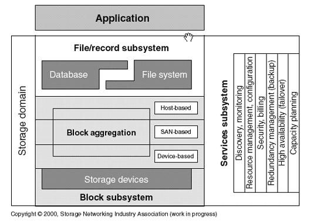

# Sistemas de ficheros distribuidos  
+ **Felix García Carballeira y Alejandro Calderón Mateos**  
+ Licencia [GPLv3.0]([https://github.com/acaldero/uc3m_sd/blob/main/LICENSE](https://github.com/acaldero/uc3m_sd/blob/main/LICENSE))  
  
  
## Contenidos  
  
* Introducción a sistemas de ficheros  distribuidos:
  * [Sistema de ficheros](#sistema-de-ficheros)  
  * [Funcionamiento básico de un sistema de ficheros](#funcionamiento-basico-de-un-sistema-de-ficheros)
  * [Arquitectura básica de un sistema de ficheros](#arquitectura-basica-de-un-sistema-de-ficheros)
  * [Posibles opciones para almacenamiento remoto](#posibles-opciones-para-almacenamiento-remoto)
* Sistemas de almacenamiento distribuidos:  
  * [Sistema de ficheros distribuido](#sistema-de-ficheros-distribuido)  
  * [Sistema de ficheros paralelo](#sistema-de-ficheros-paralelo)  
  
  
  
## Sistema de ficheros  
  
* En una máquina Von Neumann, tanto los datos como el código de un programa ha de estar cargado en memoria principal para ejecutar:  
  ```mermaid  
  flowchart LR  
  A[CPU] <--> B(Memoria principal)  
  ```  
  
* A día de hoy hay dos tecnologías principales para el almacenamiento:  
  ```mermaid  
  flowchart LR  
  A[CPU] <--> B(Memoria)  
  B[Memoria] <--> C(Disco)  
  ```  
  * Memoria RAM  
    * **Volátil** (se pierde contenido si falta electricidad)  
    * **Menor** capacidad (orden de Gigabyte)  
    * Direccionamiento a nivel de **byte**  
  * Disco  
    * **NO Volátil** (permanente)  
    * **Mayor** capacidad (orden de Terabytes)  
    * Direccionamiento a nivel de **bloque**  
  
* **Problema**: que los/as programadoras/es tengan que ocuparse de tratar con los bloques de disco para buscar en qué bloque están los datos, recuperar o guardar datos de un bloque, etc.  
* **Objetivo**: Ofrecer una abstracción de datos intermedia que se traduzca a bloques de manera que:  
  * Sea independiente del dispositivo físico.  
  * Ofrezca una visión lógica unificada.  
  * Sea lo suficientemente simple pero completa.  
  ```mermaid  
  flowchart LR  
  A(Proceso)---|"(1) Abstracción de datos"|B("(2) Gestor de abstracción")  
  B --- C(Disco)  
  C -.- D("b1, b2, ...")  
  ```  
  
* El sistema operativo integra una <u>abstracción básica y genérica</u> (**ficheros y directorios**) y hay un componente en el sistema operativo que es el <u>gestor de dicha abstracción</u> (**sistema de ficheros**).  
  ```mermaid  
  flowchart LR  
  A(Proceso)---|"ficheros y directorios"|B("sistema de ficheros")  
  B --- C(Disco)  
  C -.- D("b1, b2, ...")  
  ```  
  * Normalmente con la abstracción de **ficheros y directorios** que tiene el sistema operativo de serie es suficiente para el acceso habitual a los datos, y el propio sistema operativo usa dicha abstracción para la gestión de sus componentes (lo que demuestra su potencial).
* Aunque hay otras soluciones alternativas, como una base de datos donde <u>la abstracción</u> **se basa en el uso de tablas** y hay un componente que es el <u>gestor de dicha abstracción</u> **que es el gestor de base de datos**.  
  ```mermaid  
  flowchart LR  
  A(Proceso)---|"base de datos"|B("gestor BBDD")  
  B --- C(Disco)  
  C -.- D("b1, b2, ...")  
  ```  
* La *Storage Networking Industry Association* (SNIA) propone el [*The SNIA Shared Storage Model*](https://www.snia.org/education/storage_networking_primer/shared_storage_model):<br>
   <br>
   * Donde una aplicación puede usar un gestor de base de datos, o bien un sistema de ficheros (o bien ambos, por ejemplo un reproductor de canciones con una base de datos con la información de las canciones del usuario y las propias canciones guardadas en archivos).
   * Sería posible sistemas gestores de base de datos que usan ficheros por debajo y también sería posible sistemas de ficheros que usan bases de datos por debajo.
   * Este subsistema de ficheros/registros utiliza por debajo un almacenamiento basado en bloques, donde los bloques pueden ser resultado de una agregación en tres niveles: dispositivo, SAN o *host*.
 
#### Para más información:
  * Puede repasar de sistemas operativos el tema ["sistema de ficheros (1/3)"](https://acaldero.github.io/uc3m_so/transparencias/clase_w12-sf-ficheros.pdf#page9)
 

## Funcionamiento básico de un sistema de ficheros  

* Un sistema de ficheros es un software de sistema que establece una correspondencia lógica entre los ficheros y directorios y los dispositivos de almacenamiento.

* Funciones principales:
  * Organización, almacenamiento, recuperación, gestión de nombres, coutilización y protección de los ficheros
  * Ofrece un mecanismo de abstracción que oculta todos los detalles relacionados con el almacenamiento y distribución de la información en los dispositivos, así como el funcionamiento de los mismos.

* Organización básica:
   * Un **dispositivo** permite almacenar bloques de datos.
   * En dicho dispositivo se pueden tener una o varias **particiones** o **volúmenes**. Las particiones o volúmenes permiten dividir de forma lógica un dispositivo físico en espacios de almacenamientos con los que trabajar.
   * Por cada **partición** o **volumen** se tiene formateado con un **sistema de ficheros en disco**, que son las estructuras de datos que precisa en disco para localizar la información.
   * Cada **sistema de ficheros en disco** permite trabajar con **ficheros** y **directorios**. 
     * Un directorio es una colección de ficheros agrupados por algún criterio de el/la usuario/a.
     * Un fichero es una abstracción que permite trabajar con el contenido del archivo como si fuera una secuencia de bytes.

* Operaciones:
  * **Crear el sistema de ficheros**: crea en una partición o volumen un sistema de ficheros vacío. Reserva parte del almacenamiento para guardar las estructuras de datos que posteriormente permiten la gestión de la información en disco (metadatos en disco).
  * **Montar**: añade el árbol de directorio contenido en un sistema de ficheros a un directorio de un árbol ya montado.
  * **Desmontar**: quita el árbol de directorio de un directorio de montaje, volviendo a poder acceder al contenido inicial de ese directorio.
 
 
## Arquitectura básica de un sistema de ficheros  

* Repasando la arquitectura general de un sistema de ficheros, tenemos:
  <html>
  <table>
  <tr>
  <td>
    
  </td>
  <td>

  <ul>
  <li><b>Servidor de ficheros/archivos virtual</b>:
  <ul>
  <li>Proporciona interfaz de llamadas de E/S.
  <li>Independiente de sistema de ficheros particular.
  </ul>
  <li><b>Módulo de organización de archivos</b>:
  <ul>
  <li>Transforma peticiones lógicas en físicas.
  <li>Distinto para cada sistema de ficheros particular.
  </ul>
  <li><b>Servidor de bloques</b>:
  <ul>
  <li>Gestiona las peticiones de operaciones de bloques sobre dispositivos.
  <li>Mantiene una caché de bloques o páginas.
  </ul>  
  <li><b>Manejador de dispositivo</b>: 
  <ul>
  <li>Transforma peticiones de bloques en peticiones de dispositivo.
  </ul>   
    
  </ul>
  </td>
  </tr>
  </table>
  </html>

* En dicha arquitectura general, el software está organizado por capas, de forma que las capas superiores usan la funcionalidad de las capas inferiores para implementar su funcionalidad.<br/>
  Las principales capas de software son: <br/>
  
  * La caché de bloques tiene las siguientes operaciones habitualmente:
    * **getblk**: busca/reserva en caché un bloque (a partir de un v-nodo, desplazamiento y tamaño dado).
    * **brelse**: libera un bloque y lo pasa a la lista de libres.
    * **bwrite**: escribe un bloque de la caché a disco.
    * **bread**: lee un bloque de disco a caché.
    * **breada**: lee un bloque (y el siguiente) de disco a caché.
  * Los algoritmos de bajo nivel son:
    * **namei**: convierte una ruta al i-nodo asociado.
    * **iget**: devuelve un i-nodo de la tabla de i-nodos y si no está lo lee de memoria secundaria, lo añade a la tabla de i-nodos y lo devuelve.
    * **iput**: libera un i-nodo de la tabla de i-nodos, y si es necesario lo actualiza en memoria secundaria.
    * **ialloc**: asignar un i-nodo a un fichero.
    * **ifree**: libera un i-nodo previamente asignado a un fichero.
    * **bmap**: calcula el bloque de disco asociado a un desplazamiento del fichero. Traduce direcciones lógicas (*offset* de fichero) a físicas (bloque de disco).
    * **alloc**: asigna un bloque a un fichero.
    * **free**: libera un bloque previamente asignado a un fichero.
  * Las llamadas al sistema de archivos son las habituales en el estándar POSIX:
    * **open**
    * **write**
    * **read**
    * **close**
    * Etc.

#### Para más información:
  * Puede repasar de sistemas operativos el tema ["sistema de ficheros (3/3)"](https://acaldero.github.io/uc3m_so/transparencias/clase_w12-sf-ficheros.pdf#page18)
  * Dispone de un ejemplo de un mínimo sistema de ficheros de ejemplo en [nanofs](https://github.com/acaldero/nanofs)
 

## Posibles opciones para almacenamiento remoto

* A la hora de hacer remoto el acceso a los datos en un sistema de ficheros, tenemos varios puntos en la arquitectura donde podemos aplicar un patrón de software **proxy** para pedir la funcionalidad a una máquina remota.
* Entre las principales opciones (puede haber más opciones o mezcla de opciones) se tiene:

<html>
<table>
<tr>
  <td>
    Opción
  </td>
  <td>
    Figura
  </td>
  <td>
    Ejemplo:
  </td>
</tr>  
<tr>
  <td>
    Acceso remoto a dispositivos de bloques que están en otras máquinas
  </td>
  <td>
     
  </td>
  <td>
     <a href="https://en.wikipedia.org/wiki/Distributed_Replicated_Block_Device">DRBD</a>
  </td>
</tr>  
<tr>
  <td>
    Acceso remoto a los servicios de sistema de ficheros del sistema operativo en otra máquina
  </td>
  <td>
    
  </td>
  <td>
    <a href="https://es.wikipedia.org/wiki/Network_File_System">NFS</a>
  </td>
</tr>  
</table>
</html>


 
## Sistema de ficheros distribuido 

* De forma muy general, un sistema de ficheros distribuidos (DFS) es un *sistema de ficheros* que *permite el acceso a ficheros de múltiples máquinas* a través de una red de interconexión *haciendo posible a múltiples usuarios* de múltiples máquinas *compartir* ficheros (y por tanto, recursos de almacenamiento).

* Habitualmente las capas software usadas se basan en el uso de un patrón proxy a nivel de sistema de ficheros:<br>

<html>
<table>
<tr>
  <td>
    Servidor a nivel de usuario
  </td>
  <td>
    Servidor integrado en el Kernel
  </td>
</tr>  
<tr>
  <td>
     
  </td>
  <td>
     
  </td>
</tr>  
</table>
</html>

* Los requisitos de un sistema de ficheros distribuido son:
   * Transparencia:
      * Mismas operaciones para acceso locales y remotos
      * Imagen única del sistema de ficheros
   * Eficiencia. 
      * Un SFD tiene sobrecargas adicionales: red de comunicación, protocolos, posible necesidad de realizar más copias, etc.
   * Tolerancia a fallos:
      * Replicación, funcionamiento degradado, etc.
   * Facilidad de crecimiento (escalabilidad)
      * Eliminar los cuellos de botella
   * Consistencia
   * Actualizaciones concurrentes
   * Seguridad

* Un sistema de ficheros distribuido busca que para los programas clientes su comportamiento sea similar a un sistema de ficheros local, ofreciendo "transparencia" en una serie de aspectos:
   * *Transparencia de acceso*: los programas cliente no conocen que los ficheros están distribuidos en otras máquinas, trabaja con los ficheros como si fueran locales.
   * *Transparencia de localización*: los programas cliente utilizan nombres de directorios y ficheros que no incluyen la localización explícita de dichos ficheros en el sistema distribuido.
   * *Heterogeneidad*: los programas cliente y los servidores de ficheros distribuidos pueden ejecutarse en diferentes tipos de hardware y sistemas operativos.
   * *Transparencia de concurrencia*: si varios programas cliente acceden a un mismo fichero del sistema de ficheros distribuido, las modificaciones se han de ver de alguna forma coherente.
   * *Transparencia de fallo*: cualquier programa cliente de un fichero distribuido debería de poder trabajar aún en presencia de fallos en la red o en el servidor.
   * *Transparencia de replicación*: los clientes no deben de preocuparse por la replicación en distintos servidores que pueda realizarse por parte del sistema de ficheros distribuidos para mejorar la tolerancia a fallos y escalabilidad.
  
  
## Sistema de ficheros paralelo

* Si los accesos a las distintas máquinas donde están los datos se realiza en paralelo entonces el sistema de ficheros distribuido es también un sistema de ficheros paralelo.


