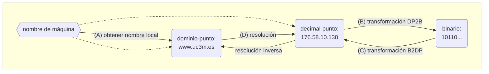
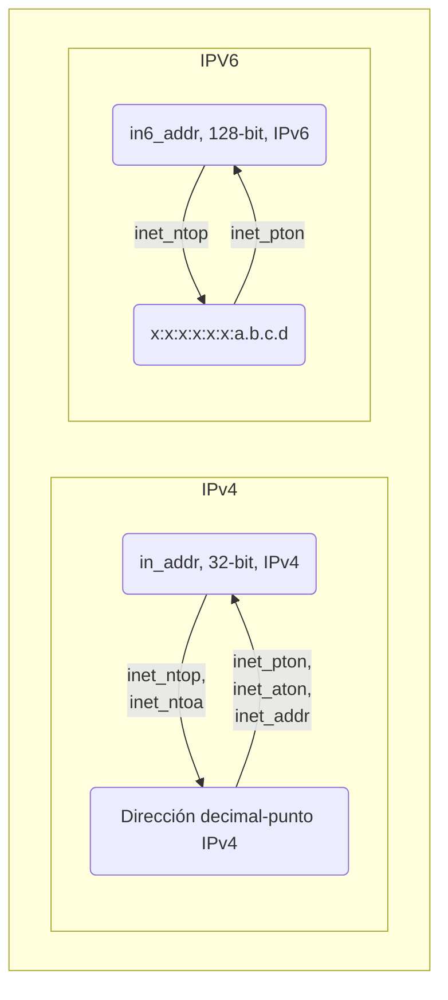
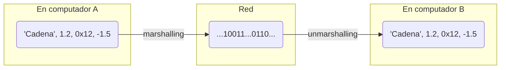
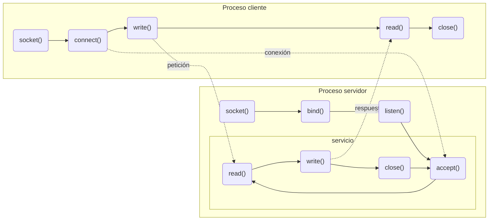
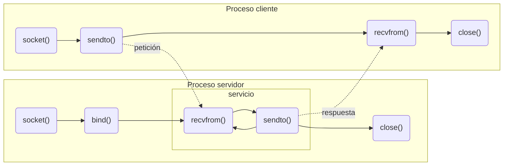

# Comunicación con Sockets
+ **Felix García Carballeira y Alejandro Calderón Mateos**
+ Licencia [GPLv3.0](https://github.com/acaldero/uc3m_sd/blob/main/LICENSE)


## Contenidos

 * Introducción a sockets
   * [Motivación](#introducción-a-sockets)
   * [Dominios y tipos](#sockets-dominios-de-comunicación)
   * [Direcciones y puertos](#direcciones)
   * [Representación de datos](#orden-de-los-bytes-big-endian-y-little-endian)
 * Modelos de comunicación
   * [Stream o orientado a conexión](#modelos-de-comunicación-orientado-a-conexión)
   * [Datagram](#modelos-de-comunicación-no-orientado-a-conexión)
 * Aspectos adicionales
   * [Opciones más comunes de un socket](#opciones-importantes-asociadas-a-un-socket)
   * [Servidor secuencial vs procesos pesados vs hilos](#servidor-secuencial-vs-procesos-pesados-vs-hilos)
   * [Trabajar con heterogeneidad en el sistema distribuido](#trabajar-con-heterogeneidad-en-el-sistema-distribuido)
   

## Introducción a sockets

* Mecanismo de IPC para poder comunicar procesos que ejecutan en distintas máquinas
  * Otros posibles mecanismos IPC: ficheros, tuberías con nombre, etc.

* Breve historia:
  * La primera implementación apareció en 1983 en UNIX BSD 4.2
    * Intento de incluir TCP/IP en UNIX
    * Diseño independiente del protocolo de comunicación
  * API formalmente especificado en el estándar POSIX.1g (2000)
  * Actualmente:
    * Disponibles en prácticamente todos los sistemas operativos: Linux, Windows, MacOS, etc.
    * API en casi todos los lenguajes:  Java (como clase nativa), Python (como paquete socket), etc.


## Qué representa un socket

```c
#include <sys/socket.h>
int socket(int domain, int type, int protocol) ;
...
```

* Un **socket** es una abstracción que:
  * Representa un extremo de una comunicación bidireccional con una terna (protocolo, dirección, puerto) asociada
  * Ofrece interfaz de acceso a la capa de transporte del protocolo TCP/IP

* Un **socket** se representa como descriptor de un punto final de comunicación (**dirección IP** y **puerto**)

* Tres elementos asociados a un socket en la creación:
  * Dominio de comunicación
  * Tipo de sockets
  * Protocolo


## Sockets: dominios de comunicación


  ```c
  int socket(int domain, int type, int protocol) ;
  ```

  * **Dominio de comunicación**
    * Un socket está asociado a un dominio desde su creación
    * Sólo se pueden comunicar sockets del mismo dominio
    * Los servicios de sockets son independientes del dominio
    * Ejemplos:
       * AF_UNIX: comunicación dentro de una máquina
       * AF_INET: comunicación usando protocolos TCP/IP (IPv4)
       * AF_INET6: comunicación usando protocolos TCP/IP (IPv6)

  * Tipo de sockets
  * Protocolo


## Sockets: tipo de socket

  ```c
  int socket(int domain, int type, int protocol) ;
  ```

  * Dominio de comunicación
       * AF_INET: comunicación usando protocolos TCP/IP (IPv4)
       * AF_INET6: comunicación usando protocolos TCP/IP (IPv6)

  * **Tipo de sockets**
    * SOCK_STREAM: Stream, protocolo TCP
    * SOCK_DGRAM: Datragrama, protocolo UDP
    * SOCK_RAW: Raw, sin protocolo de transporte (protocolo IP)

  * Protocolo
 

## Sockets: protocolo

  ```c
  int socket(int domain, int type, int protocol) ;
  ```

  * Dominio de comunicación
       * AF_INET: comunicación usando protocolos TCP/IP (IPv4)
       * AF_INET6: comunicación usando protocolos TCP/IP (IPv6)

  * Tipo de sockets
    * SOCK_STREAM: Stream
    * SOCK_DGRAM: Datragrama
    * SOCK_RAW: Raw

  * **Protocolo**
    * 0: valor por defecto (ver /etc/protocols para otros)
    

## Socket **stream** vs **datagram**

| socket         | stream         | datagram       |
|----------------|----------------|----------------|
| Protocolo      | TCP            | UDP            |
| Flujo de datos | bidireccional  | bidireccional  |
| Conexión       | conexión extremo-a-extremo antes de intercambio de datos | No hay conexión entre procesos comunicados |
| Parcelación    | flujo de bytes<br>(no preserva el límite entre mensajes) | flujo de datagramas (un datagrama es una entidad autocontenida, mantiene separación entre paquetes) (1) |
| Fiabilidad     | Si (2)           | No<br>(desordenados, duplicados, pérdidas) |
| Ejemplos       | HTTP, FTP, etc.  | DNS  |

 * (1) Longitud máxima de un datagrama (datos y cabeceras) es 64 KB<br>Cabecera IP+cabecera UDP = 28 bytes
 * (2) Paquetes ordenados por secuencia, sin duplicación de paquetes, libre de errores, notifica errores


## Comparación de protocolos

| Característica           | IP  | UDP  | TCP  |
|--------------------------|-----|------|------|
| Orientado a conexión     | NO  | NO   | SI   |
| Límite entre mensajes    | SI  | SI   | NO   |
| Ack                      | NO  | NO   | SI   |
| Timeout y retransmisión  | NO  | NO   | SI   |
| Detección de duplicación | NO  | NO   | SI   |
| Secuenciamiento          | NO  | NO   | SI   |
| Flujo de control         | NO  | NO   | SI   |


## Información asociada a una comunicación

La información asociada a una comunicación ha de incluir:
  ```
  (Protocolo, IP-local, P-local, IP-remoto, P-remoto)
  ```

Donde:
 * Protocolo: TCP, UDP, RAW
 * IP-local:  dirección IP local (origen)
 * P-local:   puerto local (origen)
 * IP-remoto: dirección IP remota (destino)
 * P-remoto:  puerto remoto (destino


## Direcciones

 * Las direcciones se usan para:
   * Asignar una dirección local a un socket (bind)
   * Especificar una dirección remota (connect o sendto)
   
 * Las direcciones son dependientes del dominio
    * Cada dominio usa una estructura específica
      * Direcciones en AF_UNIX (``struct sockaddr_un``)
        * Nombre de fichero
      * Direcciones en AF_INET (``struct sockaddr_in``)
        * Dirección de host (32 bits) + puerto (16 bits) + protocolo
   * Se utiliza la estructura genérica ``struct sockaddr`` en el API
   * Es necesario la conversión de tipos (casting) en las llamadas


## Puertos

 * Un puerto se asocia a un proceso destino en un computador:
    * Permite que la transmisión se dirija a un proceso específico en el computador destino
    * Un puerto tiene un único receptor y múltiples emisores (excepto multicast)
    * Toda aplicación que desee enviar y recibir datos debe "abrir" un puerto

 * Se representa con un número entero de 16 bits sin signo:
   * 2^16 puertos en una máquina ~ 65536 puertos posibles
   * Reservados por la IANA para aplicaciones de Internet:
      * 0-1023 (también llamados *well-known* puertos)
      * Puertos entre 1024 y 49151 son puertos registrados para ser usados por los servicios
      * Puertos por encima de 65535 para uso privado
      * http://www.iana.org/assignments/port-numbers

  * El espacio de puertos para streams y datagramas es independiente


## Dirección de host

 * En C, una dirección IP de host se almacena en una estructura de tipo ```in_addr```:
   ```c
   #include <netinet/in.h>

   typedef uint32_t in_addr_t;

   struct in_addr {
     in_addr_t s_addr; /* entero sin signo de 32 bits */
   };

   ...
   struct in_addr a1 ;
   a.s_addr = inet_addr("10.12.110.57"); // a.s_addr es la dirección en binario
   ```

* <details>
  <summary>En Python...</summary>
  El módulo ipaddress incluye clases para trabajar con direcciones de red IPv4 y IPv6

  ### ip_address.py
  ```python
  import binascii
  import ipaddress

  addr = ipaddress.ip_address('176.58.10.138')
  print(addr)
  
  print(' IP version:',  addr.version)
  print(' is private:',  addr.is_private)
  print(' packed form:', binascii.hexlify(addr.packed))
  print(' integer:',     int(addr))
  print('')
  ```
  </details>


## Direcciones en AF_INET

 * En C, una dirección incluye la dirección IP, puerto y familia en la estructura ```struct sockaddr_in```:
```c
#include <netinet/in.h>

struct sockaddr_in
{
  short          sin_family;  /* dominio Internet (AF_INET) */
  in_port_t      sin_port;    /* puerto: entero 16 bits sin signo */
  struct in_addr sin_addr;    /* dirección IP (entero 32 bits sin signo) */
  unsigned char  sin_zero[8]; /* relleno o padding (8 bytes) */
};

...
struct sockaddr_in a2;
memset(&a2, 0, sizeof(struct sockaddr_in)); // inicializar todo a cero
a2.sin_family      = AF_INET ;
a2.sin_port        = htons(8080) ; 
a2.sin_addr.s_addr = inet_addr("10.12.110.57");
```
 * **TIP:** Al usar ```struct sockaddr_in``` que hay que inicializar a 0 todos los campos para limpiar lo que tenga antes.


## Servicios sobre direcciones (1/2)

 * Hay distintas notaciones para una dirección:
    | Notación      | Ejemplo         | Formato  | Entendible por |
    |---------------|-----------------|----------|----------------|
    | dominio-punto | "www.uc3m.es"   | Texto    | Humano         |
    | decimal-punto | "176.58.10.138" | Texto    | Humano         |
    | binario       | 10110...        | Binario  | Máquina        |


 * Servicios sobre direcciones:
   * Obtener el nombre de la máquina local (ej.: "nodo1.inf.uc3m.es")
   * Obtener la dirección de un host (ej.: "nodo1.inf.uc3m.es" -> "10.1.2.3")
   * Transformar direcciones (ej.: "10.1.2.3" -> 0x12345678 / 0x12345678 -> "10.1.2.3")


## Servicios sobre direcciones (2/2)




## Servicios sobre direcciones: (A) obtener el nombre local

* En C, ```gethostname``` es la función que facilita el nombre de la máquina (formato dominio punto) en la que se ejecuta:
  ```c
  int gethostname ( char *name,        // buffer donde se almacena el nombre
                    size_t namelen );  // longitud del buffer
  ```

#### gethostname.c
```c
#include <unistd.h>
#include <stdio.h>
#include <stdlib.h>

int main ()
{
    char maquina[256];
    int err;

    err = gethostname(maquina, 256);
    if (err != -1)
        printf("Ejecuto en la maquina %s\n", maquina);

    exit(0);
}
```

* <details>
  <summary>En Python...</summary>
  El método gethostname de la clase socket se encarga.

  ### gethostname_1.py
  ```python
  import socket
  name = socket.gethostname();
  print('host name: ' + name)
  ```
  </details>


## Servicios sobre direcciones: (B) decimal-punto -> binario

```c
struct sockaddr_in  a4;
struct sockaddr_in6 a6;
memset(&a4, 0, sizeof(struct sockaddr_in));  // inicializar todo a cero
memset(&a6, 0, sizeof(struct sockaddr_in6)); // inicializar todo a cero
 ```

  * **inet_addr** -> PROBLEMA: el error devuelto se confunde con un valor válido
    ```c
    // (opción 1) in_addr_t inet_addr(const char *cp);
    a4.sin_addr.s_addr = inet_addr("10.10.10.57"); 
    if (INADDR_NONE == a4.sin_addr.s_addr) {
        // INADDR_NONE: dirección con todos los bits a uno 
        printf("ERROR en inet_addr\n") ;
    }
    ```
  * **inet_aton** ->  PROBLEMA: inet_aton solo vale para IPv4
    ```c
    // (opción 2) int inet_aton(char *str, struct in_addr *addr);
    int ret = inet_aton("10.10.10.57", &(a4.sin_addr.s_addr));
    if (0 == ret) {
        printf("ERROR en inet_aton\n") ;
    }
    ```
  * **inet_pton** -> vale para IPv4 y para IPv6
    ```c
    // (opción 3) int inet_pton(int family, const char *strptr, void *addrptr);
    int ret = inet_pton(AF_INET6, "2024:db8:8722:3a92::15", &(a6.sin6_addr)); 
    if (0 == ret) {
        printf("ERROR en inet_pton\n") ;
    } 
    ```


## Servicios sobre direcciones: (C ) binario -> decimal-punto

```c
struct sockaddr_in  a4;
memset(&a4, 0, sizeof(struct sockaddr_in));  // inicializar todo a cero
 ```

  * **inet_ntoa** ->  PROBLEMA: inet_ntoa solo vale para IPv4
    ```c
    // (opción 1) int inet_ntoa(...
    char str4[INET_ADDRSTRLEN];
    char *ret = inet_ntoa(a4.sin_addr.s_addr);
    if (NULL == ret) {
        printf("ERROR en inet_ntoa\n") ;
    }
    ```
  * **inet_ntop** -> vale para IPv4 y para IPv6
    ```c
    // (opción 2) const char *inet_ntop(int domain, const void *addrptr, char *dst_str, size_t len);
    char str4[INET_ADDRSTRLEN];
    ptr = inet_ntop(AF_INET, &(a4.sin_addr.s_addr), str4, sizeof(str4));
    if (0 == ret) {
        printf("ERROR en inet_ntop\n") ;
    } 
    ```


## Resumen de transformación de direcciones y ejemplo




### direcciones.c
```c
#include <stdlib.h>
#include <stdio.h>
#include <sys/socket.h>
#include <netinet/in.h>
#include <arpa/inet.h>

int main(int argc, char **argv)
{
    struct in_addr in;

    if (argc != 2) {
        printf("Uso: %s <decimal-punto>\n", argv[0]);
        exit(0);
    }

    if (inet_aton(argv[1], &in) == 0) {
        printf("Error en la dirección\n");
        exit(0);
    }

    printf("La dirección es %s\n", inet_ntoa(in));
    exit(0);
}
```


## Obtener la información de una máquina: (D) resolver nombres (forma clásica)

  * La información de una máquina se representa mediante la estructura ``struct hostent``:
    ```c
    struct hostent
    {
       char   *h_name ;
       char  **h_aliases ;
       int     h_addrtype ;
       int     h_length ;
       char  **h_addr_list ;
    }
    ```

    * Obtiene la información de un host a partir de una dirección en formato dominio-punto 
         ```c
      struct hostent *gethostbyname(char *str);  // str: nombre de la máquina
      ```

    * Obtiene la información de un host a partir de una dirección IP 
        ```c
      struct hostent *gethostbyaddr(const void *addr,  // addr: puntero a struct in_addr
                                      int len,           // len:  tamaño de la estructura
                                      int type);         // type: AF_INET
      ```

    * Un ejemplo de  estructura  ``struct hostent`` rellena podría ser:

<html>
<p align="center">
  <br>
<small><b>Imagen de  http://www.cs.emory.edu/~cheung/Courses/455/Syllabus/9-netw-prog/netw-supp4.html</b></small>
</p>
</html>


## Obtener la información de una máquina: (D) resolver nombres (forma moderna)
 
  * Para tanto IPv4 como IPv6 se recomienda usar la nueva estructura  ``struct addrinfo``:
    ```c
    struct addrinfo {
       int    ai_flags;    // AI_PASSIVE, AI_CANONNAME, AI_NUMERICHOST, etc.
       int    ai_family;   // PF_UNSPEC, PF_INET, etc.
       int    ai_socktype; // SOCK_STREAM, SOCK_DGRAM
       int    ai_protocol; // IPPROTO_TCP, IPPROTO_UDP
       size_t ai_addrlen;
       char * ai_canonname;
       struct sockaddr * ai_addr;
       struct addrinfo * ai_next;
    };
    ```
    
    * El equivalente a ``gethostbyname`` para IPv4 e IPv6 es **getaddrinfo** + **freeaddrinfo**
         ```c
      int getaddrinfo ( const char *restrict node,
                        const char *restrict service,
                        const struct addrinfo *restrict hints,
                        struct addrinfo **restrict res );
      void freeaddrinfo ( struct addrinfo *res );
      ```

       Se aconseja ver ejemplo de [servidor simple de Beej](https://beej.us/guide/bgnet/html/#a-simple-stream-server) sobre el uso de getaddrinfo+freeaddrinfo puesto que su uso no es un simple cambio de gethostbyname por getaddrinfo. Sobre los resultados que getaddrinfo devuelve hay que iterar e intentar hacer socket+bind o socket+connect hasta el primer resultado que lo permita, que será el de trabajo.

    * La función **getnameinfo** es la inversa de getaddrinfo: convierte una dirección de socket interna en el nombre legible y servicio correspondiente, de forma independiente del protocolo.
      ```c
      int getnameinfo ( const struct sockaddr *sa, 
                        socklen_t salen,
                        char *host, size_t hostlen,
                        char *serv, size_t servlen, int flags );
      ```


## Ejemplos de conversión

* <details>
    <summary>En C, ejemplo de conversión dominio-punto a decimal-punto...</summary>
    
   **dns.c**
   ```c
    #include <stdio.h>
    #include <string.h>
    #include <stdlib.h>
    #include <netdb.h>
    #include <sys/socket.h>
    #include <netinet/in.h>
    #include <arpa/inet.h>

    int main(int argc, char **argv)
    {
        struct hostent *hp;
        struct in_addr in;

        hp = gethostbyname("www.uc3m.es");
        if (hp == NULL) {
            printf("Error en gethostbyname\n"); exit(0);
        }

        memcpy(&in.s_addr, *(hp->h_addr_list), sizeof(in.s_addr));
        printf("%s es %s\n", hp->h_name, inet_ntoa(in));

        return 0;
    }
    ```
  </details>


* <details>
    <summary>En C, ejemplo de conversión decimal-punto a dominio-punto (clásico)...</summary>
    
   **obtener-dominio.c**
  ```c
  #include <netdb.h>
  #include <stdio.h>
  #include <string.h>
  #include <sys/socket.h>
  #include <netinet/in.h>
  #include <arpa/inet.h>

  int main(int argc, const char **argv)
  {
     struct in_addr addr; struct hostent *hp;
     char **p; struct in_addr in;
     char **q; int err;

     if (argc != 2) {
         printf("USO: %s <Direccion-IP>\n", argv[0]);
         return (1);
     }

     err = inet_aton(argv[1], &addr);
     if (err == 0) {
         printf("por favor use direccion IP en formato a.b.c.d\n");
         return (2);
     }

     hp=gethostbyaddr((char *) &addr, sizeof (addr), AF_INET);
     if (hp == NULL) {
        printf("Error en gethostbyaddr\n");
        return (3);
     }

     for (p = hp->h_addr_list; *p!=0; p++)
     {
         memcpy(&in.s_addr, *p, sizeof(in.s_addr));
         printf("%s es \t%s \n", inet_ntoa(in), hp->h_name);
         for (q=hp->h_aliases; *q != 0; q++)
              printf("%s\n", *q);
     }

     return(0);
  }
  ```
  </details>


* <details>
    <summary>En C, ejemplo de conversión decimal-punto a dominio-punto (moderno)...</summary>
    
   **obtener-dominio-6.c**
  ```c
    #include <stdio.h>
    #include <stdlib.h>
    #include <netdb.h>
    #include <string.h>
    #include <netinet/in.h>
    #include <sys/socket.h>


    int main ( int argc, char*argv[] )
    {
        int ret;
        struct addrinfo *results;
        struct addrinfo *res;
        char hostname[1025] ;

        // domain name -> lista de direcciones
        ret = getaddrinfo("www.uc3m.es", NULL, NULL, &results);
        if (ret < 0) {
            printf("ERROR en getaddrinfo: %s\n", gai_strerror(ret));
            return -1;
        }

        // recorrer todos los resultados y hacer búsqueda inversa
        for (res = results; res != NULL; res = res->ai_next)
        {
            strcpy(hostname, "") ;
            ret = getnameinfo(res->ai_addr, res->ai_addrlen,
                          hostname, 1025,
                          NULL, 0, 0);
            if (ret < 0) {
                printf("ERROR en getnameinfo: %s\n", gai_strerror(ret));
                continue;
            }

            if (*hostname != '\0')
                 printf("hostname: %s\n", hostname);
            else printf("hostname: <empty>\n");
        }

        // liberar memoria de los resultados
        freeaddrinfo(results);

        return 0;
    }
  ```
  </details>


* <details>
  <summary>En Python, conversión dominio-punto a decimal-punto...</summary>

  ### gethostname_2.py
  ```python
  import socket
  name = socket.gethostname();
  print(name + ': ' + socket.gethostbyname(name))
  ```
  </details>

* <details>
  <summary>En Python, dominio-punto/decimal-punto a decimal-punto...</summary>

  ### dns.py
  ```python
  import socket
  import sys

  arguments = len(sys.argv)
  if arguments < 2:
     print('Uso: dns <host>')
     exit()
  try:
     hostname, aliases, addresses = socket.gethostbyaddr(sys.argv[1])
     print(sys.argv[1] + ': ', hostname)
     print(sys.argv[1] + ': ', aliases)
     print(sys.argv[1] + ': ', addresses)
  except socket.error as msg:
     print('ERROR: ', msg)
   ```
  </details>

* <details>
  <summary>En Python, decimal-punto a binario...</summary>

  ### addr_dot2bin.py
  ```python
  import socket
  import struct

  // Example from: https://pythontic.com/modules/socket/inet_aton
  IPQuad  = "192.168.0.0"
  IP32Bit = socket.inet_aton(IPQuad) 
  print(IP32Bit)
   ```
  </details>


## Orden de los bytes: big-endian y little-endian

 * Hay dos órdenes de los bytes de una palabra en memoria:
    * Big-endian
       * Motorola 
    * Little-endian
       * Intel, AMD

* Las diferencias entre los dos se puede ver en la siguiente figura:


## Orden de los bytes y el *Network Byte Order*

 * Big-endian es el estándar para el ordenamiento de los bytes usado en TCP/IP
    * También llamado *Network Byte Order*
    
  * En computadores que no utilicen Big-endian es necesario emplear funciones para traducir números entre el formato que utiliza TCP/IP (Big-endian) y el empleado por el propio computador (Little-endian)
    * Host (Little-Endian) -> Network (Big-Endian): 
         ```c
       #include <arpa/inet.h>
      u_long  htonl(u_long hostlong);   // traducir número de 32 bits del formato host al de net
      u_short htons(u_short hostshort); // traducir número de 16 bits del formato host al de net
      ```
    * Network (Big-Endian) -> host (Little-Endian): 
         ```c
       #include <arpa/inet.h>
       u_long ntohl(u_long netlong);     // traducir número de 32 bits del formato net a host
       u_short ntohs(u_short netshort);  // traducir número de 16 bits del formato net a host
      ```


## Representación de los datos: marshalling/unmarshalling

 * En un sistema distribuido con máquinas heterogéneas no solo el orden de los bytes puede ser distinto, también el tamaño de la palabra en los nodos conectados (máquinas de 32-bits, 64-bits, etc.), la representación usada (enteros en complemento a dos, enteros en complemento a uno, etc.), el juego de caracteres (ASCII, utf-16, etc.), etc.

 * De forma general se precisa dos procedimientos:
    * Un procedimiento de **marshalling** o empaquetamiento de datos: <br>transforma los valores de las estructuras de datos del formato de una máquina a un formato común para envío por la red (**representación externa**).
    * Un procedimiento de **unmarshalling** o de desempaquetamiento de datos: <br>transforma del formato común recibido por la red en el formato de la máquina al que llega los valores (**representación interna**).



## Modelos de comunicación: orientado a conexión

* Uso de TCP mediante sockets stream (SOCK_STREAM) 

<html>
<table>
<tr><th>Servidor</th><th>Cliente</th></tr>
<tr>
<td valign=top>
<ul>
   <li> 1.- Creación de un socket (<b>socket</b>) </li>
   <li> 2.- Obtener la dirección</li>
   <li> 3.- Asignación de direcciones (<b>bind</b>)</li>
   <li> 4.- Preparar para aceptar conexiones (<b>listen</b>)</li>
   <li> Por cada cliente:</li>
   <ul>
   <li> 5.- Aceptar una conexión (<b>accept</b>)</li>
   <li> 6.- Transferencia de datos (<b>read</b> y <b>write</b>)</li>
   <li> 7.- Cerrar socket conectado (<b>close</b>)</li>
   </ul>
   <li> 8.- Cerrar socket servicio (<b>close</b>)</li>
</ul>
</td>
<td valign=top>
<ul>
   <li> (1) Creación de un socket (<b>socket</b>)</li>
   <li> (2) Obtener la dirección</li>
   <li></li>
   <li></li>
   <li></li>
   <li> (3) Solicitud de conexión (<b>connect</b>)</li>
   <li> (4) Transferencia de datos (<b>write</b> y <b>read</b>)</li>
   <li> (5) Cerrar un socket (<b>close</b>)</li>
</ul>
</td>
</tr>
</table>
</html>




## Ejemplo de uso de sockets orientados a conexión

**servidor-base-tcp.c**
   ```c
    #include <stdio.h>
    #include <string.h>
    #include <unistd.h>
    #include <netinet/in.h>
    #include <sys/types.h>
    #include <arpa/inet.h>
    #include <sys/socket.h>

    int main ( int argc, char **argv )
    {
         int sd, newsd, ret;
         socklen_t size;
         struct sockaddr_in server_addr, client_addr;

         // (1) creación de un socket
         // * NO tiene dirección asignada aquí
         sd = socket(AF_INET, SOCK_STREAM, 0) ;
         if (-1 == sd) {
             printf("Error en la creación del socket");
             return -1;
         }

         // (2) obtener la dirección
         bzero((char *)&server_addr, sizeof(server_addr));
         server_addr.sin_family = AF_INET;
         server_addr.sin_port = htons(4200);
         server_addr.sin_addr.s_addr = INADDR_ANY;

         // (3) asigna dirección a un socket
         // * host = INADDR_ANY -> cualquier dirección del host
         // * port = 0 -> el sistema selecciona el primer puerto libre
         // * port = 1...1023 -> puertos reservados (puede necesitar ser root la ejecución)
         ret = bind(sd,(struct sockaddr *)& server_addr, sizeof(server_addr)) ;
         if (ret < 0) {
             printf("Error en el bind\n") ;
             return -1 ;
         }

         // (4) preparar para aceptar conexiones
         // * listen permite definir el número máximo de peticiones pendientes a encolar
         // * SOMAXCONN está en sys/socket.h
         listen(sd, SOMAXCONN);

         while (1)
         {
            // (5) aceptar nueva conexión (newsd) desde socket servidor (sd)
            // * bloquea al servidor hasta que se produce la conexión
            // * sd permite acceptar conexiones y newsd permitirá trabajar con cliente
            newsd = accept (sd, (struct sockaddr *) &client_addr, &size);
            if (newsd < 0) {
                printf("Error en el accept");
                return(-1);
            }

            // Para ayudar a la depuración,
            // se imprime la IP y puerto del cliente que se conecta
            // client_addr almacena la IP y el puerto del proceso cliente
            printf("conexión aceptada de IP:%s y puerto:%d\n",
                    inet_ntoa(client_addr.sin_addr),
                        ntohs(client_addr.sin_port));

            // Preparar el mensaje a enviar: 1024 bytes con "hola mundo"
            char buffer[1024] ;
            strcpy(buffer, "Hola mundo") ;

            // (6) transferir datos sobre newsd
            size_t total    = sizeof(buffer) ;
            size_t escritos = 0 ;
            ssize_t result  = 0 ;
            while (escritos != total) // queda por escribir
            {
               result = write(newsd, buffer+escritos, total-escritos) ;
               // puede que write NO escriba todos los datos solicitados
               if (-1 == result) { break; }
               escritos = escritos + result ;
            }
            if (escritos != total) { // error, no se ha escrito todo
                printf("Error al escribir buffer") ;
            }

            // (7) cerrar socket conectado
            close(newsd);
         }

         // (8) cerrar socket de servicio
         close(sd);

    } /* fin main */
   ```

**cliente-base-tcp.c**
   ```c
    #include <stdlib.h>
    #include <stdio.h>
    #include <unistd.h>
    #include <string.h>
    #include <netdb.h>
    #include <sys/socket.h>
    #include <arpa/inet.h>
    #include <arpa/inet.h>

    int main ( int argc, char **argv )
    {
        char *maquina; short puerto;
        struct sockaddr_in server_addr;
        struct hostent *hp;
        int sd, ret;

        if (argc != 3) {
            printf("Uso: %s <IP máquina> <puerto>\n", argv[0]);
            return 0;
        }
        maquina = argv[1] ;
        puerto = (short) atoi(argv[2]);

        // (1) creación del socket (NO tiene dirección asignada aquí)
        sd = socket(AF_INET, SOCK_STREAM, 0);
        if (sd < 0) {
            printf("ERROR en socket\n") ;
            return -1 ;
        }

         // (2) obtener la dirección
        bzero((char *)&server_addr, sizeof(server_addr));
        hp = gethostbyname(maquina);
        memcpy (&(server_addr.sin_addr), hp->h_addr, hp->h_length);
        server_addr.sin_family = AF_INET;
        server_addr.sin_port = htons(puerto);

        // (3) Solicitud de conexión (con socket remoto)
        // * si el socket local no tiene dirección asignada
        //   entonces se le asigna una automáticamente con puerto temporal
        ret = connect(sd, (struct sockaddr *) &server_addr, sizeof(server_addr)) ;
        if (ret < 0) {
            printf("ERROR en la conexión\n");
            return -1;
        }

        // Preparar el espacio para recepción del mensaje
        char buffer[1024] ;
        strcpy(buffer, "") ;

        // (4) transferir datos sobre sd
        size_t total  = sizeof(buffer) ;
        size_t leidos = 0 ;
        ssize_t result = 0 ;
        while (leidos != total) // queda por escribir
        {
           result = read(sd, buffer+leidos , total-leidos ) ;
           // puede que read NO lea todos los datos solicitados
           if (-1 == result) { break; }
           leidos = leidos + result ;
        }
        if (leidos != total) { // error, no se ha leído todo
            printf("Error al leer buffer") ;
        }

        // Imprimir el mensaje recibido
        printf("mensaje del servidor: %s\n", buffer) ;

        // (5) Cerrar socket
        close(sd);

        return 0;
    }
   ```

* Para compilar, se puede usar:
   ```bash
   gcc -Wall -g  -o servidor-base-tcp servidor-base-tcp.c
   gcc -Wall -g  -o cliente-base-tcp  cliente-base-tcp.c
  ```

* Para ejecutar, se puede usar:
   ```bash
   user$ ./servidor-base-tcp &
   user$ ./cliente-base-tcp localhost 4200
   conexión aceptada de IP:127.0.0.1 y puerto:57422
   mensaje del servidor: Hola mundo
   user$  kill -9 %1
  ```


* <details>
  <summary>En Python...</summary>

  ### server_base_tcp.py
  ```python
  import socket
  import sys
   
  sock = socket.socket(socket.AF_INET, socket.SOCK_STREAM)
  sock.setsockopt(socket.SOL_SOCKET, socket.SO_REUSEADDR, 1)
   
  server_address = ('localhost', 10009)
  sock.bind(server_address)
  sock.listen(5)
   
  while True:
       connection, client_address = sock.accept()
       try:
           message = ''
           while True:
               msg = connection.recv(1)
               if (msg == b'\0'):
                   break;
               message += msg.decode()
           message = message + "\0"
   
           print('mensaje: ' + message)
           connection.sendall(message.encode())
       finally:
           connection.close()
  ```

  ### client_base_tcp.py
  ```python
  import socket
  import sys
  
  arguments = len(sys.argv)
  if arguments < 3:
      print('Uso: client_base_tcp  <host> <port>')
      exit()
  
  sock = socket.socket(socket.AF_INET, socket.SOCK_STREAM)
  server_address = (sys.argv[1], int(sys.argv[2]))
  print('conectando a {} y puerto {}'.format(*server_address))
  sock.connect(server_address)
  
  try:
      message = b'Esto es una cadena de prueba\0'
      sock.sendall(message)
  
      message = ''
      while True:
          msg = sock.recv(1)
          if (msg == b'\0'):
              break;
          message += msg.decode()
      message = message + "\0"
  
      print('mensaje: ' + message)  
  finally:
      sock.close()
  ```
  </details>


## Modelos de comunicación: NO orientado a conexión

* Uso de UDP mediante sockets datagrama (SOCK_DGRAM) 

<html>
<table>
<tr><th>Servidor</th><th>Cliente</th></tr>
<tr>
<td valign=top>
<ul>
   <li> (1) Creación de un socket (<b>socket</b>) </li>
   <li> (2) Obtener la dirección de un socket</li>
   <li> (3) Asignación de direcciones (<b>bind</b>)</li>
   <li>Bucle:</li>
   <ul>
   <li> (4) Transferencia de datos (<b>recvfrom</b> y <b>sendto</b>)</li>
   </ul>
   <li> (5) Cerrar socket (<b>close</b>)</li>
</ul>
</td>
<td valign=top>
<ul>
   <li> (1) Creación de un socket (<b>socket</b>)</li>
   <li> (2) Obtener la dirección de un socket</li>
   <li></li>
   <li></li>
   <li> (3) Transferencia de datos (<b>sendto</b> y <b>recvfrom</b>)</li>
   <li> (4) Cerrar un socket (<b>close</b>)</li>
</ul>
</td>
</tr>
</table>
</html>




## Ejemplo de uso de sockets NO orientados a conexión

**servidor-base-udp.c**
   ```c
#include <arpa/inet.h>
#include <netinet/in.h>
#include <stdbool.h>
#include <stdio.h>
#include <string.h>
#include <unistd.h>

    int main ( int argc, char *argv[] )
    {
        int sock, ret;

        // (1) Creación del socket
        sock = socket(PF_INET, SOCK_DGRAM, 0) ;
        if (sock < 0) {
            printf("Error al crear el socket\n") ;
            return -1;
        }

        // (2) Obtener la dirección del socket
        struct sockaddr_in server_address;
        memset(&server_address, 0, sizeof(server_address));
        server_address.sin_family      = AF_INET;
        server_address.sin_port        = htons(4200);
        server_address.sin_addr.s_addr = htonl(INADDR_ANY);

        // (3) Asignación de dirección
        ret = bind(sock, (struct sockaddr *)&server_address, sizeof(server_address)) ;
        if (ret < 0) {
            printf("Error en el bind\n");
            return -1;
        }

        // Buffer de recepción de mensajes y
        // estructura donde guardar la dirección del cliente
        struct sockaddr_in client_address;
        unsigned int client_address_len = 0;
        char buffer[1024];

        // Bucle
        while (true)
        {
                // borrar memoria del mensaje anterior
                memset(buffer, 0, 1024) ;

                // (4) Transferencia de datos
                ret = recvfrom(sock,
                               buffer, 1024, 0,
                               (struct sockaddr *)&client_address,
                               &client_address_len);
                if (ret < 0) {
                    printf("Error en recvfrom") ;
                }

                // Imprimir mensaje
                printf("mensaje: '%s' desde %s\n",
                       buffer,
                       inet_ntoa(client_address.sin_addr));
        }

        // (5) Cerrar socket
        close(sock) ;

        return 0;
}
   ```

**cliente-base-udp.c**
   ```c
    #include <arpa/inet.h>
    #include <stdio.h>
    #include <string.h>
    #include <sys/socket.h>
    #include <unistd.h>

    int main ( int argc, char *argv[] )
    {
        int sock, ret;

        // (1) Creación del socket
        sock = socket(PF_INET, SOCK_DGRAM, 0) ;
        if (sock < 0) {
            printf("Error al crear el socket\n") ;
            return -1;
        }

        // (2) Obtener la dirección del socket
        struct sockaddr_in server_address;
        memset(&server_address, 0, sizeof(server_address));
        server_address.sin_family      = AF_INET;
        server_address.sin_port        = htons(4200);
        inet_pton(AF_INET, "localhost", &server_address.sin_addr);


        // Mensaje a ser enviado
        char buffer[1024];
        strcpy(buffer, "Hola mundo...") ;

        // (3) Transferencia de datos
        ret = sendto(sock,
                     buffer, 1024, 0,
                     (struct sockaddr*)&server_address,
                     sizeof(server_address));
        if (ret < 0) {
            printf("Error en sendto") ;
        }

        // Imprimir mensaje
        printf("mensaje: '%s'\n", buffer);

        // (4) Cerrar socket
        // * close(sock) equivale a shutdown(sock, SHUT_RDWR) ;
        // SHUT_RD: cierra canal de lectura
        // SHUT_WR: cierra el canal de escritura,
        //          al terminar los datos read devolverá 0
        // SHUT_RDWR: cierra ambos canales
        close(sock);

        return 0;
    }
   ```


* Para compilar, se puede usar:
   ```bash
   gcc -Wall -g  -o servidor-base-udp servidor-base-udp.c
   gcc -Wall -g  -o cliente-base-udp  cliente-base-udp.c
  ```

* Para ejecutar, se puede usar:
   ```bash
   user$ ./servidor-base-udp &
   user$ ./cliente-base-udp 
   mensaje: 'Hola mundo...' desde 127.0.0.1
   mensaje: 'Hola mundo...'
   user$  kill -9 %1
  ```


## Opciones importantes asociadas a un socket

Las funciones setsockopt y getsockopt permiten establecer y consultar (respectivamente) las opciones asociadas a un socket:

   ```c
  #include <sys/types.h>
  #include <sys/socket.h>
  int getsockopt (int sd, int nivel, int opcion,       void *valor, socklen_t *len);
  int setsockopt (int sd, int nivel, int opcion, const void *valor, socklen_t  len);
   ```

Las opciones más importantes son:

* SO_REUSEADDR: para poder volver a usar la dirección de inmediato asociada con bind.

   ```c
   int val = 1;
   setsockopt(sd, SOL_SOCKET, SO_REUSEADDR, (void*) &val, sizeof(val));
   ```

   Por defecto cuando se cierra un socket hay que esperar un tiempo (constante TIME_WAIT, normalmente unos 20 segundos) hasta poder volver a hacer bind para utilizar la misma dirección. Si se ejecuta antes normalmente aparece el error **"Address already in use"** que esta opción soluciona.

* TCP_NODELAY: envío inmediato (sin intentar agrupar mensajes relativamente juntos en el tiempo)

   ```c
  int option = 1 ;
  rc = setsockopt(s, IPPROTO_TCP, TCP_NODELAY, &option, sizeof(option)) ;
   ```

   Por defecto espera un poco de tiempo antes de enviar pocos bytes por si puede agrupar varias pequeñas peticiones. El problema es que la latencia de cada petición particular es mayor. Por eso se recomienda el envío inmediato.

* SO_RCVBUF, SO_SNDBUF: 
  * Fijar el tamaño del buffer de envío/recepción
       ```c
       int size = 16*1024;
       err = setsockopt(s, SOL_SOCKET, SO_SNDBUF, (char *)&size, sizeof(size));
    ```
  * Conocer el tamaño del buffer de envío/recepción
    ```c
    int size ;
    err = getsockopt(s, SOL_SOCKET, SO_SNDBUF, (char *)&size, sizeof(size)) ;
    printf("%d\n", size) ;
    ```


## Servidor secuencial vs procesos pesados vs hilos

* El servidor base es secuencial: una vez se conecta un cliente, hasta que no termina de atender no acepta conexiones de otros clientes (lo que reduce el rendimiento)

**Esqueleto de servidor-base-tcp.c**
   ```c

    ...
    int main ( int argc, char **argv )
    {
         ...
         while (1)
         {
            // (5) aceptar nueva conexión (newsd) desde socket servidor (sd)
            // * bloquea al servidor hasta que se produce la conexión
            // * sd permite acceptar conexiones y newsd permitirá trabajar con cliente
            newsd = accept (sd, (struct sockaddr *) &client_addr, &size);
            if (newsd < 0) {
                printf("Error en el accept");
                return(-1);
            }

            ...

            // (6) transferir datos sobre newsd
            size_t total    = sizeof(buffer) ;
            size_t escritos = 0 ;
            ssize_t result  = 0 ;
            while (escritos != total) // queda por escribir
            {
               result = write(newsd, buffer+escritos, total-escritos) ;
               // puede que write NO escriba todos los datos solicitados
               if (-1 == result) { break; }
               escritos = escritos + result ;
            }
            if (escritos != total) { // error, no se ha escrito todo
                printf("Error al escribir buffer") ;
            }

            // (7) cerrar socket conectado
            close(newsd);
         }

         ...
    } /* fin main */
   ```

* El servidor puede ser concurrente usando procesos pesados: una vez se conecta un cliente, se crea un proceso pesado que se encargue de atenderle.

**Esqueleto de servidor-fork-tcp.c**
   ```c

    ...
    int main ( int argc, char **argv )
    {
         ...
         while (1)
         {
            // (5) aceptar nueva conexión (newsd) desde socket servidor (sd)
            // * bloquea al servidor hasta que se produce la conexión
            // * sd permite acceptar conexiones y newsd permitirá trabajar con cliente
            newsd = accept (sd, (struct sockaddr *) &client_addr, &size);
            if (newsd < 0) {
                printf("Error en el accept");
                return -1;
            }

            ...

            pid_t pid = fork() ;
            if (pid < 0) {
                printf("Error en fork()\n") ;
                return -1;
            } 
            if (0 == pid) // el proceso hijo atiende al cliente
            {
                // (6) transferir datos sobre newsd
                size_t total    = sizeof(buffer) ;
                size_t escritos = 0 ;
                ssize_t result  = 0 ;
                while (escritos != total) // queda por escribir
                {
                   result = write(newsd, buffer+escritos, total-escritos) ;
                   // puede que write NO escriba todos los datos solicitados
                   if (-1 == result) { break; }
                   escritos = escritos + result ;
                }
                if (escritos != total) { // error, no se ha escrito todo
                    printf("Error al escribir buffer") ;
                }

                // (7) cerrar socket conectado
                close(newsd);
            }
         }

         ...
    } /* fin main */
   ```

* El servidor puede ser concurrente usando procesos ligeros: una vez se conecta un cliente, se crea un hilo que se encargue de atenderle.

**Esqueleto de servidor-thread-tcp.c**
   ```c

    ...
    int busy = 0 ;
    pthread_mutex_t     m = PTHREAD_MUTEX_INITIALIZER ;
    pthread_condition_t c = PTHREAD_COND_INITIALIZER ;

    void *tratar_peticion ( void * arg )
    {
         int s_local;
         
         /// avisar copiado argumentos ////
         pthread_mutex_lock(&m);
         s_local = (* (int *) arg);
         busy = 0;
         pthread_cond_signal(&c);
         pthread_mutex_unlock(&m);
         /////////////////////
         
         // (6) transferir datos sobre newsd
         size_t total    = sizeof(buffer) ;
         size_t escritos = 0 ;
         ssize_t result  = 0 ;
         while (escritos != total) // queda por escribir
         {
             result = write(newsd, buffer+escritos, total-escritos) ;
             // puede que write NO escriba todos los datos solicitados
             if (-1 == result) { break; }
                 escritos = escritos + result ;
             }
             if (escritos != total) { // error, no se ha escrito todo
                 printf("Error al escribir buffer") ;
         }
         
         // (7) cerrar socket conectado
         close(s_local);
     
         pthread_exit(NULL);
         return NULL ;
    }

    int main ( int argc, char **argv )
    {
         pthread_attr_init(&attr);
         pthread_attr_setdetachstate(&attr, PTHREAD_CREATE_DETACHED);
         
         ...
         while (1)
         {
            // (5) aceptar nueva conexión (newsd) desde socket servidor (sd)
            // * bloquea al servidor hasta que se produce la conexión
            // * sd permite acceptar conexiones y newsd permitirá trabajar con cliente
            newsd = accept (sd, (struct sockaddr *) &client_addr, &size);
            if (newsd < 0) {
                printf("Error en el accept");
                return -1;
            }

            ...
            pthread_create(&thid, &attr, tratar_peticion, (void *)&newsd);
            
            /// Esperar copia de argumentos ///
            pthread_mutex_lock(&m);
            while (busy == 1)
                   pthread_cond_wait(&c, &m);
            busy = 1;
            pthread_mutex_unlock(&m);
            /////////////////////
         }

         ...
    } /* fin main */
   ```

* <details>
  <summary>En Python...</summary>

  ### Esqueleto de servidor-thread-tcp.py
  ```python
  import threading
  import socket
  
  def worker(sock):
      try:
          ...
          sock.sendall(message.encode())
          ...
      finally:
          sock.close()
  
  sock = socket.socket(socket.AF_INET, socket.SOCK_STREAM)
  sock.setsockopt(socket.SOL_SOCKET, socket.SO_REUSEADDR, 1)
 
  server_address = ('localhost', 12345)
  sock.bind(server_address)  
  sock.listen(5)
  
  while True:
      connection, client_address = sock.accept()
 
      t = threading.Thread(target=worker, name='Daemon', args=(connection,))
      t.start()
  ```
  </details>


## Trabajar con heterogeneidad en el sistema distribuido

* En general cuando se desarrolla una aplicación con sockets hay que plantear una solución que sea independiente de:
   * Arquitectura (Little-endian, big-endian)
   * Lenguaje de programación
* Emplear soluciones que definan el tamaño de los enteros (por ejemplo: 32 bits) puede ser un problema
   * Puede existir máquinas en el sistema distribuido que no puedan trabajar con el tamaño seleccionado
* Posibles soluciones:
   * **Protocolo con base binaria**: usar biblioteca que permita transformar de un formato binario de red a cualquier formato de host y viceversa.
      * Ventaja: envío rápido y compacto
      * Desventaja: tiempo de transformación, dificultad de depurar protocolos binarios, necesidad de biblioteca adicional.
      * Protocolos de ejemplo: protobuf (opción binaria)
   * **Protocolo basado en texto**: desarrollar aplicaciones que codifiquen los datos en cadenas de caracteres y envíen cadenas de caracteres
      * Ventaja: normalmente no se precisa de bibliteca adicional y es fácil de depurar
      * Desventaja: eficiencia
      * Protocolos de ejemplo: HTTP, SMTP, etc.


## Trabajar con heterogeneidad con protocolos basados en texto (1/2)

 * Para la lectura de cadenas de caracteres con sockets stream
    * Cuando una cadena de caracteres finaliza con el código ASCII ‘\0’ no se sabe a priori su longitud y no se puede usar la función recvMessage para leerla.
    * En este caso hay que leer byte a byte hasta leer el el código ASCII ‘\0’, y se puede usar la función readLine para ello.
    **lines.c**
       ```c
   
        ssize_t readLine ( int fd, void *buffer, size_t n )
        {
            ssize_t numRead;  /* num of bytes fetched by last read() */
            size_t totRead;   /* total bytes read so far */
            char *buf;
            char ch;

            if (n <= 0 || buffer == NULL) {
                errno = EINVAL;
                return -1;
            }

            buf = buffer;
            totRead = 0;
            while (1)
            {
                numRead = read(fd, &ch, 1);     /* read a byte */

                if (numRead == -1) {
                     if (errno == EINTR)        /* interrupted -> restart read() */
                         continue;
                else return -1;                 /* some other error */
                } else if (numRead == 0) {      /* EOF */
                        if (totRead == 0)       /* no bytes read; return 0 */
                             return 0;
                        else break;
                } else {                        /* numRead must be 1 if we get here*/
                        if (ch == '\n') break;
                        if (ch == '\0') break;
                        if (totRead < n - 1) {   /* discard > (n-1) bytes */
                             totRead++;
                            *buf++ = ch;
                        }
                }
            }

            *buf = '\0';
            return totRead;
        }
       ```

 * Para la escritura de cadenas de caracteres con sockets stream
    * Para el envío se puede usar sendMessage PERO hay que indicar el número de caracteres incluido el fin de cadena:
      ```c
      char buffer[256] ;
      strcpy(buffer, "Cadena a enviar") ;
      sendMessage(socket, buffer, strlen(buffer)+1) ;
      ```

* <details>
  <summary>En Python...</summary>

  ```python
  def read_string(sock):
      str = ''
      while True:
         msg = sock.recv(1)
         if (msg == b'\0'):
             break;
         str += msg.decode()
         return str

  def write_string(sock, str):
         sock.sendall(str) 
  ```
  </details>

## Trabajar con heterogeneidad con protocolos basados en texto (2/2)

 * Para recibir un número con sockets stream (como cadena)
    * Usando readLine se lee la cadena de caracteres que lo representa.
    * A continuación se transforma a número.
       ```c
      int n ;
      char buffer[256];
      char *endptr ;
      
      readLine(socket, buffer, 256) ;
      n = strtol(buffer, &endptr, 10) ; // n = atoi(buffer) ;
      if (endptr[0] != '\0') {
          printf("Error: %s no es un número en base %d\n", buffer, 10) ;
      }
       ```

 * Para enviar un número con sockets stream
    * Para el envío se puede usar sendMessage PERO hay que indicar el número de caracteres incluido el fin de cadena:
      ```c
      int n = 1234;
      char buffer[256];
      sprintf(buffer, "%d", n);
      sendMessage(socket, buffer, strlen(buffer)+1);
      ```

    * Se puede transformar números en coma flotante, etc. de forma similar.

* <details>
  <summary>En Python...</summary>

  ```python
  def read_string(sock):
      a = ''
      while True:
         msg = sock.recv(1)
         if (msg == b'\0'):
             break;
         a += msg.decode()
         return a
  
  def read_number(sock):
         a = read_string(sock)
         return(int(a,10))

  def write_string(sock, str):
         sock.sendall(str) 

  def write_number(sock, num):
         a = str(num) + b'\0'
         write_string(sock, a)
  ```
  </details>


**Material adicional**:
  * <a href="https://beej.us/guide/bgnet/html/index-wide.html">Beej's Guide to Network Programming</a>


