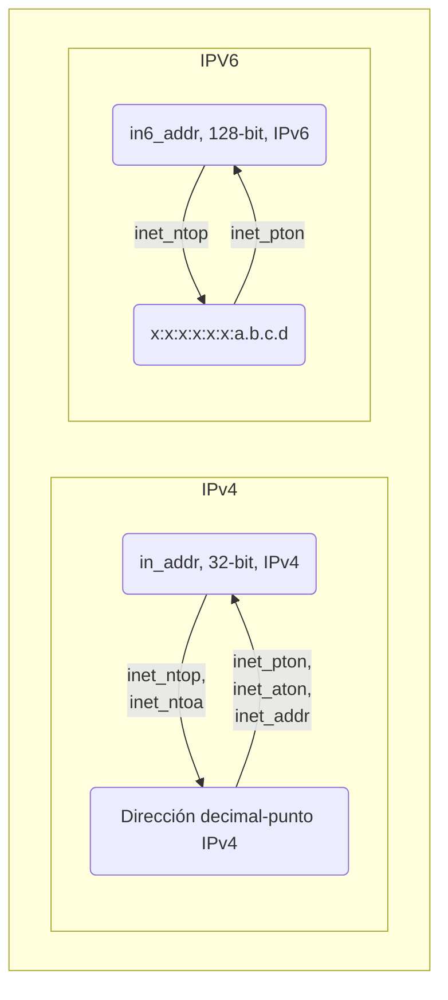

# Comunicación con Sockets
+ **Felix García Carballeira y Alejandro Calderón Mateos**
+ Licencia [GPLv3.0](https://github.com/acaldero/uc3m_sd/blob/main/LICENSE)


## Contenidos

 * Introducción a sockets
   * Motivación
   * Dominios y tipos
   * Direcciones y puertos
   * Representación de datos
 * Ejemplo con sockets
   * Datagram
   * Stream

---

## Introducción a sockets

* Mecanismo de IPC que proporciona comunicación entre procesos que ejecutan en máquinas distintas
  * Otros mecanismos IPC: ficheros, Pipes con nombre, memoria remota, etc.

* Breve historia:
  * La primera implementación apareció en 1983 en UNIX BSD 4.2
    * Intento de incluir TCP/IP en UNIX
    * Diseño independiente del protocolo de comunicación
  * API formalmente especificado en el estándar POSIX.1g (2000)
  * Actualmente:
    * Disponibles en prácticamente todos los sistemas operativos: Linux, Windows, MacOS, etc.
    * API en casi todos los lenguajes:  Java (como clase nativa), Python (como paquete socket), etc.

---

## Qué representa un socket

* Un **socket** es un descriptor de un punto final de comunicación (**dirección IP** y **puerto**)

* Abstracción que:
  * Representa un extremo de una comunicación bidireccional con una dirección asociada
  * Ofrece interfaz de acceso a la capa de transporte del protocolo TCP/IP

* Tres elementos asociados a un socket:
  ```c
  #include <sys/socket.h>
  int socket(int domain, int type, int protocol) ;
  ```

  * Dominio de comunicación
  * Tipo de sockets
  * Protocolo

---

## Sockets: dominios de comunicación


  ```c
  int socket(int domain, int type, int protocol) ;
  ```

  * **Dominio de comunicación**
    * Un socket está asociado a un dominio desde su creación
    * Sólo se pueden comunicar sockets del mismo dominio
    * Los servicios de sockets son independientes del dominio
    * Ejemplos:
       * AF_UNIX: comunicación dentro de una máquina
       * AF_INET: comunicación usando protocolos TCP/IP (IPv4)
       * AF_INET6: comunicación usando protocolos TCP/IP (IPv6)

  * Tipo de sockets
  * Protocolo

---

## Sockets: tipo de socket

  ```c
  int socket(int domain, int type, int protocol) ;
  ```

  * Dominio de comunicación
       * AF_INET: comunicación usando protocolos TCP/IP (IPv4)
       * AF_INET6: comunicación usando protocolos TCP/IP (IPv6)

  * **Tipo de sockets**
    * SOCK_STREAM: Stream, protocolo TCP
    * SOCK_DGRAM: Datragrama, protocolo UDP
    * SOCK_RAW: Raw, sin protocolo de transporte (protocolo IP)

  * Protocolo
    * 0: valor por defecto (ver /etc/protocols para otros)
 
---

## Sockets: protocolo

  ```c
  int socket(int domain, int type, int protocol) ;
  ```

  * Dominio de comunicación
       * AF_INET: comunicación usando protocolos TCP/IP (IPv4)
       * AF_INET6: comunicación usando protocolos TCP/IP (IPv6)

  * Tipo de sockets
    * SOCK_STREAM: Stream
    * SOCK_DGRAM: Datragrama
    * SOCK_RAW: Raw

  * **Protocolo**
    * 0: valor por defecto (ver /etc/protocols para otros)
    
---

## Socket **stream** vs **datagram**

| socket         | stream         | datagram       |
|----------------|----------------|----------------|
| Protocolo      | TCP            | UDP            |
| Flujo de datos | bidireccional  | bidireccional  |
| Conexión       | conexión extremo-a-extremo antes de intercambio de datos | No hay conexión entre procesos comunicados |
| Parcelación    | flujo de bytes<br>(no preserva el límite entre mensajes) | flujo de datagramas (un datagrama es una entidad autocontenida, mantiene separación entre paquetes) (1) |
| Fiabilidad     | Si (2)           | No<br>(desordenados, duplicados, pérdidas) |
| Ejemplos       | HTTP, FTP, etc.  | DNS  |

 * (1) Longitud máxima de un datagrama (datos y cabeceras) es 64 KB<br>Cabecera IP+cabecera UDP = 28 bytes
 * (2) Paquetes ordenados por secuencia, sin duplicación de paquetes, libre de errores, notifica errores

---

## Información asociada a una comunicación

La información asociada a una comunicación ha de incluir:
  ```
  (Protocolo, IP-local, P-local, IP-remoto, P-remoto)
  ```

Donde:
 * Protocolo: TCP, UDP, RAW
 * IP-local:  dirección IP local (origen)
 * P-local:   puerto local (origen)
 * IP-remoto: dirección IP remota (destino)
 * P-remoto:  puerto remoto (destino


## Direcciones

 * Las direcciones se usan para:
   * Asignar una dirección local a un socket (bind)
   * Especificar una dirección remota (connect o sendto)
   
 * Las direcciones son dependientes del dominio
    * Cada dominio usa una estructura específica
      * Direcciones en AF_UNIX (``struct sockaddr_un``)
        * Nombre de fichero
      * Direcciones en AF_INET (``struct sockaddr_in``)
        * Dirección de host (32 bits) + puerto (16 bits) + protocolo
   * Se utiliza la estructura genérica ``struct sockaddr`` en el API
   * Es necesario la conversión de tipos (casting) en las llamadas


## Puertos

 * Un puerto se asocia a un proceso destino en un computador:
    * Permite que la transmisión se dirija a un proceso específico en el computador destino
    * Un puerto tiene un único receptor y múltiples emisores (excepto multicast)
    * Toda aplicación que desee enviar y recibir datos debe "abrir" un puerto

 * Se representa con un número entero de 16 bits sin signo:
   * 2^16 puertos en una máquina ~ 65536 puertos posibles
   * Reservados por la IANA para aplicaciones de Internet:
      * 0-1023 (también llamados *well-known* puertos)
      * Puertos entre 1024 y 49151 son puertos registrados para ser usados por los servicios
      * Puertos por encima de 65535 para uso privado
      * http://www.iana.org/assignments/port-numbers

  * El espacio de puertos para streams y datagramas es independiente

---

## Dirección de host

Una dirección IP de host se almacena en una estructura de tipo ```in_addr```:
```c
#include <netinet/in.h>

typedef uint32_t in_addr_t;

struct in_addr {
  in_addr_t s_addr; /* entero sin signo de 32 bits */
};

...
struct in_addr a1 ;
a.s_addr = inet_addr("10.12.110.57"); // a.s_addr es la dirección en binario
```

---

## Direcciones en AF_INET

 * Estructura ```struct sockaddr_in```:
```c
#include <netinet/in.h>

struct sockaddr_in
{
  short          sin_family;  /* dominio Internet (AF_INET) */
  in_port_t      sin_port;    /* puerto: entero 16 bits sin signo */
  struct in_addr sin_addr;    /* dirección IP (entero 32 bits sin signo) */
  unsigned char  sin_zero[8]; /* relleno o padding (8 bytes) */
};

...
struct sockaddr_in a2;
memset(&a2, 0, sizeof(struct sockaddr_in)); // inicializar todo a cero
a2.sin_family      = AF_INET ;
a2.sin_port        = htons(8080) ; 
a2.sin_addr.s_addr = inet_addr("10.12.110.57");
```
 * **TIP:** Al usar ```struct sockaddr_in``` que hay que inicializar a 0 todos los campos para limpiar lo que tenga antes.

---

## Servicios sobre direcciones (1/2)

 * Hay distintas notaciones para una dirección:
    | Notación      | Ejemplo         | Formato  | Entendible por |
    |---------------|-----------------|----------|----------------|
    | dominio-punto | "www.uc3m.es"   | Texto    | Humano         |
    | decimal-punto | "176.58.10.138" | Texto    | Humano         |
    | binario       | 10110...        | Binario  | Máquina        |


 * Servicios sobre direcciones:
   * Obtener el nombre de la máquina local (ej.: "nodo1.inf.uc3m.es")
   * Obtener la dirección de un host (ej.: "nodo1.inf.uc3m.es" -> "10.1.2.3")
   * Transformar direcciones (ej.: "10.1.2.3" -> 0x12345678 / 0x12345678 -> "10.1.2.3")

---

## Servicios sobre direcciones (2/2)


---

## Servicios sobre direcciones: =A= obtener el nombre local

Función que facilita el nombre de la máquina (formato dominio punto) en la que se ejecuta:
```c
int gethostname ( char *name,        // buffer donde se almacena el nombre
                  size_t namelen );  // longitud del buffer
```

#### gethostname.c
```c
#include <unistd.h>
#include <stdio.h>
#include <stdlib.h>

int main ()
{
    char maquina[256];
    int err;

    err = gethostname(maquina, 256);
    if (err != -1)
        printf("Ejecuto en la maquina %s\n", maquina);

    exit(0);
}
```

---

## Servicios sobre direcciones: =B= decimal-punto -> binario

```c
struct sockaddr_in  a4;
struct sockaddr_in6 a6;
memset(&a4, 0, sizeof(struct sockaddr_in));  // inicializar todo a cero
memset(&a6, 0, sizeof(struct sockaddr_in6)); // inicializar todo a cero
 ```

  * **inet_addr** -> PROBLEMA: el error devuelto se confunde con un valor válido
    ```c
    // (opción 1) in_addr_t inet_addr(const char *cp);
    a4.sin_addr.s_addr = inet_addr("10.10.10.57"); 
    if (INADDR_NONE == a4.sin_addr.s_addr) {
        // INADDR_NONE: dirección con todos los bits a uno 
        printf("ERROR en inet_addr\n") ;
    }
    ```
  * **inet_aton** ->  PROBLEMA: inet_aton solo vale para IPv4
    ```c
    // (opción 2) int inet_aton(char *str, struct in_addr *addr);
    int ret = inet_aton("10.10.10.57", &(a4.sin_addr.s_addr));
    if (0 == ret) {
        printf("ERROR en inet_aton\n") ;
    }
    ```
  * **inet_pton** -> vale para IPv4 y para IPv6
    ```c
    // (opción 3) int inet_pton(int family, const char *strptr, void *addrptr);
    int ret = inet_pton(AF_INET6, "2024:db8:8722:3a92::15", &(a6.sin6_addr)); 
    if (0 == ret) {
        printf("ERROR en inet_pton\n") ;
    } 
    ```

---

## Servicios sobre direcciones: =C= binario -> decimal-punto

```c
struct sockaddr_in  a4;
memset(&a4, 0, sizeof(struct sockaddr_in));  // inicializar todo a cero
 ```

  * **inet_ntoa** ->  PROBLEMA: inet_ntoa solo vale para IPv4
    ```c
    // (opción 1) int inet_ntoa(...
    char str4[INET_ADDRSTRLEN];
    char *ret = inet_ntoa(a4.sin_addr.s_addr);
    if (NULL == ret) {
        printf("ERROR en inet_ntoa\n") ;
    }
    ```
  * **inet_ntop** -> vale para IPv4 y para IPv6
    ```c
    // (opción 2) const char *inet_ntop(int domain, const void *addrptr, char *dst_str, size_t len);
    char str4[INET_ADDRSTRLEN];
    ptr = inet_ntop(AF_INET, &(a4.sin_addr.s_addr), str4, sizeof(str4));
    if (0 == ret) {
        printf("ERROR en inet_ntop\n") ;
    } 
    ```

---

## Resumen de transformación de direcciones




### direcciones.c
```c
#include <stdlib.h>
#include <stdio.h>
#include <sys/socket.h>
#include <netinet/in.h>
#include <arpa/inet.h>

int main(int argc, char **argv)
{
    struct in_addr in;

    if (argc != 2) {
        printf("Uso: %s <decimal-punto>\n", argv[0]);
        exit(0);
    }

    if (inet_aton(argv[1], &in) == 0) {
        printf("Error en la dirección\n");
        exit(0);
    }

    printf("La dirección es %s\n", inet_ntoa(in));
    exit(0);
}
```

---

## Obtener la información de una máquina: =D= resolver nombres

  * La información de una máquina se representa mediante la estructura ``struct hostent``:
    ```c
    struct hostent
    {
       char   *h_name ;
       char  **h_aliases ;
       int     h_addrtype ;
       int     h_length ;
       char  **h_addr_list ;
    }
    ```
    
  * Obtiene la información de un host a partir de una dirección en formato dominio-punto (getaddrinfo para IPv4 e IPv6)
    ```c
    struct hostent *gethostbyname(char *str);  // str: nombre de la máquina
    ```

  * Obtiene la información de un host a partir de una dirección IP (getaddrinfo para IPv4 e IPv6)
    ```c
    struct hostent *gethostbyaddr(const void *addr,  // addr: puntero a una estructura struct in_addr
                                  int len,           // len:  tamaño de la estructura
                                  int type);         // type: AF_INET
    ```
    


---

## Ejemplos

* <details>
    <summary>Ejemplo de conversión dominio-punto a decimal-punto...</summary>
    
   **dns.c**
   ```c
    #include <stdio.h>
    #include <string.h>
    #include <stdlib.h>
    #include <netdb.h>
    #include <sys/socket.h>
    #include <netinet/in.h>
    #include <arpa/inet.h>

    int main(int argc, char **argv)
    {
        struct hostent *hp;
        struct in_addr in;

        hp = gethostbyname("www.uc3m.es");
        if (hp == NULL) {
            printf("Error en gethostbyname\n"); exit(0);
        }

        memcpy(&in.s_addr, *(hp->h_addr_list), sizeof(in.s_addr));
        printf("%s es %s\n", hp->h_name, inet_ntoa(in));

        return 0;
    }
    ```
  </details>

* <details>
    <summary>Ejemplo de conversión decimal-punto a dominio-punto...</summary>
    
   **obtener-dominio.c**
  ```c
  #include <netdb.h>
  #include <stdio.h>
  #include <string.h>
  #include <sys/socket.h>
  #include <netinet/in.h>
  #include <arpa/inet.h>

  int main(int argc, const char **argv)
  {
     struct in_addr addr; struct hostent *hp;
     char **p; struct in_addr in;
     char **q; int err;

     if (argc != 2) {
         printf("USO: %s <Direccion-IP>\n", argv[0]);
         return (1);
     }

     err = inet_aton(argv[1], &addr);
     if (err == 0) {
         printf("por favor use direccion IP en formato a.b.c.d\n");
         return (2);
     }

     hp=gethostbyaddr((char *) &addr, sizeof (addr), AF_INET);
     if (hp == NULL) {
        printf("Error en gethostbyaddr\n");
        return (3);
     }

     for (p = hp->h_addr_list; *p!=0; p++)
     {
         memcpy(&in.s_addr, *p, sizeof(in.s_addr));
         printf("%s es \t%s \n", inet_ntoa(in), hp->h_name);
         for (q=hp->h_aliases; *q != 0; q++)
              printf("%s\n", *q);
     }

     return(0);
  }
  ```
  </details>

---

## Orden de los bytes: big-endian y little-endian

 * Hay dos órdenes de los bytes de una palabra en memoria:
    * Big-endian
       * Motorola 
    * Little-endian
       * Intel, AMD

* Las diferencias entre los dos se puede ver en la siguiente figura:


---

## Orden de los bytes y el *Network Byte Order*

 * Big-endian es el estándar para el ordenamiento de los bytes usado en TCP/IP
    * También llamado *Network Byte Order*
    
  * En computadores que no utilicen Big-endian es necesario emplear funciones para traducir números entre el formato que utiliza TCP/IP (Big-endian) y el empleado por el propio computador (Little-endian)
    * Host (Little-Endian) -> Network (Big-Endian): 
         ```c
       #include <arpa/inet.h>
      u_long  htonl(u_long hostlong);   // traducir número de 32 bits del formato host al de net
      u_short htons(u_short hostshort); // traducir número de 16 bits del formato host al de net
      ```
    * Network (Big-Endian) -> host (Little-Endian): 
         ```c
       #include <arpa/inet.h>
       u_long ntohl(u_long netlong);     // traducir número de 32 bits del formato net a host
       u_short ntohs(u_short netshort);  // traducir número de 16 bits del formato net a host
      ```

---

## Representación de los datos: marshalling/unmarshalling

 * En un sistema distribuido con máquinas heterogéneas no solo el orden de los bytes puede ser distinto, también el tamaño de la palabra en los nodos conectados (máquinas de 32-bits, 64-bits, etc.), la representación usada (enteros en complemento a dos, enteros en complemento a uno, etc.), el juego de caracteres (ASCII, utf-16, etc.), etc.

 * De forma general se precisa dos procedimientos:
    * Un procedimiento de **marshalling** o empaquetamiento de datos: <br>transforma los valores de las estructuras de datos del formato de una máquina a un formato común para envío por la red (**representación externa**).
    * Un procedimiento de **unmarshalling** o de desempaquetamiento de datos: <br>transforma del formato común recibido por la red en el formato de la máquina al que llega los valores (**representación interna**).

|                       |             |                |                |                       |
|-----------------------|-------------|----------------|----------------|-----------------------|
|                       | marshalling |                | unmarshalling  |                       |
| “Cadena” 1.2 7.3 -1.5 | ----------> |  …10011…0110…  | ---------->    | “cadena” 1.2 7.3 -1.5 |
| En computador A       |             |  Red           |                | En computador B       |
|                       |             |                |                |                       |


## Modelos de comunicación: orientado a conexión

* Sockets stream (SOCK_STREAM) que usa TCP

* Pasos:
<html>
<table>
<tr><th>Receptor</th><th>Enviador</th></tr>
<tr>
<td valign=top>
<ul>
   <li> Creación de un socket (**socket**) </li>
   <li> Asignación de direcciones (**bind**)</li>
   <li> Preparar para aceptar conexiones (**listen**)</li>
   <li> Aceptar una conexión (**accept**)</li>
   <li> Obtener la dirección de un socket</li>
   <li> Transferencia de datos (**read** y **write**)</li>
   <li> Cerrar un socket (**close**)</li>
</ul>
</td>
<td valign=top>
<ul>
   <li> Creación de un socket (**socket**)</li>
   <li> Obtener la dirección de un socket</li>
   <li> Solicitud de conexión (**connect**)</li>
   <li> Transferencia de datos (**write** y **read**)</li>
   <li> Cerrar un socket (**close**)</li>
</ul>
</td>
</tr>
</table>
</html>


## Modelos de comunicación: NO orientado a conexión

* Sockets datagrama (SOCK_DGRAM) que usa UCP

* Pasos:
<html>
<table>
<tr><th>Receptor</th><th>Enviador</th></tr>
<tr>
<td valign=top>
<ul>
   <li> Creación de un socket (**socket**) </li>
   <li> Obtener la dirección de un socket</li>
   <li> Asignación de direcciones (**bind**)</li>
   <li> Transferencia de datos (**recvfrom** y **sendto**)</li>
   <li> Cerrar un socket (**close**)</li>
</ul>
</td>
<td valign=top>
<ul>
   <li> Creación de un socket (**socket**)</li>
   <li> Obtener la dirección de un socket</li>
   <li> Transferencia de datos (**sendto** y **recvfrom**)</li>
   <li> Cerrar un socket (**close**)</li>
</ul>
</td>
</tr>
</table>
</html>


**Material adicional**:
  * <a href="https://beej.us/guide/bgnet/html/index-wide.html">Beej's Guide to Network Programming</a>


