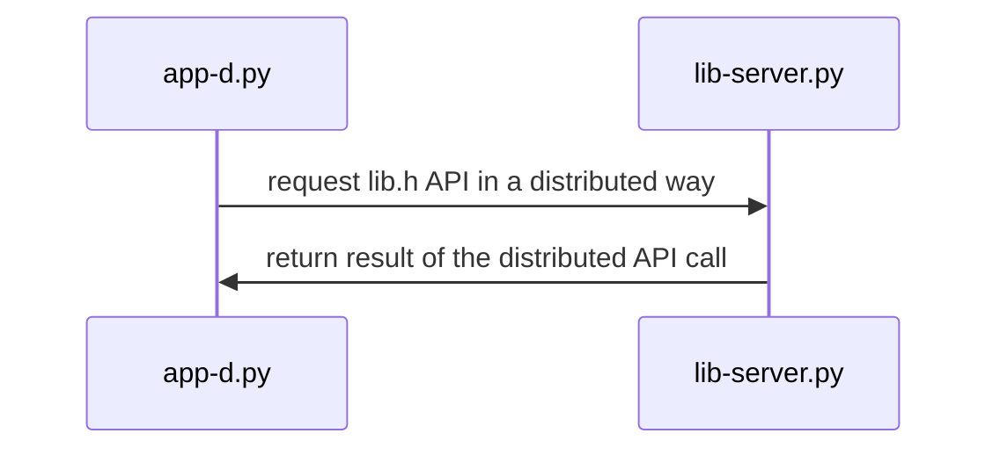

## Materiales usados en ARCOS.INF.UC3M.ES con Licencia CC BY-NC-SA 4.0
  * Felix García Carballeira y Alejandro Calderón Mateos

## Aplicación que usa un servicio distribuido basado en gSOAP/XML

#### Preparación

* Se precisa tener instalado los paquetes de python zeep (para crear clientes) y spyne (para crear servicios):
  ```
  pip install zeep spyne
  ```
  Suele tardar algún tiempo la instalación, hay que esperar.

* El siguiente paso habitual es crear el archivo de servicio web (lib-server.py en nuestro ejemplo):
  ```
  import time
  from spyne import Application, ServiceBase, Integer, Unicode, rpc
  from spyne.protocol.soap import Soap11
  from spyne.server.wsgi import WsgiApplication
  from wsgiref.simple_server import make_server

  class Calculadora(ServiceBase):
      @rpc(Integer, Integer, _returns=Integer)
      def add(ctx, a, b):
           return a+b

      @rpc(Integer, Integer, _returns=Integer)
      def sub(ctx, a, b):
           return a-b

  application = Application(services=[Calculadora], tns='http://tests.python-zeep.org/', in_protocol=Soap11(validator='lxml'), out_protocol=Soap11())
  application = WsgiApplication(application)

  server = make_server('127.0.0.1', 8000, application)
  server.serve_forever()
  ```
* Y ejecutar dicho servicio web:
  ```
  python3 ./lib-server.py
  ```

* A continuación hay que conocer la información del servicio Web usando "python -mzeep URL", siendo URL la asociada al WSDL:
  ```
  python -mzeep http://localhost:8000/?wsdl
  ```

* El siguiente paso habitual es crear el archivo cliente de dicho servicio web (app-d.py en nuestro ejemplo):
  ```
  import zeep

  wsdl_url = "http://localhost:8000/?wsdl"
  soap = zeep.Client(wsdl=wsdl_url)

  result = soap.service.add(5, 5)
  print("5 + 5 = ", result)
  ```


#### Ejecutar

<html>
<table>
<tr><th>Paso</th><th>Cliente</th><th>Servidor</th></tr>

<tr>
<td>1</td>
<td>

```
```

</td>
<td>

```
$ python3 ./lib-server.py &
```

</td>
</tr>

<tr>
<td>2</td>
<td>

```
$ python3 ./app-d.py
127.0.0.1 - - [29/Apr/2023 02:50:39] "GET /?wsdl HTTP/1.1" 200 3537
127.0.0.1 - - [29/Apr/2023 02:50:39] "POST / HTTP/1.1" 200 283
5 + 5 =  10
```

</td>
<td>

```
```

</td>
</tr>


</table>
</html>


#### Arquitectura




