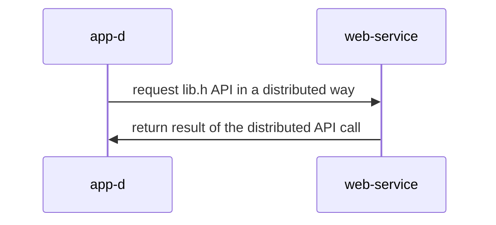

## Materiales usados en ARCOS.INF.UC3M.ES con Licencia GPLv3.0
  * Felix García Carballeira y Alejandro Calderón Mateos

## Aplicación que usa un servicio distribuido basado en gSOAP/XML

#### Preparación

* Se precisa tener instalado el paquete de python "zeep" para crear clientes:
  ```
  pip3 install zeep 
  ```
  Suele tardar algún tiempo la instalación, hay que esperar.

* A continuación hay que conocer la información del servicio Web usando "python -mzeep URL", siendo URL la asociada al WSDL:
  ```
  python3 -mzeep http://www.dneonline.com/calculator.asmx?WSDL
  ```

* El siguiente paso habitual es crear el archivo cliente de dicho servicio web (app-d.py en nuestro ejemplo):
  ```
  import zeep

  wsdl_url = "http://www.dneonline.com/calculator.asmx?WSDL"
  soap = zeep.Client(wsdl=wsdl_url) 

  result = soap.service.Add(5, 5)
  print("5 + 5 = ", result)

  result = soap.service.Multiply(5, 5)
  print("5 * 5 = ", result)
  ```


#### Ejecutar

<html>
<table>
<tr><th>Paso</th><th>Cliente</th><th>Servidor</th></tr>

<tr>
<td>1</td>
<td>

```
$ python3 ./app-d.py
5 + 5 =  10
5 * 5 =  25
```

</td>
<td>

```
```

</td>
</tr>

</table>
</html>


#### Arquitectura




