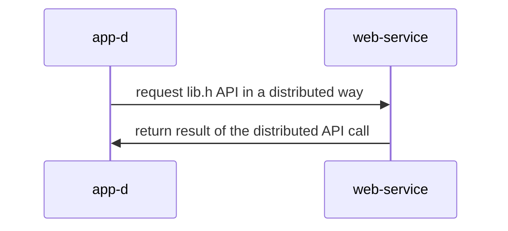

## Materiales usados en ARCOS.INF.UC3M.ES con Licencia GPLv3.0
  * Felix García Carballeira y Alejandro Calderón Mateos

## Aplicación que usa un servicio distribuido basado en gSOAP/XML

#### Requisitos

Tener instalado gSOAP.
Si no se tiene instalado, se puede instalar con:
 * Linux (Ubuntu, Debian o similar):
   ```
   sudo apt-get install -y gsoap
   ```
 * MacOS
   ```
   brew install gsoap
   ```


#### Compilar

Hay que introducir:
```
cd ws-gsoap-xml-wsdl
make
```

Y la salida debería ser similar a:
```
wsdl2h -c -o calc.h "http://www.dneonline.com/calculator.asmx?WSDL"
Saving calc.h


**  The gSOAP WSDL/WADL/XSD processor for C and C++, wsdl2h release 2.8.117
**  Copyright (C) 2000-2021 Robert van Engelen, Genivia Inc.
**  All Rights Reserved. This product is provided "as is", without any warranty.
**  The wsdl2h tool and its generated software are released under the GPL.
**  ----------------------------------------------------------------------------
**  A commercial use license is available from Genivia Inc., contact@genivia.com
**  ----------------------------------------------------------------------------

Reading type definitions from type map "/usr/share/gsoap/WS/typemap.dat"
Connecting to 'http://www.dneonline.com/calculator.asmx?WSDL' to retrieve WSDL/WADL or XSD... connected, receiving...
Done reading 'http://www.dneonline.com/calculator.asmx?WSDL'

Warning: 2 service bindings found, but collected as one service (use option -Nname to produce a separate service for each binding)

To finalize code generation, execute:
> soapcpp2 calc.h

soapcpp2 -C -c calc.h

**  The gSOAP code generator for C and C++, soapcpp2 release 2.8.117
**  Copyright (C) 2000-2021, Robert van Engelen, Genivia Inc.
**  All Rights Reserved. This product is provided "as is", without any warranty.
**  The soapcpp2 tool and its generated software are released under the GPL.
**  ----------------------------------------------------------------------------
**  A commercial use license is available from Genivia Inc., contact@genivia.com
**  ----------------------------------------------------------------------------

Saving soapStub.h annotated copy of the source interface header file
Saving soapH.h serialization functions to #include in projects
Using tempuri service name: CalculatorSoap
Using tempuri service style: document
Using tempuri service encoding: literal
Using tempuri service location: http://www.dneonline.com/calculator.asmx
Using tempuri schema namespace: http://tempuri.org/
Saving CalculatorSoap.Add.req.xml sample SOAP/XML request
Saving CalculatorSoap.Add.res.xml sample SOAP/XML response
Saving CalculatorSoap.Subtract.req.xml sample SOAP/XML request
Saving CalculatorSoap.Subtract.res.xml sample SOAP/XML response
Saving CalculatorSoap.Multiply.req.xml sample SOAP/XML request
Saving CalculatorSoap.Multiply.res.xml sample SOAP/XML response
Saving CalculatorSoap.Divide.req.xml sample SOAP/XML request
Saving CalculatorSoap.Divide.res.xml sample SOAP/XML response
Saving CalculatorSoap.Add.req.xml sample SOAP/XML request
Saving CalculatorSoap.Add.res.xml sample SOAP/XML response
Saving CalculatorSoap.Subtract.req.xml sample SOAP/XML request
Saving CalculatorSoap.Subtract.res.xml sample SOAP/XML response
Saving CalculatorSoap.Multiply.req.xml sample SOAP/XML request
Saving CalculatorSoap.Multiply.res.xml sample SOAP/XML response
Saving CalculatorSoap.Divide.req.xml sample SOAP/XML request
Saving CalculatorSoap.Divide.res.xml sample SOAP/XML response
Saving CalculatorSoap.nsmap namespace mapping table
Saving soapClient.c client call stub functions
Saving soapClientLib.c client stubs with serializers (use only for libs)
Saving soapC.c serialization functions

Compilation successful 

gcc -g -I/opt/homebrew/Cellar/gsoap/2.8.127/include/ -L/opt/homebrew/Cellar/gsoap/2.8.127/lib/ -c soapC.c          -o soapC.o
gcc -g -I/opt/homebrew/Cellar/gsoap/2.8.127/include/ -L/opt/homebrew/Cellar/gsoap/2.8.127/lib/ -c soapClientLib.c  -o soapClientLib.o
gcc -g -I/opt/homebrew/Cellar/gsoap/2.8.127/include/ -L/opt/homebrew/Cellar/gsoap/2.8.127/lib/ -c app-d.c          -o app-d.o
gcc -o app-d  -g -I/opt/homebrew/Cellar/gsoap/2.8.127/include/ -L/opt/homebrew/Cellar/gsoap/2.8.127/lib/  app-d.o soapClientLib.o soapC.o  -lgsoap
```

#### Ejecutar

<html>
<table>
<tr><th>Paso</th><th>Cliente</th><th>Servidor</th></tr>

<tr>
<td>1</td>
<td>

```
$ ./app-d 
Sum = 3
```

</td>
<td>

```
```

</td>
</tr>

</table>
</html>


#### Arquitectura




https://www.genivia.com/dev.html#client-c


