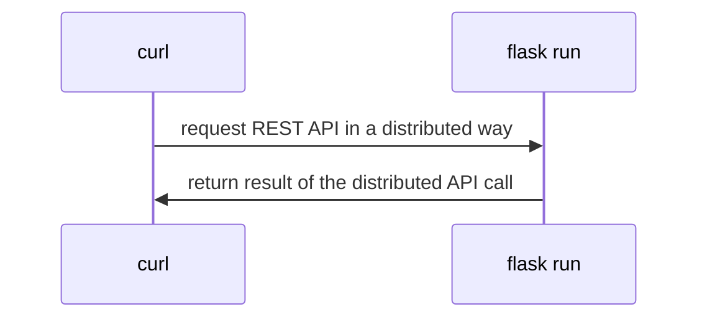

## Materiales usados en ARCOS.INF.UC3M.ES con Licencia GPLv3.0
  * Felix García Carballeira y Alejandro Calderón Mateos

## Servicio distribuido basado en REST con Python Flask

#### Preparación

Hay que introducir:
```
cd distribuido-rest-json-flask
./run.sh
```

Si no se tiene instalado gsoap, se puede instalar con:
 * Linux (Ubuntu, Debian o similar):
   ```
   sudo apt-get install -y pip3-install
   pip3 install flask requests
   ```
 * MacOS
   ```
   brew install python3
   pip3 install flask requests
   ```

#### Ejecutar

<html>
<table>
<tr><th>Paso</th><th>Cliente</th><th>Servidor</th></tr>

<tr>
<td>1</td>
<td>

```
```

</td>
<td>

```
FLASK_APP=app.py FLASK_DEBUG=true  flask run &
```

</td>
</tr>

<tr>
<td>2</td>
<td>

```
curl -i http://127.0.0.1:5000/ddaa  -X GET
curl -i http://127.0.0.1:5000/ddaa  -X POST \
     -H 'Content-Type: application/json' \
     -d '{"name":"first", "array": {}}'
```

</td>
<td>

```
```

</td>
</tr>

</table>
</html>


#### Arquitectura



